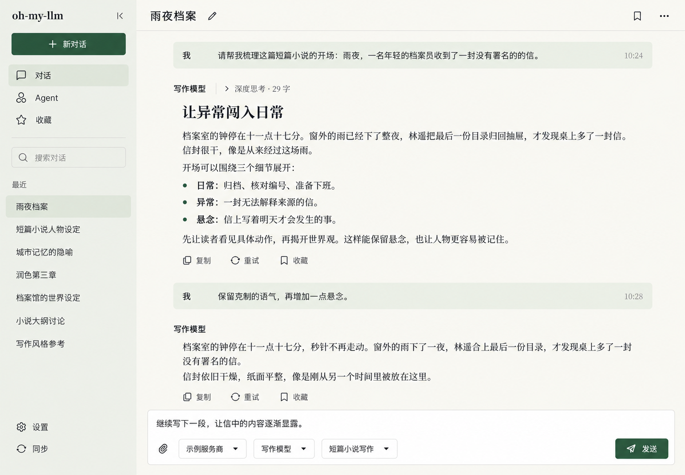
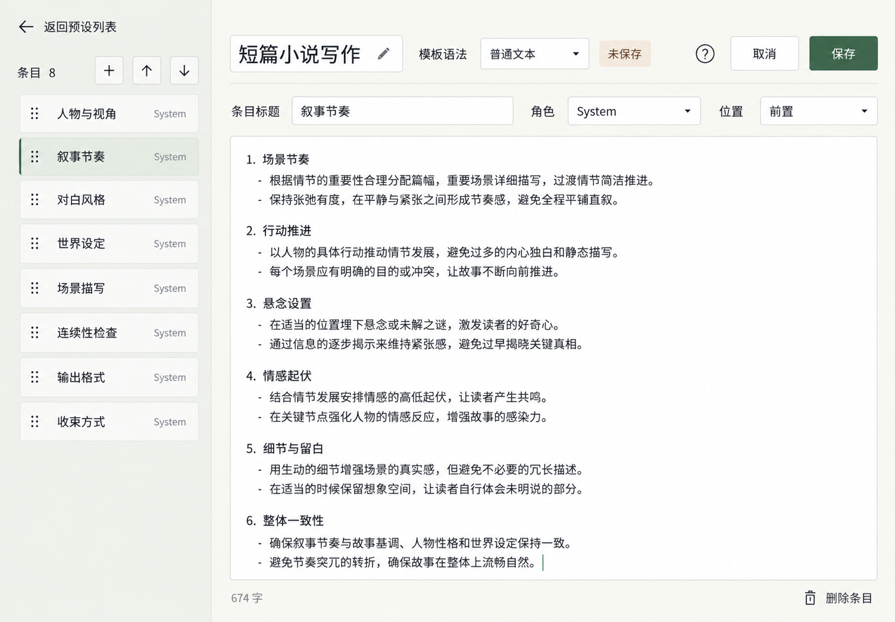

# UI 重构设计基准

日期：2026-10-09。工作分支：`feat/ui-redesign`。状态：**视觉方向已获用户认可，Flutter 实现尚未开始**。

本目录保存认可的参考图、用户意见与设计依据。后续文档和代码继续在同一分支完成。当前运行时约定见 [DESIGN.md](../../../DESIGN.md)；迁移时逐项更新，不能把本文中的目标写成已经实现的行为。

## 已确认的方向

用户最新要求是尽量模仿 Anthropic 的设计语言，仅改变整体色调：采用**暖白、灰绿与深绿**，延续其字体搭配、阅读排版、克制的边框和控件层级。此次重构需要明显改变整体风格与页面组织。

- 聊天采用开放的阅读画布。Assistant 长文直接呈现在主区域，用户消息保留轻背景；推理、状态和操作处于次级层级。
- 侧栏可以保留。同一工作区只保留一套主要侧向导航，避免全局导航、设置分类和条目列表逐层并列。必要的内容预览不是新增导航层。
- 预设编辑改为独立页面。宽屏保留条目列表与正文编辑区；进入编辑时以条目导航替换原导航位置，提供明确返回入口。窄屏使用条目选择和全宽编辑。
- 新增、上移、下移置于条目列表顶部。模板语法与名称／保存处于同一紧凑工具区域，不单独占据一整行；窄屏按可用宽度换行。
- 去掉没有操作价值的说明、口号和装饰文案。概念、协议、语法说明通过就近问号按需查看；真实状态、错误、禁用原因和操作后果继续可见。
- 用不同字体区分界面操作、标题与阅读正文，并同时考虑中文和英文。用户接受多个中文字体及较大的字体包，可裁剪字集，但不能只保留约 3000 个常用字。
- 所有功能继续保留。画面没有展开的入口不等于可以删除；以[功能对应清单](../../audits/2026-10-09-ui-concept-coverage.md)和当前业务实现逐项核对。

字体候选、字集与打包方法见 [中英文字体方案](typography.md)。具体字体、颜色数值、字号、行距和深色模式仍需在实际 Flutter 字样与页面中确定。

## 用户反馈沿革

| 探索阶段 | 用户反馈 | 后续约束 |
| --- | --- | --- |
| Fluent／中性极简 | 像只换了色，变化太小 | 同时调整排版、控件外观、信息层级与页面结构 |
| 更大胆的多种风格 | 第一版太像 ChatGPT，整体均不满意 | 以本应用的阅读和编辑任务决定布局 |
| 书页方向 | 视觉气质尚可，页面结构太差、不实用 | 保留阅读感；正文与编辑器获得空间，标题和留白服从使用密度 |
| Anthropic 暖色方向 | 风格可以，侧栏堆叠、杂乱说明和标语没有必要 | 精简导航层级与文案，强调色改用绿色 |
| 导航平衡 | 并非不能用侧栏，不能一个叠一个；预设改页面合适 | 单套侧向导航；复杂预设编辑采用独立页面 |
| 单侧栏聊天与预设 | 很认可聊天主区域；排序应在上面；模板语法独占一行浪费 | 保留聊天视觉基准，修正预设顶部工具区域 |
| 主要页面扩展 | 要多展示主要页面，不能漏功能；最终一组“非常好” | 保存完整图组，同时记录图中未展开的能力 |
| 最终记录要求 | 尽量模仿 Anthropic，仅色调不同；字体区分也需考虑中文 | 固化设计依据与字体角色，多字体本地打包纳入实施准备 |

前期实际组件预览的观察与限制见[现状记录](../../audits/2026-10-09-ui-style-baseline.md)。反馈表保留的是设计取舍，不把主观风格判断登记成运行时缺陷。

## 参考图

以下 11 张 PNG 已随本文纳入 Git，共约 16.23 MiB；来自本次对话的 imagegen 概念图，不依赖 ignored 的日志目录或 Codex 缓存。全部为示例数据，并非真实用户内容、运行截图或已实现界面。

### 优先参考：聊天主区域

用户特别认可这张图的主页面设计。后续增加功能时，继续保持正文优先与克制的视觉密度。

### 修正后的预设编辑

排序动作在条目列表顶部；模板语法收进顶部工具区域；页面正文保留主要空间。

### 主要页面图组

| 图 | 用途 | 对应核对项 |
| --- | --- | --- |
| [00 聊天视觉基准](references/00-chat-approved.png) | 优先参考开放正文、布局比例与视觉气质 | 02 增补功能时不能退回多层气泡与容器 |
| [01 预设编辑](references/01-preset.png) | 独立页面、顶部排序、紧凑语法选择 | 新增／编辑／条目角色与位置／宏／保存 |
| [02 聊天完整示意](references/02-chat.png) | 在基准方向中补足主要操作 | 上下文、检查点、推理、消息与发送配置 |
| [03 服务商与模型](references/03-providers.png) | 平坦记录与展开模型 | 协议、连接配置、模型能力与批量添加 |
| [04 历史对话](references/04-history.png) | 搜索、选择与分页 | 标题／用户消息搜索、重命名、删除 |
| [05 收藏](references/05-favorites.png) | 收藏夹与内容阅读 | 来源定位、详情路由与批量操作 |
| [06 Agent](references/06-agent.png) | 作品、正文与执行信息的层级 | 文档、剧情、配置、总结、子任务与停止 |
| [07 预设列表与设置](references/07-presets.png) | 提示词管理与设置导航 | 单条 System、导入、其它提示词及设置分类 |
| [08 同步](references/08-sync.png) | 分组选择、配对和导入确认 | 客户端／服务端、敏感分类、合并／替换 |
| [09 媒体](references/09-media.png) | 目录、网格与预览 | 图片／视频、随机播放、密度与播放器操作 |
| [10 窄屏对话与预设](references/10-mobile.png) | 同一风格在窄屏中的组织 | 导航、发送设置、条目切换与顶部保存 |

01—10 与[功能对应清单](../../audits/2026-10-09-ui-concept-coverage.md)一一对应。图片编号仅用于评审归档。图中文字、示例数量、行距和按钮状态不能代替业务契约；快捷键、最新回复重试、注入顺序、敏感同步确认等遵循当前实现。实际实现需要补齐图中没有展示的深色、空态、错误、加载、焦点、大字号和键盘状态。

## Anthropic 的设计依据与本应用的转化

查阅日期：2026-10-09。以下区分来源事实与本应用的设计决策。

| 来源 | 可以确认的设计信息 | 本应用采用方式 |
| --- | --- | --- |
| [Geist 的 Anthropic 品牌案例](https://geist.co/work/anthropic) | 早期品牌系统将 Styrene 无衬线与 Tiempos 衬线字体搭配，使用温暖的色彩、人文图像与功能优先的组件系统 | 接近其字体反差、温度与细节克制度；用中文黑体／宋体建立同样清晰的角色分工 |
| [Anthropic 官方品牌指南](https://github.com/anthropics/skills/blob/main/skills/brand-guidelines/SKILL.md) | 公布墨黑、暖白、中性灰及彩色强调；面向品牌产物推荐 Poppins 标题、Lora 正文 | 参考字体搭配原则与中性色层级；本应用强调色使用绿色，字体需经过中英混排实测 |
| [Claude 官网](https://claude.com/) | 本次浏览器观察到衬线大标题、无衬线导航与按钮、暖白画布、细边框与有限强调 | 转化成工具界面的标题、阅读正文与操作层级；标题与留白缩到真实工作密度 |

Geist 案例是历史品牌设计，官方指南面向品牌产物，官网属于营销页面。它们不是同一份产品字体规格，不据此断言当前 Claude 全部页面使用某个字体文件。

本应用的视觉落点：

- **字体负责层级**：界面操作清晰、阅读区域有人文感，标题无需靠巨大字号制造风格。
- **画布负责空间**：暖白作为主要背景，内容以留白、细线和文字层次组织；灰绿表达轻选中，深绿承载主要动作。
- **控件保持安静**：紧凑的圆角、克制的描边与阴影；输入框、菜单、按钮、开关、列表与弹层使用一致的形态和交互状态。
- **绿色集中使用**：选中、主要操作与焦点形成统一强调；错误、警告等继续使用独立语义色，正文保持高可读性。
- **内容决定密度**：长文画布与设置表单各有合理密度，侧栏和工具区域不能挤占正文。正文宽度、用户字号与触摸命中区都要实际校验。
- **品牌保持自身身份**：继续使用 oh-my-llm 的名称与图标；界面中不加入无任务价值的品牌口号或插画。

## 实施前的边界

当前提交只保存设计资料，不改主题、字体资产、依赖、路由或业务代码。具体实施顺序待下一轮讨论。

设计落地必须保留现有输入法、键盘、焦点、滚动、可访问性与流式刷新隔离。视觉风格改变不要求替换全部 Material 底层能力；优先利用现有主题、共享组件和 GoRouter，在真实任务中确定需要调整的结构。

所有可视预览继续使用开发服务与内置浏览器，不操作用户桌面应用。浏览器视觉核对不等于 Windows／Android 原生输入和性能验收，最终报告须如实区分证据。
