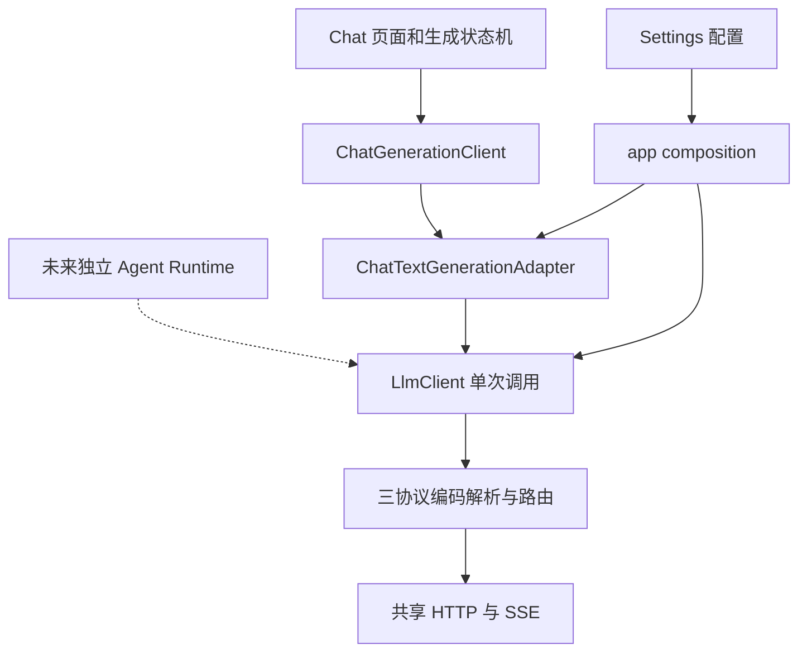

# 面向独立 Agent 页面的共享 LLM 基础设施计划

日期：2026-09-11。调查基线：`master@fa39e15`。原计划分支：`docs/llm-agent-infrastructure-plan`；实施提交分支：`feat/shared-llm-infrastructure`。

状态：**代码已实施，离线自动检查通过；平台与真实服务验证单列**（2026-09-12）。用户已授权提交并创建 PR；本轮提交以 `fa39e15` 为基线。第 2 节是实施前调查快照；当前实现与验证记录见第 12 节，不将历史调查证据当作最终验收。

## 1. 目标与范围

将现有三协议客户端提取为可以由 Chat 和未来 Agent 共同消费的“一次模型调用”模块，补齐请求取消、原生函数工具往返、续接信息和必要的用量观测。现有对话式写作继续使用自己的页面、状态机、提示词拼接和持久化模型。

用户的优先级是 Chat Completions，其次 Responses，最后 Messages。按这个顺序交付工具支持；不得为了同时兼容三者，把原生协议必需的信息丢掉。

### 本轮实施计划包含

- 提取协议中立的调用契约，以及现有协议编码、解析和路由实现。
- 用 Chat 文本适配器连接既有 `ChatGenerationClient`，保持现有 Chat 行为。
- 单次请求级取消、响应头等待超时、SSE idle timeout、请求关联标识。
- 三协议的客户端函数工具定义、流式调用参数、完整调用结果、工具结果回传和下一次调用。
- 结构化终态、必要的原生续接信息、输出上限、推理选项、有限缓存选项及用量观测。
- 契约测试、协议测试、Chat 回归和真实本地 HTTP 取消验证。

### 明确不在本轮范围内

- Agent 页面、Agent Loop、Harness 内容、Tool 执行器、Tool Registry、Skills 发现、SubAgent 调度。
- 小说世界书、角色卡、剧本触发、人物状态库、正文／草稿／修订事务、剧情评审。
- 自动压缩、检索、上下文选择、提示词前缀优化器、费用预算与任务级用量账本。
- 复用或改造 Chat 的预设 Prompt、检查点、消息树、发送条目选择及输出正则业务。
- Shell、任意文件读写、MCP、远程工具、厂商托管工具、多模态工具结果。
- 新的 Settings 页面、设置交换格式、数据库表或 schema 版本、Agent Android 通知。
- 全仓库目录重构、服务商能力目录、模型名推断、厂商 SDK 引入。

完成本计划后，应用仍没有可运行的小说 Agent。未来 Agent 能获得可靠的单次调用接口，并自行决定何时执行工具、修改作品、继续循环或停止。

## 2. 已核实的基础设施现状

| 能力 | 当前代码和事实 | 决定 |
| --- | --- | --- |
| 三协议调用 | `lib/features/chat/data/generation/` 已有三个 client、parser 和路由；不依赖 Chat 页面或检查点 | 提取到 `core/llm`，保留单一实现 |
| 调用接口 | `features/chat/application/ports/chat_generation_client.dart` 将文本消息、Chat 角色、推理和用量绑定在一起 | Chat 接口保留，共享层新增中立接口 |
| 原生 Tools | 当前请求不传工具；CC／Responses 未收集完整调用；Messages 拒绝工具块和参数增量 | 需要新增完整往返，不能只加请求字段 |
| HTTP／SSE | `core/http/llm_http_stream_transport.dart`、`sse_event_decoder.dart` 已共享 | 原位加强，不重写传输栈 |
| 取消 | transport 使用普通 `http.Request`；等待 `send()` 返回期间未显式 abort | 使用已安装 http 的请求级 abort，并验证取消竞态 |
| 超时 | SSE idle timer 在收到响应后才建立；只有 `data:` 行重置 | 新增响应头等待超时，保留 idle 语义 |
| 用量 | `ChatGenerationUsage` 已支持输入、输出、推理、缓存读／写；`merge` 是单请求快照合并 | 移为共享值对象，JSON 和合并语义不变 |
| 配置 | Settings 已拥有服务商、模型、endpoint、key、protocol，自定义 Header 有共享注入 | 继续由 Settings 拥有；composition 注入调用目标 |
| 日志 | URI 可以重复；SSE 缓冲最多 128 条且溢出可丢弃 | 新增关联标识；不得当成 Agent 的执行日志 |
| 持久化 | SQLite 连接、迁移链可复用；Chat 后台仓库是 80ms 合并的会话快照写入 | 不把 Chat Repository 作为工具事务存储 |
| 生成生命周期 | `ChatGenerationCoordinator`／`ChatGenerationRun` 独占 Chat 的停止、重试、保存终态 | 留在 Chat，Agent 将来独立实现 |
| 前台通知 | 当前数据含 conversationId，协调器监听 Chat 状态 | 暂不提取 |

调查时已经执行的有限验证：

- `llm_http_stream_transport_test.dart`：8 个测试通过，日志在 ignored 的 `logs/agent-infra-transport-test.log`。
- import boundary checker：389 个文件、0 条违规，日志在 `logs/agent-infra-import-boundaries.log`。
- 本地 loopback HTTP 实验：配置 100ms idle timeout 后，服务器 350ms 不发响应头仍无超时；取消订阅后再等 350ms 未完成，服务器放行后才完成。相同环境的 `http.AbortableRequest` 正对照产生 `RequestAbortedException`。诊断源文件和输出在 `logs/agent-infra-transport-probe.dart`／`.log`。
- 现有取消测试会在取消后继续发送一个数据块，不能证明“服务器永远不再发数据”时仍能完成取消。
- 未执行全量测试、analyze、构建或真实模型请求。这些调查证据不代表下文功能已实现。

## 3. 目标边界



`ChatTextGenerationAdapter` 是长期存在的业务边界：把结构化模型事件投影成 Chat 的正文、推理、停止原因和用量。它不是等 Agent 完成后删除的过渡别名。

共享模块不导入 `features/`、Flutter、Riverpod 或持久化组件。协议实现可以依赖 `core/http`、日志和共享值对象。Provider 和生产实例装配放在 `app/composition/llm_bindings.dart`。feature 通过自己的 application port 接受依赖，不导入这个 composition 文件。

### 现有 Chat 行为归属

| 行为 | 最终归属及要求 |
| --- | --- |
| 五步 Prompt 拼接、条目隐藏、检查点 | 原有 Chat request builder；不传给共享层额外业务信息 |
| `<thought>`／`<thinking>`／`<think>` 跨 chunk 分离 | Chat adapter 使用现有 splitter；共享层保留模型原文 |
| Anthropic 前置 system 合并、后置 system 转 user、同 role 文本合并 | Chat adapter 调用现有 transformer；共享输入不默默改写语义 |
| “请求未返回有效内容” | Chat adapter 按现有正文／推理判断；工具专用输出在共享层合法 |
| `length` 等原因的自动重试 | 原有 Chat 状态机；共享层不进行业务重试 |
| CC `include_usage` 不兼容降级 | 协议层保留已有窄规则：仅特定 400／422 错误，最多重发一次 |
| Responses `store:false` 和无服务端会话 | 共享 Responses 路径保留，不引入 `previous_response_id`／conversation |
| Chat 当前推理和缓存默认值 | adapter 显式给出，避免成为未来 Agent 的隐式政策 |

## 4. 文件布局与迁移清单

以下路径均相对仓库根。“新增”表示相对调查基线新增。迁移同时处理 `test/` 下镜像文件，不复制两套协议实现。

### 4.1 新增共享契约

| 文件（新增） | 责任 |
| --- | --- |
| `lib/core/llm/llm_client.dart` | `LlmClient.streamCompletion` 与基于同一事件流的 `complete` |
| `lib/core/llm/llm_request.dart` | `LlmRequestTarget`、`LlmRequest`、`LlmGenerationOptions`、工具定义和选择 |
| `lib/core/llm/llm_content.dart` | 输入条目、完成的 assistant turn、工具调用／结果、原生续接 envelope |
| `lib/core/llm/llm_event.dart` | 展示增量、用量事件、最终结果、错误种类 |
| `lib/core/llm/llm_call_control.dart` | 单次调用取消信号；不持有页面或 HTTP client |
| `lib/core/llm/llm_usage.dart` | 从 Chat 移出的 `LlmUsage` |
| `lib/core/llm/llm_reasoning_effort.dart` | 移出的 `ReasoningEffort` 枚举；保留枚举名与取值 |

现有 `llm_api_protocol.dart`、`llm_endpoint_resolver.dart` 原位复用。不要增加只转发一次构造调用的 factory 或万能 barrel export。

### 4.2 协议实现迁移

源目录前缀为 `lib/features/chat/data/generation/`，目标前缀为 `lib/core/llm/protocols/`：

| 源相对文件 | 目标相对文件 |
| --- | --- |
| `protocol_routing_chat_generation_client.dart` | `protocol_routing_llm_client.dart`，类改为 `ProtocolRoutingLlmClient` |
| `chat_completions/chat_completions_client.dart` | `chat_completions/chat_completions_client.dart` |
| `chat_completions/chat_completions_parser.dart` | `chat_completions/chat_completions_parser.dart` |
| `responses/responses_client.dart` | `responses/responses_client.dart` |
| `responses/responses_parser.dart` | `responses/responses_parser.dart` |
| `anthropic/anthropic_messages_client.dart` | `anthropic/anthropic_messages_client.dart` |
| `anthropic/anthropic_parser.dart` | `anthropic/anthropic_parser.dart` |

对应七个 `test/features/chat/data/generation/` 测试文件迁至 `test/core/llm/protocols/`；路由测试同步更名。两项有意不移动：

- `chat_completions/inline_reasoning_tag_splitter.dart` 及其测试。
- `anthropic/anthropic_message_transformer.dart` 及其测试。

新增 `lib/features/chat/data/generation/chat_text_generation_adapter.dart` 与镜像测试。保留现有 `ChatGenerationClient`、request／chunk／result／exception、Provider 和 `FakeChatGenerationClient` 的 Chat 语义。

### 4.3 原子更新与边界门禁

- 删除旧 `chat_generation_usage.dart`，所有使用点改成共享 `LlmUsage`；`ChatMessage.tokenUsage` 和 Chat exception／chunk／result 的字段类型同步修改。保留现有 JSON key、null 行为、非负数解析和 `merge` 规则，数据库无需迁移。
- `ReasoningEffort` 从 `chat_message.dart` 移出，Settings 等使用点直接导入共享文件。不要为了这个枚举移动整个 `ChatMessage`，也不留下旧文件 re-export。
- 新增 `app/composition/llm_bindings.dart`，由 `llmClientProvider` 构造共享 transport、三协议 client 和 router；`cross_feature_bindings.dart` 仅将 Chat port 绑定到 adapter。保留 `bindChatGenerationClient:false` 测试入口。
- 更新 `test/integration/bootstrap_integration_test.dart` 的旧具体类型断言，验证能经生产绑定调用正确协议，避免把换一个包装类当作行为契约。
- 修改 `tool/architecture/import_boundary_checker.dart` 和 `test/architecture/import_boundary_checker_test.dart`：共享契约不得导入 `core/llm/protocols/`、HTTP 实现或 app；features 不得直接导入协议实现或 `app/composition/llm_bindings.dart`。composition 可以装配实现。维持已有 core→features 禁令，不添加宽泛 allowlist。
- 修改路径前用 `rg` 列出所有使用点；调查基线下 Chat port 有 18 个 lib 引用与 38 个 test 引用，这只是核对线索，不是必须保持的数量。

## 5. 调用契约

本节是实施契约。实现者可以调整文件内组织，不能自行改变可观察语义、扩大范围或用 `Map<String, dynamic>` 取代上层类型。

### 5.1 请求与生命周期

```dart
abstract class LlmClient {
  Stream<LlmEvent> streamCompletion(
    LlmRequest request, {
    LlmCallControl? control,
  });

  Future<LlmResult> complete(
    LlmRequest request, {
    LlmCallControl? control,
  });
}
```

- `LlmRequestTarget` 必填 protocol、endpoint、apiKey、model；endpoint 继续经现有 resolver 处理，不按 host 猜协议。
- `LlmRequest` 必填 target、按顺序排列的 input；options 默认全未指定，tools 默认空，toolChoice 默认 auto。
- `LlmGenerationOptions` 包含可空的 reasoningEffort、maxOutputTokens、responseHeaderTimeout、streamIdleTimeout，以及第 8 节限定的缓存选项。数值必须为正。缺省保持协议／服务商默认，Chat 例外由 adapter 提供。
- 协议选项采用可空 `LlmProtocolOptions` sealed 类型：`ChatCompletionsOptions` 仅含 promptCacheKey；`ResponsesOptions` 含 promptCacheKey、可空 reasoningSummary（auto）、可空 reasoningContext（currentTurn）；`MessagesOptions` 含第 8 节的 automaticCacheControl。字段随所属任务加入。共享 enum reasoningEffort 继续通过协议 encoder 映射；不接收任意扩展参数 Map。
- 请求、工具 schema、输入和结果集合构造后不可被外部修改；JSON 嵌套值也需防御性复制，拒绝非 JSON 值。
- stream 是单订阅、惰性的；订阅触发一次调用。`complete` 只折叠这个 stream，不再次发请求。
- 每个订阅的解析器、参数缓冲、用量和取消状态独立。共享一个 client 的两次并发调用不能串流、互相取消或共享 splitter 状态。
- 每次调用分配唯一 `requestId`。CC 窄兼容重发共享 requestId，但 attempt 从 1 增至 2；没有第三次，也不重放已经开始输出的成功响应。
- `LlmCallControl.cancel()` 幂等；已取消的 control 不可重用于新调用。订阅前取消不得发送请求；`complete` 被取消抛明确的 cancelled 异常。取消订阅应传播到该请求的 control。
- 不把暂停订阅当作取消；不为所有调用建立全局“当前请求”。

### 5.2 输入、输出和原生续接

输入采用 sealed 类型，首版只支持以下三类：

| 类型 | 必需内容与语义 |
| --- | --- |
| `LlmTextMessage` | 中立 role（system／user／assistant）、text；Chat 显式转换角色 |
| `LlmAssistantTurn` | 已完成的有序输出块及 `LlmReplayEnvelope`；来自上一次结果 |
| `LlmToolResult` | callId、name、文本 output、isError；它是外部执行结果，不会触发执行 |

输出块至少区分 text、reasoning summary、function call。完整原生 reasoning／签名等放在续接 envelope，不能把可见 reasoning 文本当作它的替代品。

`LlmReplayEnvelope` 保存 protocol、解析后的 endpoint、model 与允许回传的原生输出条目。由对应协议 codec 生成与校验，不允许作为任意请求字段注入入口；不含 API key、Header、完整请求或完整 HTTP 响应。它是内存值对象，本轮不设计持久化版本协议。

- 原生内容必须保留顺序、ID 和续接所需字段。对非工具文本可提供显示投影；工具续接始终使用完成的 assistant turn。
- envelope 仅能回传到相同 protocol／endpoint／model。切换模型或协议时明确拒绝，由未来调用方重新建立上下文；不能静默丢掉签名或工具状态。
- input 可以包含多轮历史，但每轮工具调用必须在下一轮模型生成之前有对应结果。校验 callId 唯一、每个 pending call 恰好一个 result、name 匹配；拒绝缺失、重复和未知结果。
- 首版一次请求必须提交当前轮全部 pending 工具结果。SubAgent 异步分批回传等后续再设计。
- 追加结果不得修改历史 assistant turn。一次文本→工具→文本往返的第二个请求必须包含完整的前序输入、assistant turn 和工具结果。
- 不假装跨协议字节无损；无损指在同协议内保留下一次请求所必需的原生字段。

### 5.3 事件、终态与错误

- `LlmEvent` 至少包含正文增量、可展示推理增量、按调用索引／ID 关联的工具参数增量、用量更新和 `LlmCompleted`。
- 增量只用于进度／展示。完整参数必须等该调用结束后一次 JSON 解码并验证为 object，不能逐 chunk 执行或推测补齐 JSON。
- `LlmCompleted` 在成功结束时恰好一次，携带完整 `LlmResult`；此前增量和最终结果不能被消费者重复拼接。
- 工具终态的完成依据分别为 CC 对应 choice 的 `finish_reason=tool_calls`、Responses 的 `response.completed`、Messages 的 `message_stop` 且 stop_reason 为 tool_use。CC 收集终态后仍消费尾随 usage，直到正常流结束才发布完整结果；终态后发生传输错误仍按错误处理。
- `LlmResult` 包含 requestId、assistant turn、全部完整 toolCalls、usage、标准 stopKind、原始 finishReason。stopKind 为 completed／toolCalls／incomplete／refused／unknown。
- `complete` 遇到完整终态后返回它；失败则抛 `LlmException`，携带 requestId、协议／URI、错误种类、HTTP 状态、厂商错误码、已有 usage、源异常与堆栈。保留已有 Chat 诊断字段的映射能力。
- 正常空文本、只有 reasoning、只有工具调用都可以是共享层结果。Chat adapter 负责自己的空内容提示。
- EOF 不等于可执行工具调用已完成：缺少协议完成依据、参数 JSON 截断、缺失 ID／name 或重复冲突 ID 时必须失败，不发布可执行的 toolCalls。可展示的部分文本不因此被抹去。
- 对现有 Chat 接受的纯文本 EOF 行为保持兼容，标为 unknown；不能把缺失终态包装成已确认 completed。工具轮要求完整终态。
- usage-only 事件不能因“没有正文”而被丢弃。用量在单次请求内按非 null 新值覆盖合并，绝不把多个 chunk 的累计值相加。

### 5.4 工具定义边界

- `LlmToolDefinition`：name、description、parameters（JSON object schema）。name 非空且在同一请求中唯一；schema 根类型必须为 object。
- `LlmToolChoice`：auto／none／required／named；named 必须指向已声明工具。`parallelToolCalls` 是可空 bool，只控制模型是否可以同时提出多个调用，不控制本地执行并发。
- tools 为空时 auto／none 省略工具字段；required／named 发送前失败。工具错误结果不会触发共享层重试：Messages 使用 is_error，CC／Responses 没有对应布尔字段时，将错误 output 编码为 JSON 文本 `{"is_error":true,"content":原始output}`；成功 output 保持原文。
- 首版 OpenAI 两协议显式采用 `strict:false`，保留调用方 schema 的含义；不自动把 optional 变 required。Messages 不附加未经支持验证的 strict 字段。完整 strict schema 支持另开范围。
- `LlmToolCall`：callId、name、原始 argumentsJson 和解码后的 arguments object。需验证名称属于本次定义，但这不代表参数业务有效或有执行权限。
- 协议层只做结构、关联和输入大小限制；不引入 JSON Schema 执行引擎。真实 schema 校验、权限、幂等键、数据库事务与回滚属于未来 Tool executor。
- 首版固定上限：每轮最多 32 个工具调用、每个调用参数最多 1 MiB UTF-8、每个工具结果最多 1 MiB UTF-8。写入缓冲之前检查累积大小；这些是本地防护值，不声称来自厂商限制，不增加 Settings 开关。
- 未识别的输出块若影响续接可靠性，应报 unsupported output；不得将无法理解的工具块伪装成普通正文。未知非语义 SSE 元数据仍可跳过。

## 6. 请求取消、超时和隔离

继续使用当前 `package:http`，已安装的 1.6.0 提供 `AbortableRequest`。实施时核对 lockfile 和实际实现；不为本功能升级依赖。

1. transport 用 `AbortableRequest` 连接 request control；`CustomHeadersHttpClient` 必须传递原 request，不能重建为不可 abort 的普通 request。
2. responseHeaderTimeout 从发起 send 开始，到收到响应头结束。超时或取消触发 abort，并让调用方在有限时间内结束等待。
3. 响应头之后沿用 SSE idle timeout；HTTP 非 2xx 错误体读取也必须可取消、受无数据超时约束，不能在 `bytesToString()` 永久挂住。
4. 不依赖阻塞 `async*` 的 finally 才触发 abort。调用方取消、订阅取消、超时和底层 late completion 均有明确清理路径。
5. 迟到的响应和异常必须被接住、取消／释放，不发出第二个终态，不产生 unhandled Future error。timeout 和 cancelled 是不同错误种类。
6. 取消不调用共享 `http.Client.close()`。另一请求继续收到事件，之后还能发新请求。
7. 原生 socket／DNS 阶段的立即终止受 http 实现限制。验收承诺是调用方有限时间结束及迟到资源清理，不宣称同步中止每一个 OS 操作。
8. Chat adapter 无需改变 Chat port 的方法签名：每个订阅拥有 control，取消订阅直接触发它。Chat stop／终态持久化仍由原有 Run 完成。

新增响应头等待上限：共享 options 缺省 null；Chat adapter 明确提供 60 秒。已有 SSE timeout 设置继续映射。该项是有意修复的用户可见行为：服务器一直不回响应头时出现现有 inline 错误，而不是无限等待；不新增页面或设置项。

## 7. 三协议工具往返

| 内容 | Chat Completions | Responses | Messages |
| --- | --- | --- | --- |
| 工具定义 | `tools[].function` | `tools[]` 的 function 字段 | `tools[]` 的 input_schema |
| 选择 | auto／none／required／具名 function | auto／none／required／具名 function | auto／none／any／tool |
| 并行请求选项 | `parallel_tool_calls` | `parallel_tool_calls` | 支持的 tool_choice 结构中映射 `disable_parallel_tool_use`；none 不附加无意义字段 |
| 调用收集 | 按 choice=0 内的 tool index 合并 ID、name、arguments | 按 output index／item ID 收集 function_call，保留 call_id | 按 content block index 收集 tool_use 与 input_json_delta |
| 工具结果 | role=tool、tool_call_id、文本 content | function_call_output、call_id、output | user content 内 tool_result、tool_use_id、content、is_error |
| assistant 续接 | 原 assistant content、tool_calls 和需要回传的扩展推理字段 | 有序 output items，含 reasoning 所需字段 | 完整有序 content blocks，含 thinking signature／redacted_thinking |

### Chat Completions

- 流式和现有非标准 `message` 回退路径均保持文本行为；工具支持也要覆盖完整 message envelope。
- 支持两个工具参数交错分片；不假设 ID、name、arguments 都在第一片，也不使用“当前唯一工具”全局变量。
- `finish_reason=tool_calls` 加上完整调用结构才可形成工具终态；`length` 后的半个 JSON 不可交给执行器。
- `include_usage` 降级不去掉 tools、tool_choice 或历史工具结果；工具不支持的 HTTP 错误原样向上传递，不改用 Prompt 模拟。
- 正文内的 `<thinking>` 标签由 Chat adapter 分离。共享层只对协议专门的 reasoning 字段做结构化投影。

### Responses

- 保持 `store:false`。推理模型的无状态工具续接需请求并保留 `reasoning.encrypted_content`，同时保留 reasoning item 与工具 item 的顺序及必要 ID。
- final output item 用于校准完整对象，delta 用于显示；不能把 done 的完整 arguments 再拼到 delta 后面。
- tool item 的内部 id 和 call_id 是不同字段；结果用 call_id 关联，不能互换。
- 区分 completed／incomplete／failed，失败时保留自然携带的 usage。不能为了取到 function_call 将 failed 改为成功。
- 当 tools 非空或 input 已含原生 reasoning turn 时附加 `include: ["reasoning.encrypted_content"]`；普通 Chat 文本路径不附加。Chat 原有 summary／context 默认保留在 adapter 的协议选项映射内。

### Messages

- 共享路径接收前置 system 与显式有序 block；不自行把历史中段 system 改成 user。不能合法编码时显式报错，Chat 已通过自己的 transformer 处理。
- tool_use 的开始对象可能已经带完整 input，也可能通过 JSON 增量提供；结束时组装一次，避免把空对象与增量错误合并。
- thinking 的 signature_delta 与 redacted_thinking 原样保留；可见推理摘要不是可回传的签名块。
- 工具结果放在跟随该 assistant turn 的 user 消息中，工具结果块在普通 user text 之前；同一轮多个结果保持对应关系。
- 共享 Messages 请求必须显式有 maxOutputTokens；Chat adapter 继续给 8192。缺失时发送前失败，不能静默选一个 Agent 输出预算。
- 保留现有 effort 映射及 usage 归一化：输入总量包含 raw input、cache read 和 cache write。归一化只做一次。

## 8. 缓存与用量：首版有限支持

缓存命中是服务端行为，稳定前缀是调用方的上下文构建责任。把“数据库快照”放在末尾可能减少前缀变动，但不能由本模块强制，也不能保证模型注意力或命中率。

- 首版支持 OpenAI 两协议可空的 `prompt_cache_key`；缺省不发送。它不是开启缓存的必需开关，也不能保证命中。
- 支持 Messages 可空的自动 `cache_control`：ephemeral，TTL 可省略或指定 5m／1h；缺省不发送。Chat adapter 保持现有 ephemeral 默认值。
- options 使用封闭的协议选项类型，不接受任意请求字段 Map。给错协议的选项在发送前失败。
- 不在首版统一 OpenAI 不同模型代际的 retention／TTL 字段，也不做显式 block breakpoint 编辑器。当前官方协议存在模型相关差异；等具体模型需求明确后单独扩展。
- `LlmUsage` 保留 inputTokens、outputTokens、reasoningTokens、cachedInputTokens、cacheWriteInputTokens，缺失为 null。未知不显示成 0；同请求事件 merge 不是多请求总和。
- requestId／attempt 要贯穿 request、response、SSE 与 error 日志；`NetworkLogger` 可选参数扩展要同步所有 override 与 fake，非 LLM 日志不必伪造 ID。
- 记录协议、模型、耗时、stopKind、工具调用数量、已有 usage；不默认新增记录完整请求、工具参数、工具结果、签名或 encrypted_content。现有 SSE 原文日志需对新增结构化敏感块做省略／摘要处理，不能因为引入 Tools 扩大采集。
- 最小实现是在 transport 增加 `logRawResponse` 参数：现有纯文本 Chat 路径保留原策略；tools 非空或 input 含原生续接 turn 的调用固定 false，关闭 SSE 原文及 HTTP 错误体落盘。协议层只记录结构化摘要，错误日志也不能经异常字符串间接写入原始正文。异常对象仍保留必要诊断字段，由已有显式诊断入口处理。transport 不为脱敏解析具体协议 JSON。
- 不改变 Header 脱敏、请求正文默认关闭和 LLM／peer HTTP 信任域。LLM HTTP client 不能作为未来 Tool 的通用网络权限。
- 自动测试只能断言静态前缀顺序不变、字段编码正确、usage 解码正确；真实缓存命中率必须由明确授权的真实调用观察，不能用 mock 数字作效果证据。

## 9. 按顺序实施的任务

每项完成后更新本节状态和真实验证证据。提交建议表达独立审查单元，不代表本轮获准提交或推送。不得在中间任务混入 Agent 功能。

### 任务 1：固定 Chat 行为基线

依赖：无。建议提交：`test(llm): 固定共享调用提取前的聊天契约`。

- [x] 核对当前工作区和依赖版本，记录基线 commit；检查七个迁移测试和两个保留测试的用例归属。
- [x] 在现有协议 client 测试中确认请求默认值、文本／推理分离、usage-only、错误字段和空回复；只补缺失行为，不复制已覆盖用例。
- [x] 核对 `multi_protocol_chat_generation_integration_test.dart` 的参数化范围；调查时常规成功／失败路径只有 CC，不能据文件名宣称已有三个协议全链路验证。
- [x] 建立之后 Chat adapter 测试所需的 typed fixture；继续使用原有 Chat fake 测页面，不把全部 Chat 测试改成 wire mock。
- [x] 执行相关单文件测试并记录 baseline 日志。纯提取任务无需人为制造编译失败作为 red。
- [x] 如果现有测试已经覆盖所有上述行为，只记录基线，不为凑提交增加重复测试或创建空提交。

验收：能明确说出哪些行为已有测试、哪些本次补齐；测试基线通过。若基线失败，先诊断是否已有失败并记录，不将无关修复悄悄纳入后续迁移。

### 任务 2：提取共享调用并接回 Chat

依赖：任务 1。建议提交：`refactor(llm): 提取单次调用并保留聊天文本适配`。

- [x] 按第 4 节原子移动枚举、usage、七个协议实现和镜像测试；删除旧路径，更新所有引用。
- [x] 建立第 5 节的最小中立文本调用、事件和结果契约；工具专属成员随对应任务加入，不提交空实现或永远抛 UnimplementedError 的接口。
- [x] 新建 Chat adapter，把 splitter、Messages 文本转换、空回复和 Chat 默认选项放回 Chat 边界。
- [x] 迁移 exception 映射，保留 URI、状态码、厂商错误码、原始诊断、usage 和 cause stack；不要只保留 message。
- [x] 新增 composition 绑定，保留 Chat fake override 开关；现有设置解析仍输出相同 target。
- [x] 补边界 checker 的正反 fixture：合法 app 装配通过，core→Chat、feature→协议实现、共享契约→HTTP 实现失败。
- [x] 运行迁移后的协议测试、adapter 测试、usage 序列化测试、bootstrap 和 Chat lifecycle 测试；运行 import gate。

验收：三协议原有文本请求与 Chat 显示／保存行为一致；新的共享调用不依赖 Chat。不存在旧协议实现副本、旧 usage 别名或新增 DB 迁移。此阶段共享层不得接收 Tools 后静默忽略。

### 任务 3：修复请求级取消和超时

依赖：任务 2。建议提交：`fix(llm): 支持响应头等待超时与请求级取消`。

- [x] 在 `test/core/http/llm_http_stream_transport_test.dart` 先写“不再发数据仍完成取消”和“等待响应头超时”的行为 red。
- [x] 实现 control→AbortableRequest，处理订阅前取消、等待 headers、SSE 中途、非 2xx 读 body、迟到响应和重复取消。
- [x] 在 `test/core/http/custom_headers_http_client_test.dart` 验证 Header 注入后仍是同一个可 abort 请求；不通过 close singleton 取消。
- [x] 在新 `test/core/llm/llm_call_control_test.dart` 验证 signal 幂等和禁止复用；在 adapter 测试确认 Chat stop 传播取消。
- [x] 建立两个并行调用，取消 A 后 B 继续完成，再发 C 成功；验证 fallback 前取消阻止第二次 send。
- [x] 用真实本地 HTTP server 作为实际 http 行为正对照；服务端停在 headers 和首个 SSE 后分别验证。测试必须有 finally 关闭 server/client。
- [x] 用受控 Completer／fake clock 测超时，不用固定长 sleep 猜竞态；断言无重复终态和未处理异常。

验收：第 6 节全部路径有证据；Chat 新增 60 秒响应头超时的错误仍 inline。red 必须是行为失败，不是测试挂死等硬超时；硬超时是诊断信号。

### 任务 4：Chat Completions 原生工具往返

依赖：任务 3。建议提交：`feat(llm): 支持 Chat Completions 原生函数工具往返`。

- [x] 在共享契约中加入 typed tools、输入／输出 turn、工具结果和 replay envelope；实现调用关联、完整性及大小限制校验。
- [x] 先写请求编码与交错参数分片的 red，再实现 tools、choice、parallel 及完整 tool_calls 收集。
- [x] 在首次启用工具输出前就屏蔽默认 SSE 日志中的工具参数及新增原生续接内容，并有日志断言；不能等任务 7 才修复中间提交的内容采集问题。后续两个协议沿用这条约束。
- [x] 覆盖纯工具、文本加工具、多个工具、usage-only、完整 message 回退、截断 JSON、未知工具、重复 ID、超限参数和未确认 EOF。
- [x] 明确 `strict:false`；不自动改写 schema 的 required 或 additionalProperties。
- [x] 新增 `test/integration/llm_tool_roundtrip_integration_test.dart`：真实共享 client＋受控 HTTP fixture；第一轮返回调用，测试侧简单 handler 返回文字，第二轮返回正文。
- [x] 断言第二轮请求包含原输入、原 assistant tool_calls 和正确 tool_call_id；handler 执行次数恰好一次，只有完整调用才执行。
- [x] 覆盖兼容重发不丢工具字段、取消不重发、错误不会自动改用文本模拟；Chat 不请求 tools 时仍通过旧回归。

验收：CC 工具可完整往返，非法结果发送前失败。测试 handler 只属于测试，不顺手引入生产 Tool executor。

### 任务 5：Responses 原生续接

依赖：任务 4。建议提交：`feat(llm): 支持 Responses 工具调用与推理续接`。

- [x] 使用含多个 output item、reasoning encrypted_content 和 function_call 的 fixture 写 red。
- [x] 编码 tools／choice／results，解析 item start、delta、done 与 response terminal；最终对象不能重复追加参数或正文。
- [x] 保留有序原生 output，验证内部 item id 与 call_id 分工，以及跨 target replay 明确失败。
- [x] 补 completed／incomplete／failed usage 和截断参数路径，禁止把 incomplete 工具当可执行结果。
- [x] 在往返 integration 中增加 Responses 场景；第二次请求验证 store:false、无 previous_response_id，且 required reasoning items 完整回传。

验收：可以通过无服务端会话的两次调用完成工具往返；不丢推理续接字段，Chat 的原文本行为保持。

### 任务 6：Messages 原生工具与签名续接

依赖：任务 5。建议提交：`feat(llm): 支持 Messages 工具调用与签名续接`。

- [x] 写包含 thinking、signature_delta、redacted_thinking、两个 tool_use 的 red；包括起始 input 与分片 JSON 两类响应。
- [x] 编码选择和结果块，验证顺序、tool_use_id、is_error、多结果合并与 system 合法性。
- [x] 删除旧 parser 对合法 tool_use／input_json_delta 的拒绝，保留对不支持语义块的明确报错。
- [x] 将 Messages maxOutputTokens 缺失视为发送前错误；Chat 仍明确给 8192，保留旧推理 effort 与 usage 归一化。
- [x] 在往返 integration 中增加 Messages 场景，断言 thinking／签名／redacted block 的必要字段未被显示摘要替代。

验收：三协议分别通过同一“第一轮调用→外部结果→第二轮正文”的行为契约；协议专属字段由各自 fixture 验证，不做虚假的统一 JSON 格式。

### 任务 7：调用参数、缓存选项与关联日志

依赖：任务 6。建议提交：`feat(llm): 补齐调用参数与缓存用量观测`。

- [x] 完成可空 maxOutputTokens 映射：CC 使用 max_completion_tokens，Responses 使用 max_output_tokens，Messages 使用 max_tokens；Chat 的 CC／Responses 缺省仍不附加该字段。
- [x] 不为旧网关自动改换 token 上限字段；显式配置不支持时返回原错误，未来有真实需求再增加窄适配。
- [x] 实现第 8 节封闭缓存选项和协议不匹配校验；不新增 Settings 持久化或 UI。
- [x] requestId／attempt 贯穿 transport 和日志，协议 summary 记录 stopKind／usage；同步所有 logger override 和测试 fake。
- [x] 新增参数／缓存编码 red，覆盖缺省省略、错误协议拒绝、null usage 和单请求累计快照 merge。
- [x] 日志测试放入现有 `test/core/logging/` owner，验证敏感 Header 脱敏以及工具参数、结果、签名和 encrypted_content 不进入默认日志。
- [x] 验证前缀数组的稳定顺序：只在末尾追加新 turn／result；不声称自动测试证明真实缓存命中。

验收：调用方可表达首版参数，能区分同 URI 上的并行请求和兼容重发。日志不成为内容数据库，也不新增 Agent 状态栏。

### 任务 8：集成回归与范围审计

依赖：任务 1–7。建议提交：`test(llm): 验证三协议共享调用与聊天回归`。

- [x] 汇总测试 owner，合并重复的事故回归用例；不为同一参数拼装规则建立 parser／client／UI 三套镜像断言。
- [x] 全量测试、analyze、格式与 import boundary gate 通过；记录命令、退出码与日志位置。
- [ ] Windows 手工验证：Chat 正文／推理、取消、切会话、错误 inline、重试、用量、历史保存；测试服务可复现即可，不自动读取密钥发付费请求。
- [x] Android 编译和既有 Chat 前台通知回归列为平台检查；未执行真机检查必须标 PENDING，不得以 Windows 测试替代。
- [ ] 三协议真实服务商 Tools 与缓存检查单独记录 protocol／model／endpoint 类别和结果。未获具体调用授权或无有效配置时为 PENDING，不阻止离线契约结论，但不能宣称所有网关可用。
- [x] 更新 AGENTS.md 中被本次迁移实际改变的路径、职责与测试说明；不提前写 Agent 架构规则。
- [x] 审计基线 HEAD 到当前工作区的完整差异（含新增未跟踪文件），确认无 Agent 页面、数据库 migration、Settings 格式升级、Prompt 改造、Shell／MCP 或生产工具执行代码。提交前检查包含全部未跟踪文件；提交后再核对 base…head。

验收：下节自动验收通过，平台／真实服务验证如实列明。若修改了 Chat 正常行为，除第 6 节明确的超时修复外必须先定位原因，不能用“适配 Agent”掩盖回归。

## 10. 测试归属与通过标准

| 契约 | 主要 owner | 必须观察到的结果 |
| --- | --- | --- |
| 共享请求／结果／控制 | 新 `test/core/llm/llm_client_test.dart`、`llm_call_control_test.dart` | 单订阅一次请求，终态一次，并发隔离 |
| 用量模型 | 新 `test/core/llm/llm_usage_test.dart`，保留 Chat message／repository 往返测试 | 旧 JSON 往返、null、合并不累加；原 Chat port contract 测试仍归 Chat，不冒称已有独立 usage 测试文件可移动 |
| 取消／超时 | 现有 transport 测试 | 没有下一帧也能取消，headers／body 均有界，另一请求不受影响 |
| 协议编码／解码 | 七个迁移后的协议测试 | 原文本与新工具字段／终态、原生续接信息正确 |
| Chat 语义 | 新 adapter 测试＋保留 splitter／transformer 测试 | 标签、system 转换、空回复、默认值一致 |
| 工具连续调用 | 新 llm_tool_roundtrip integration | 三协议各自两次调用闭环，无生产执行器 |
| 既有 Chat 功能 | 现有 Chat／bootstrap／lifecycle integration | 页面、停止、重试、保存未被共享层接管 |
| 依赖与日志 | 现有 architecture／logging 测试 | 禁止依赖被拒绝、并发可追踪且不泄漏新增内容 |

测试名称和注释使用简体中文。有效业务数据用 typed fixture；原始协议 wire fixture、malformed 数据和旧 JSON 兼容测试可直接写 JSON，并标明测试边界。工具字符串参数中的中文、转义字符与跨 chunk 分片至少各覆盖一次。

### 执行命令与硬超时

遵守 AGENTS.md：单文件测试进程级硬超时 60000ms，全量 240000ms；所有测试输出写入 ignored 的 `logs/`。工具若提供 timeout 参数必须显式填写；若当前执行工具只有 yield 时间，应使用能够在期限到达时杀进程树的 wrapper，不能把 yield 当成 timeout。

PowerShell 命令体示例（外层仍须上述硬超时）：

```powershell
New-Item -ItemType Directory -Force logs | Out-Null
flutter test test/core/http/llm_http_stream_transport_test.dart --reporter compact 2>&1 | Out-File -Encoding utf8 logs/llm-transport-green.log
$TestExit = $LASTEXITCODE
Write-Host "EXIT=$TestExit"
Get-Content -Tail 100 logs/llm-transport-green.log
```

```powershell
New-Item -ItemType Directory -Force logs | Out-Null
flutter test --reporter compact 2>&1 | Out-File -Encoding utf8 logs/fltest.log
$TestExit = $LASTEXITCODE
Write-Host "EXIT=$TestExit"
Get-Content -Tail 150 logs/fltest.log
```

命令必须在同一次工具执行中完整运行并读取退出码。硬超时后先执行 `scripts/kill-stale-test-processes.ps1` 再诊断，不能直接再跑测试。red 日志用相应 `logs/<任务>-red.log`，失败必须确实来自目标行为。

最终串行运行并记录：

```powershell
flutter analyze
dart run tool/check_import_boundaries.dart
git diff --check
```

analyze／gate 输出同样重定向到 `logs/`；不要和测试同时运行争用 Windows 工具链。提交前按 AGENTS.md 格式化全部改动 Dart 文件，暂存后再次 `dart format --output=none --set-exit-if-changed` 检查。本文档的完成不需要运行 Flutter 测试，也不自动授权后续提交。

### 失败定位顺序

1. baseline 已失败：先区分已有问题、环境问题和本次行为变化，记录后再继续。
2. 请求字段不同：核对 Chat adapter 默认值与协议 encoder，不修改 Chat prompt builder 来迎合共享接口。
3. 工具结果不能续接：先检查 callId／item id、assistant 原生内容和顺序，再检查 schema；不让模型用正文“圆回去”。
4. 取消挂起：定位 send 前、headers、body 或 async stream 清理阶段；禁止用 close shared client 快速掩盖。
5. 重复输出／用量翻倍：检查 delta 与 done 是否重复折叠，以及 usage 快照是否被相加。
6. 边界门禁失败：修正依赖方向；只有具体且必要的既有例外才能解释，不能给新模块加宽泛豁免。

## 11. 后续 Agent 阶段的接入约定

后续新建独立 `features/agent/` 页面和 application runtime，由 app composition 注入这里的 `LlmClient`。其项目、运行、步骤、工具权限、正文版本和状态库必须有独立的数据所有权。

小说状态库应当区分“模型提出的修改”与“已审核写入的事实”，正文修订应有明确版本与提交边界；这些不能由一次 LLM 调用是否成功替代。剧本可借鉴按需加载机制，但触发条件、启用后的约束和完成判定需要小说业务协议。本轮不预先创建相关表或接口。

用户理解中的 Harness 还应包含开发者编写的运行控制、权限、上下文和恢复规则；System Prompt 与 Tools 是其中一部分。状态栏通常由运行状态投影得到，不必每轮把整个 UI 状态追加到模型上下文。SubAgent 的同步／异步是调度语义，不是本次模型 client 的职责。这些区分用于防止本轮把 Chat 控制器包装成通用 Agent 框架。

## 12. 资料与实施时复核

以下官方资料在调查阶段核对，描述协议能力，不代表所有兼容网关或模型都实现了该能力。实施各协议时重新确认对应字段，若官方变化影响本文的接口或范围，先指出具体矛盾再修订计划，不默默扩大实现。

- [OpenAI Function calling](https://developers.openai.com/api/docs/guides/function-calling)：两种 OpenAI API 的定义、调用结果与 strict 语义。
- [OpenAI Prompt caching](https://developers.openai.com/api/docs/guides/prompt-caching)：稳定前缀、缓存 key 和模型相关配置；不能假设所有模型使用同一 retention 字段。
- [Anthropic Define tools](https://platform.claude.com/docs/en/agents-and-tools/tool-use/define-tools)：工具定义、选择与结果结构。
- [Anthropic Thinking](https://platform.claude.com/docs/en/build-with-claude/thinking)：思考块与工具续接需要保留的信息。
- [Anthropic Prompt caching](https://platform.claude.com/docs/en/build-with-claude/prompt-caching)：自动缓存与 TTL。

本地可执行证据以当前 `pubspec.lock` 和已安装 http 源码为准；升级依赖或替换 HTTP wrapper 后，必须重跑真实 loopback 取消正对照。


## 12. 实施记录与验证证据（2026-09-12）

### 实际交付与边界

- 共享契约、七个协议实现及镜像测试已提取；`LlmUsage` 和 `ReasoningEffort` 原子更新所有引用，不保留旧别名。
- Chat 经长期文本适配器消费共享调用；原提示词、检查点、状态机、数据库、Settings 格式、页面和前台通知所有权保持。
- 工具定义／选择／参数增量、完成调用、外部结果回传、原生续接、大小与关联校验已实现。共享层没有执行工具的代码。
- 取消使用请求级 abort；Chat 增加计划内的 60 秒响应头上限。CC 窄兼容重发保留工具字段与 requestId，attempt 区分两次请求。
- 自动化测试只证明 wire 契约、静态前缀顺序及用量解析；不作为真实缓存命中率或任意兼容网关支持的证明。

### 实施中的细化与测试归属

- 额外共享实现帮助文件 `protocols/llm_input_encoder.dart`、`llm_response_accumulator.dart` 分别集中有序输入校验／编码和终态折叠，避免三个协议复制关联规则。
- 迁移的 client 测试通过真实 Chat adapter 保留历史文本与默认选项契约；新的 `*_tools_test.dart` 直接测共享协议路径。独立 `chat_text_generation_adapter_test.dart` 只负责标签、空回复、默认参数和取消传播，不复制页面测试。
- 自定义 Header 后仍可 abort 的测试归入 `llm_call_control_test.dart` 的真实 HTTP loopback，直接覆盖真实 http client 加 wrapper；未在 wrapper 单元测试复制相同断言。
- 完整 JSON 构造拒绝自定义 `toJson` 对象、非有限数字和循环引用；原生工具参数与显示调用按解码后的对象校验一致性。
- Responses 完成对象可以校准 `complete()` 的正文，但不会把 done 的完整文本作为新 delta 发出，因此 Chat 旧增量行为保留。可靠的原生输出缺失时 `assistantTurn` 为 null；工具轮缺少可靠续接则失败，不静默降为文本。
- 自审补充的取消回归发现：`async*` 生成器取消 Future 仍可能抛出清理异常。两个订阅边界均接住已取消订阅的清理 Future；调用未取消时的流异常仍正常交给消费者。真实 SSE 测试服务器显式关闭输出缓冲，确保确实收到首段再取消。

### Red / green 与阶段证据

日志均在 ignored 的 `logs/`，可再生成，不提交日志。

| 验证 | 实际结果 | 日志 |
| --- | --- | --- |
| 提取前协议与 Chat 契约基线 | 155 个通过 | `llm-baseline.log` |
| 等待响应头取消 | red 是取消 Future 超时，修复后通过；原无新帧 SSE 取消测试本就通过，不冒称该项为 red | `llm-cancel-red.log` / `llm-cancel-green.log` |
| CC 原生工具 | 5 个行为 red，随后 green | `llm-cc-tools-red.log` / `llm-cc-tools-green.log` |
| 三协议文本与工具 | 132 个通过的阶段快照 | `llm-three-protocols-green.log` |
| 缓存／输出选项 | 4 个缺字段或未拒绝的 red，随后 green | `llm-options-red.log` / `llm-options-green.log` |
| 生产装配工具往返 | 三协议各两次请求，测试 handler 恰好一次；无生产执行器 | `llm-wiring-green.log` |
| 日志及共享调用聚合 | 204 个通过的阶段快照；实际日志无工具参数、结果或错误回显 | `llm-focused-green.log` |
| 适配器与取消回归 | 9 个通过；包括真实 HTTP 响应头前取消、首段 SSE 后取消及共享 client 后续可用 | `llm-adapter-cancel-red.log` / `llm-adapter-cancel-green.log` |

### 最终自动检查

| 命令 | 结果 | 日志 / 说明 |
| --- | --- | --- |
| `flutter test --no-pub --reporter compact` | PASS，1812 个测试通过，退出码 0 | `logs/fltest.log`；进程硬超时 240000ms，实际约 97 秒 |
| `flutter analyze --no-pub` | PASS，无问题，退出码 0 | `logs/llm-analyze.log` |
| `dart run tool/check_import_boundaries.dart` | PASS，399 个文件、0 条违规，退出码 0 | `logs/llm-import-boundaries.log` |
| `dart format --output=none --set-exit-if-changed <全部改动及新增 Dart 文件>` | PASS，85 个文件、0 处改动 | 提交前列表由 git diff 与未跟踪文件共同生成，暂存后再次检查 |
| `git diff --check` | PASS | 同时检查新增文件格式，无临时调试标记 |
| `flutter build apk --release --no-pub` | PASS，退出码 0 | `logs/build-android.log`；仅编译，不代表真机验证 |
| 范围检查 | PASS | 除共享类型迁移与导入外，原 Chat 业务内容一致；数据库、依赖和原生平台代码无变更；版本号由提交 hook 按提交类型自动更新 |

最终全量测试包含独立推理摘要选项、所有工具选择、32／33 次调用边界、完整 message 工具回退、原生回放参数一致性，以及取消清理异常的回归。Responses 显式 summary 可独立于 effort；Chat 只在原本启用推理时提供其旧 summary／context 默认值。对应 red / green 另见 `llm-reasoning-options-red.log`／`llm-reasoning-options-green.log`（25 个回归通过）。

### 平台与真实服务检查

- Windows 手工 UI：PENDING，当前会话没有可用的原生桌面 UI 自动化入口。离线 Chat 页面、生命周期、持久化和通知装配回归另由测试覆盖。
- Android 编译：PASS，`flutter build apk --release --no-pub` 退出码 0，耗时约 236.5 秒，生成 `build/app/outputs/flutter-apk/app-release.apk`（85.9 MB），日志 `logs/build-android.log`。构建输出了 Cupertino 字体缺失和 Java 8 编译选项过时警告，未阻止构建，本轮未扩展修复这些资源／依赖问题。真机前后台切换／通知检查：PENDING，未连接并操作 Android 设备。
- 真实三协议 Tools／缓存：PENDING，本轮未指定可调用服务商、模型与具体付费调用授权；没有读取用户密钥或发真实模型请求。
- 提交／PR：用户在离线验证完成后授权提交并创建 PR。基础接口、三个协议及 Chat 接回作为一个完整功能提交，避免拆出不可编译的迁移中间态；不实现内置工具执行器，不把真实服务验证作为当前 PR 的完成阻塞。提交信息和 PR 状态以 Git 历史及远端记录为准。
