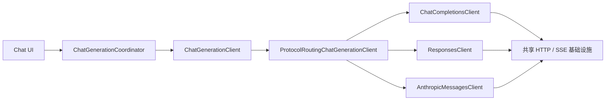

# Chat Completions、Responses 与 Anthropic 协议适配设计

## 状态

- 日期：2026-08-09
- 状态：已完成交互式设计确认，等待书面规格复核
- 适用仓库：`oh-my-llm`
- 实现阶段：尚未开始

## 1. 背景与目标

应用当前只实现 OpenAI Chat Completions 兼容请求，并通过 host 匹配和解析 Strategy 对 Google、DeepSeek 等厂商做了额外适配。随着 Responses API、Anthropic Messages API 以及未来 Agent 能力的加入，现有客户端同时承担 URL、认证、请求体、厂商差异、SSE 解码、内容解析、超时和错误处理，继续扩展会使维护成本快速上升。

本次工作的目标是：

1. 在添加或编辑服务商时显式选择 Chat Completions、Responses 或 Anthropic 协议。
2. 支持三种协议的纯文本多轮对话与本轮 reasoning 展示。
3. 允许 URL 填写域名、API 根地址或完整生成端点，并在请求时补全或替换标准后缀。
4. 将应用层聊天生成契约改为协议中立，三个协议使用独立客户端。
5. 抽取真正通用的 HTTP、SSE、超时、日志和错误基础设施。
6. 删除现有按 host 匹配的 Google、DeepSeek 请求适配和 Gemini List parts 解析。
7. 为未来独立的 Agent 模式保留清晰基础设施边界，但不实现任何 Agent 功能或占位数据结构。

## 2. 已确认的产品决策

### 2.1 普通聊天上下文

普通聊天完全由客户端维护文本上下文。每次请求重新构建当前消息树活动路径，不依赖服务端会话状态。

所有协议遵守同一 reasoning 规则：

- assistant 正文 `content` 进入后续请求。
- `reasoningContent` 只持久化用于 UI 展示，不进入后续上下文。
- 不论 reasoning 是开放文本、摘要、签名还是加密内容，都不在普通聊天中回放。
- 编辑消息形成新分支时，仍由现有消息树决定需要发送的可见文本路径。

### 2.2 Responses 状态

Responses 请求固定使用客户端无状态模式：

- `store: false`
- 不发送或保存 `previous_response_id`
- 不使用 `conversation`
- 不保存或回放 raw output item、encrypted reasoning 或 response ID
- reasoning context 固定为当前轮

这会放弃跨轮 persisted reasoning，但符合普通聊天“仅可见文本进入上下文”的统一语义。未来 Agent 模式另行设计完整 output item 回放。

### 2.3 Anthropic 缓存

Anthropic 默认启用官方自动 Prompt Cache：

```json
"cache_control": {"type": "ephemeral"}
```

客户端不计算或移动显式缓存断点，不提供 TTL 设置。缓存是否命中由 Anthropic 根据稳定请求前缀处理。

### 2.4 Anthropic System 转换

对最终的协议中立消息列表执行以下确定性转换：

1. 从索引 0 开始消费连续的 System 消息。
2. 使用单个换行符连接这些 System 内容，写入 Anthropic 顶层 `system`。
3. 从第一条非 System 消息开始，后续出现的所有 System 转为 User。
4. 相邻同角色消息由客户端合并，内容使用单个换行符连接。

### 2.5 reasoning 协议支持

- Chat Completions：发送官方 `reasoning_effort`，接收 `reasoning_content`，并保留三种内联 reasoning 标签解析。
- Responses：发送 `reasoning.effort`、`reasoning.summary: auto`、`reasoning.context: current_turn`，接收 reasoning summary/reasoning text。
- Anthropic：第一阶段只支持 adaptive thinking，不支持手动 `budget_tokens`。

## 3. 方案选择

采用“协议中立应用层 + 三个独立协议客户端”。

没有采用在现有客户端内部加入大型 `switch` 的方案，因为请求 JSON、认证、SSE 和错误格式会继续交织。也没有采用完全插件化的协议注册引擎，因为 tools、多模态和 Agent 尚未设计，当前定义通用插件协议会形成过早抽象。



三个协议客户端互不继承，只共同依赖协议中立的应用层契约和低层基础设施。

## 4. 分层与所有权

### 4.1 协议枚举

新增纯 Dart 枚举 `LlmApiProtocol`：

```text
chatCompletions
responses
anthropic
```

枚举放在 `lib/core/llm/llm_api_protocol.dart`，不导入 Flutter、Riverpod、settings 或 chat。它是服务商配置和聊天路由共同使用的最小共享类型。

### 4.2 应用层契约

将 `ChatCompletionClient` 泛化为 `ChatGenerationClient`。应用层不出现 `choices`、`input`、`thinking`、`content_block_delta` 等协议字段。

中立请求结构表达：

```text
ChatGenerationRequest
├── target
│   ├── protocol
│   ├── endpoint
│   ├── apiKey
│   └── model
├── messages
├── reasoningEffort?
└── streamIdleTimeout?
```

中立消息 `ChatRequestMessage` 只包含：

```text
role: system | user | assistant
content: String
```

中立流式结果 `ChatGenerationChunk` 包含：

```text
contentDelta
reasoningDelta
finishReason?
usage?
```

`usage` 的中立结构为：

```text
ChatGenerationUsage
├── inputTokens?
├── outputTokens?
├── reasoningTokens?
└── cachedInputTokens?
```

协议没有提供某项时保持 `null`，不以 `0` 伪装为已知值。只在响应自然携带 usage 时填充，不为了取得 usage 给兼容端点增加额外请求字段；本次不新增 usage 持久化或 UI。

`complete()` 继续由基类折叠 `streamCompletion()` 得到，保持测试 Fake 只需覆写流式方法的现有约定。第一阶段没有单独的非流式网络执行路径；Chat Completions 解析器仍接受 `delta` 或 `message` envelope，以兼容现有响应形状并复用内容提取逻辑。

### 4.3 路由器

`ProtocolRoutingChatGenerationClient` 是应用组合层绑定给 chat feature 的唯一客户端。它只根据 `request.target.protocol` 委派，不解析 JSON、不转换消息、不修改异常。

### 4.4 共享基础设施

共享层负责：

- 发起流式 POST
- 使用外部 LLM 的 `httpClientProvider`
- 取消底层请求
- 连接异常包装
- SSE 行与事件边界解码
- idle timeout
- 网络日志与敏感字段脱敏
- HTTP 状态码和原始错误体封装

共享层不读取任何具体协议 JSON 字段。局域网 peer 请求继续使用 `peerHttpClientProvider`，不得复用 LLM 请求客户端。

## 5. 服务商配置与兼容迁移

### 5.1 配置字段

`LlmProviderConfig` 新增必填 `apiProtocol`。协议属于服务商，其下全部 `LlmProviderModelConfig` 继承该协议。`resolveForProvider()` 生成 `LlmModelConfig` 时带入协议。

不把协议下放到单个模型，也不允许同一服务商内模型使用不同协议。需要不同协议时创建两个服务商配置。

服务商添加/编辑表单增加协议选择，默认 Chat Completions。服务商列表显示协议名称。修改协议立即作用于该服务商全部模型。

### 5.2 SharedPreferences 兼容

旧服务商 JSON 缺少 `apiProtocol` 时，`fromJson()` 固定回退为 `chatCompletions`。不新增 SQLite migration，也不修改聊天会话 schema。

`VersionedJsonStorage` 的全局 wrapper 版本不因单个可选字段变化而提升；实体解码器承担旧字段默认值迁移。

### 5.3 设置导出与 Sync

将 `SettingsExportData.formatVersion` 从 6 升至 7：

- 版本 6 导入时为全部服务商补 `chatCompletions`。
- 版本 7 写出 `apiProtocol`。
- 旧应用必须因不支持格式 7 而拒绝导入，不能静默把 Anthropic/Responses 配置当成 Chat Completions。
- Settings Sync snapshot 使用同一版本化 codec，相关 supported range、迁移和拒绝测试同步更新。

### 5.4 导入合并与去重

协议纳入服务商和模型的匹配条件。无相同 ID 时：

```text
服务商等价键 = apiProtocol + 规范化 API 根地址 + apiKey
服务商内模型等价键 = modelName
```

同 URL/Key 分别配置 Chat Completions 与 Responses 时，不能被合并为一个服务商。

## 6. URL 与模型列表

### 6.1 保存规则

配置中保存用户原始输入的 URL，只做首尾空白清理。实际请求时由 `LlmEndpointResolver` 解析，避免设置界面暗中重写用户配置。

只接受绝对 `http` 或 `https` URI。fragment 判为配置错误。query 保留，并在 path 解析完成后附加到最终 URI。

### 6.2 生成端点

标准后缀为：

| 协议 | 后缀 |
|---|---|
| Chat Completions | `/v1/chat/completions` |
| Responses | `/v1/responses` |
| Anthropic | `/v1/messages` |

Resolver 行为：

1. 忽略 path 末尾 `/` 进行匹配。
2. 如果已经是目标协议完整后缀，直接使用。
3. 如果末尾是另外两种已知生成后缀，替换为目标后缀。
4. 如果 path 末尾是 `/v1`，追加目标协议末段。
5. 其他情况追加完整 `/v1/...` 后缀。
6. 保留 host、port、自定义反向代理前缀和 query。

示例：

| 输入 | 协议 | 输出 |
|---|---|---|
| `https://api.openai.com` | Chat Completions | `https://api.openai.com/v1/chat/completions` |
| `https://api.openai.com/v1` | Responses | `https://api.openai.com/v1/responses` |
| `https://api.openai.com/v1/chat/completions` | Chat Completions | 原样使用 |
| `https://api.openai.com/v1/chat/completions` | Responses | `https://api.openai.com/v1/responses` |
| `https://host/proxy/openai/v1` | Responses | `https://host/proxy/openai/v1/responses` |

不为 Azure 或其他特殊路由推断 deployment、api-version 等厂商语义。用户可以通过完整 URL 和 query 表达网关要求，但本次只识别三种标准终端后缀。

### 6.3 模型列表

模型列表使用同一个 Resolver，从 API 根地址生成 `/v1/models`。完整生成端点先移除已知生成后缀，再替换为 `/models`。

- Chat Completions/Responses：`Authorization: Bearer <key>`
- Anthropic：`x-api-key: <key>` 与 `anthropic-version: 2023-06-01`

模型列表失败不修改已保存服务商，不自动切换协议或认证。

## 7. 中立消息构建

现有 `buildRequestMessages()` 的五段顺序保持不变：

1. 检查点记忆 System
2. `placement == before` 的预设消息
3. 经过 `RequestMessageFilter` 的当前对话路径
4. `placement == beforeLatestInput` 的预设消息
5. `placement == after` 的预设消息

构建器只输出 `ChatRequestMessage`，不调用任何协议转换器，也不序列化 JSON。

从 `ChatMessage` 构建 assistant 请求消息时只读取 `content`，明确忽略 `reasoningContent`。三个协议都必须通过测试证明历史请求不包含 reasoning。

## 8. 三种协议请求编码

### 8.1 Chat Completions

Header：

```text
Content-Type: application/json
Accept: text/event-stream
Authorization: Bearer <apiKey>
```

请求体：

```json
{
  "model": "model-id",
  "stream": true,
  "messages": [
    {"role": "system", "content": "..."},
    {"role": "user", "content": "..."}
  ],
  "reasoning_effort": "medium"
}
```

`reasoning_effort` 只在模型支持 reasoning 且当前会话启用时发送。

删除全部 host 匹配和厂商请求补丁，包括：

- DeepSeek/Volcengine `thinking`
- Google `extra_body.google.thinking_config`
- 跳过标准 `reasoning_effort` 的厂商分支

不发送显式 Prompt Cache 字段，使用服务端默认缓存行为。

### 8.2 Responses

Header 与 Chat Completions 相同，端点为 `/v1/responses`。

请求体：

```json
{
  "model": "model-id",
  "stream": true,
  "store": false,
  "input": [
    {"role": "system", "content": "..."},
    {"role": "user", "content": "..."}
  ],
  "reasoning": {
    "effort": "medium",
    "summary": "auto",
    "context": "current_turn"
  }
}
```

未启用 reasoning 时省略 `reasoning`。始终不发送 `previous_response_id`、`conversation` 或 encrypted reasoning include。

### 8.3 Anthropic Messages

Header：

```text
Content-Type: application/json
Accept: text/event-stream
x-api-key: <apiKey>
anthropic-version: 2023-06-01
```

完成第 2.4 节的 System 和同角色转换后编码：

```json
{
  "model": "model-id",
  "stream": true,
  "max_tokens": 8192,
  "cache_control": {"type": "ephemeral"},
  "system": "组合后的系统提示词",
  "messages": [
    {"role": "user", "content": "..."},
    {"role": "assistant", "content": "..."}
  ],
  "thinking": {
    "type": "adaptive",
    "display": "summarized"
  },
  "output_config": {"effort": "medium"}
}
```

没有 leading System 时省略顶层 `system`。第一阶段不新增输出长度设置；Anthropic 使用协议内常量 `8192`。

reasoning effort 映射：

| 应用值 | Anthropic 值 |
|---|---|
| low | low |
| medium | medium |
| high | high |
| xhigh | max |

未启用 reasoning 时省略 `thinking` 和 `output_config`，不按模型名称猜测关闭方式。

### 8.4 自定义 Header 优先级

继续使用现有 `CustomHeadersHttpClient`：用户自定义 Header 在请求发送前覆盖协议默认 Header。这样反向代理仍可覆盖 Authorization、x-api-key 或其他默认值。日志必须在脱敏后反映最终有效 Header。

## 9. SSE 与流式解析

### 9.1 通用 SSE Decoder

共享 SSE 层输出：

```text
SseEvent
├── eventName?
├── data
└── rawData
```

契约：

- 空行结束事件。
- 多个 `data:` 行以换行连接。
- `event:` 保存为事件名。
- `:` 注释行忽略。
- 未以空行结束的最后一个事件仍被消费。
- 只有 `data:` 行重置 idle timeout；注释 keepalive 不重置。
- 取消订阅立即取消底层 HTTP stream。

### 9.2 Chat Completions 解析

- `choices[0].delta.content` -> `contentDelta`
- `choices[0].delta.reasoning_content` -> `reasoningDelta`
- `choices[0].finish_reason` -> finish reason
- `[DONE]` -> 正常流结束
- `choices[0].message` 作为 `delta` 的兼容 envelope

不再接收 `reasoning` 作为 `reasoning_content` 别名，不再解析 Gemini List parts。

#### 内联 reasoning 标签

只在 Chat Completions 的 `content` 字符串中识别：

- `<thought>...</thought>`
- `<thinking>...</thinking>`
- `<think>...</think>`

规则：

- 标签名大小写不敏感。
- opening tag 允许空白和属性；closing tag 允许空白。
- 标签可横跨任意 SSE chunk。
- 标签自身不输出，内部文本进入 `reasoningDelta`。
- 同一 envelope 同时有 `reasoning_content` 和内联标签时，先追加显式 `reasoning_content`，再追加从 `content` 提取的 reasoning。
- 未闭合 opening tag 后的内容在流结束前持续视为 reasoning。
- 流末尾的不完整标签文本按当前通道原样刷新。
- 未配对的 closing tag 按普通正文处理。
- splitter 实例为单次请求所有，不跨请求共享状态。

### 9.3 Responses 解析

- `response.output_text.delta` -> `contentDelta`
- `response.reasoning_summary_text.delta` -> `reasoningDelta`
- `response.reasoning_text.delta` -> `reasoningDelta`
- `response.refusal.delta` -> 用户可见 `contentDelta`
- `response.completed` -> 正常结束
- `response.incomplete` -> 读取 `incomplete_details.reason`
- `response.failed` 或 `error` -> 请求异常

`.done` 事件只做完整性检查，不重复追加其中完整文本。

### 9.4 Anthropic 解析

- `content_block_delta` + `text_delta` -> `contentDelta`
- `content_block_delta` + `thinking_delta` -> `reasoningDelta`
- `signature_delta` -> 忽略
- `message_delta.delta.stop_reason` -> finish reason
- `message_stop` -> 正常结束
- `ping` -> 忽略；其 `data:` 行仍重置 idle timeout
- `error` -> 请求异常

普通聊天不发送 tools。若收到 `tool_use`、`server_tool_use` 或其他工具内容块，抛出明确的“不支持该响应类型”异常，不静默吞掉。

三个协议的已知生命周期/记账事件可以忽略。无法识别的新事件类型记录脱敏诊断后忽略，以允许协议增加与文本无关的事件；如果流最终没有正文或 reasoning，仍按空响应失败。事件明确声明 tool、error、failed 或 incomplete 时，不得按未知事件忽略。

## 10. Finish reason 与空响应

归一化规则：

| 协议原始值 | 应用层值 |
|---|---|
| Chat `stop` | `stop` |
| Chat `length` | `length` |
| Responses `completed` | `stop` |
| Responses `incomplete/max_output_tokens` | `length` |
| Anthropic `end_turn` / `stop_sequence` | `stop` |
| Anthropic `max_tokens` / `model_context_window_exceeded` | `length` |
| Anthropic `refusal` | `refusal` |
| 其他值 | 保留原始字符串 |

现有异常 finish reason 自动重试逻辑继续消费归一化值。HTTP、解析和协议错误不在协议客户端内部自动重试，也不删除字段后重试，更不能自动切换协议。

流完成后：

- 正文和 reasoning 都为空：抛出无有效内容异常。
- 只有 reasoning、没有正文：保留 reasoning，并沿用现有 inline 空回复卡。
- 已输出部分内容后失败：由现有 generation lifecycle 保留已生成内容并落盘错误终态。
- 用户主动 stop/cancel：不生成网络错误消息。

## 11. 错误、日志与安全

将 `ChatCompletionException` 泛化为 `ChatGenerationException`：

```text
message
protocol
uri
statusCode?
apiErrorCode?
responseBody?
cause?
causeStackTrace?
```

协议客户端负责从官方错误 envelope 中提取 message/code；共享 Transport 保留非 2xx 原始响应体和网络 cause/stack。

上层仍将错误作为 inline assistant 消息显示，禁止改为 SnackBar/Dialog。

日志要求：

- 请求正文默认关闭，不因本次重构扩大日志采集。
- API key、Authorization、Cookie 和已知敏感 Header 统一脱敏。
- 自定义 Header 使用最终实际值参与脱敏后的诊断日志。
- SSE 原始 data 可以进入现有缓冲日志，但异常中只保留诊断所需范围。
- 外部 LLM 与 peer HTTP 信任域保持隔离。

## 12. 文件组织

目标结构：

```text
lib/core/llm/
  llm_api_protocol.dart
  llm_endpoint_resolver.dart

lib/core/http/
  llm_http_stream_transport.dart
  sse_event_decoder.dart

lib/features/chat/application/ports/
  chat_generation_client.dart

lib/features/chat/data/
  protocol_routing_chat_generation_client.dart
  chat_completions/
    chat_completions_client.dart
    chat_completions_parser.dart
    inline_reasoning_tag_splitter.dart
  responses/
    responses_client.dart
    responses_parser.dart
  anthropic/
    anthropic_messages_client.dart
    anthropic_message_transformer.dart
    anthropic_parser.dart
```

具体实现可在不破坏职责边界的前提下合并过短文件，但必须维持：一个协议不能解析另一个协议的响应，通用 Transport 不能理解协议 JSON。

最终删除被替代的：

- `openai_compatible_chat_client.dart`
- `vendor_payload_adapters.dart`
- `chunk_parse_strategy.dart`
- 混合多个厂商策略的 `chat_chunk_parser.dart`

先前以 host fallback 为前提的条件性 Vendor Capability 规划不再适用于本次产品决策。未来若重新引入非标准适配，必须基于真实需求在三个官方协议客户端之外重新设计，不能恢复隐式 host 猜测。

## 13. 实现迁移顺序

1. 新增 `LlmApiProtocol`、配置字段和旧 JSON 默认值。
2. 更新设置导出格式、Sync codec、导入合并与去重测试。
3. 泛化应用层 client/request/chunk/result/exception/Provider 名称。
4. 抽取 URL Resolver、SSE Decoder 和共享 HTTP Transport。
5. 实现新 Chat Completions 客户端，先达到现有正文、reasoning、timeout、stop/cancel 行为等价。
6. 实现 Responses 客户端。
7. 实现 Anthropic transformer 和客户端。
8. 加入协议路由与服务商表单选择。
9. 使模型列表按协议选择 URL 和认证。
10. 删除旧客户端、vendor adapter 和厂商 parser Strategy。
11. 运行格式、架构门禁、静态分析和全量测试。

迁移过程中可以使用短期薄适配层保持编译，但最终提交序列结束时不能留下两套 client port 或两套 generation 状态来源。

## 14. 测试设计

### 14.1 配置与迁移

- 旧 provider JSON 缺字段时默认 Chat Completions。
- 三种协议 provider/model round-trip。
- `resolveForProvider()` 继承协议。
- 同 URL/Key、不同协议不去重。
- 设置导出 v6 -> v7 迁移。
- 未来版本拒绝。
- Settings Sync snapshot 的协议字段、supported range 和 malformed 输入。
- 添加/编辑服务商保存并显示协议。

### 14.2 URL Resolver

参数化覆盖：

- 域名
- `/v1`
- 三种完整端点
- 末尾 `/`
- 自定义反向代理前缀
- host port
- query
- 已知端点互相替换
- `/models` 推导
- 非绝对 URL
- 非 HTTP(S)
- fragment

### 14.3 请求编码

每种协议分别断言最终 URL、Header 和 JSON。这是外部协议契约测试，不属于脆弱实现细节。

重点覆盖：

- Chat `reasoning_effort` 的有/无。
- Chat 不包含 vendor patch。
- Responses 始终 `store:false`，不含服务端续接字段。
- Responses reasoning `current_turn`。
- Anthropic 自动 cache、System 转换、同角色合并、固定 max tokens。
- Anthropic adaptive effort 映射。
- 三种协议都不把历史 `reasoningContent` 编入请求。
- 用户自定义 Header 覆盖协议默认 Header。

### 14.4 SSE 与 Parser

- SSE event 被任意切分为网络 byte chunk 后仍正确恢复。
- UTF-8 跨 byte chunk。
- 多 `data:` 行、注释、ping、无尾部空行。
- 注释不重置 idle timeout，data 重置。
- 取消订阅释放底层 stream。
- 非 2xx、SSE error、malformed JSON、空响应。

Chat：

- content、`reasoning_content`、finish reason、`[DONE]`。
- `<thought>`、`<thinking>`、`<think>`。
- 大小写、属性、跨 chunk、未闭合、不完整标签、未配对 closing tag。
- `reasoning_content` 与内联标签同时出现的拼接顺序。
- List parts 和 `reasoning` 别名不再触发特殊解析。

Responses：

- output text、summary、reasoning text、refusal。
- completed、incomplete、failed、error。
- `.done` 不重复累计文本。

Anthropic：

- text、thinking、signature、ping、message stop。
- stop reason 映射。
- error event。
- 意外 tool block 明确失败。

### 14.5 应用集成

- router 按协议调用且只调用正确客户端。
- Fake 只覆写 `streamCompletion()`。
- stop/cancel/retry/finalize 继续只通过 `ChatGenerationCoordinator` / `ChatGenerationRun`。
- 三种协议产生相同的正文、reasoning 与持久化终态。
- 错误继续成为 inline assistant 消息。
- 消息树编辑、分支与 retry 只发送活动路径文本。

## 15. 验收标准

功能验收：

- 旧服务商和旧会话无需用户操作继续工作。
- 添加服务商时可以选择三种协议。
- URL 可填写域名、API 根地址或完整生成端点。
- 三种协议均可完成纯文本多轮对话。
- Chat Completions 显示 `reasoning_content` 和三种内联标签 reasoning。
- Responses 显示本轮 reasoning summary/text。
- Anthropic 显示本轮 thinking summary，并使用自动缓存。
- 普通聊天的历史请求永远不包含 reasoning。
- 代码中不存在 Google、DeepSeek 等 host 请求适配。
- 不存在新旧两套 generation 状态机或 client port。

工程门禁：

```powershell
dart format --output=none --set-exit-if-changed <本次改动的 Dart 文件>
dart run tool/check_import_boundaries.dart
flutter analyze
flutter test --reporter compact 2>&1 | Out-File -Encoding utf8 fltest.log; $E = $LASTEXITCODE; Write-Host "EXIT=$E"; Get-Content -Tail 150 fltest.log
```

全量测试只有 `EXIT=0` 才通过。失败详情从 `fltest.log` 定向查询，不以截断的终端输出判断。

## 16. 明确不在本次范围

- tools、tool result、MCP、Agent
- 图片、音频、文件等多模态
- Responses 服务端状态、response ID 和 `previous_response_id`
- reasoning/signature/encrypted output item 回放
- Anthropic 手动 `budget_tokens`
- Prompt Cache 显式断点、TTL 设置和缓存统计 UI
- 输出 token 数量设置
- 结构化输出
- 根据模型名称猜测协议能力
- 请求失败后自动切换协议或删除字段重试
- Google、DeepSeek、Volcengine、Azure 等厂商专用请求适配
- SDK 引入；继续使用原始 `package:http`

## 17. 未来 Agent 边界

当前不新增 `agentMode`、tool item、raw protocol metadata 或无消费者的扩展接口。

未来 Agent 应使用独立运行模型：

```text
普通聊天
ChatGenerationClient
ChatRequestMessage
只回放可见文本

Agent
AgentRunClient
AgentTranscriptItem
保留 reasoning、signature、tool call/result、output item
```

Agent 可以复用 URL Resolver、认证 Header 构建、HTTP Transport、SSE Decoder 和日志安全基础设施，但不能把工具循环、opaque output item 或服务端会话状态塞进普通聊天的 `ChatMessage` 和 `ChatGenerationClient`。

## 18. 官方资料依据

- OpenAI Chat Completions API：<https://developers.openai.com/api/reference/resources/chat/subresources/completions/methods/create>
- OpenAI Prompt Caching：<https://developers.openai.com/api/docs/guides/prompt-caching>
- OpenAI Responses Streaming Events：<https://platform.openai.com/docs/api-reference/responses-streaming/response/content_part>
- OpenAI Model Guidance：<https://developers.openai.com/api/docs/guides/latest-model>
- Anthropic Messages API：<https://platform.claude.com/docs/en/api/messages/create>
- Anthropic Messages 多轮语义：<https://platform.claude.com/docs/en/build-with-claude/working-with-messages>
- Anthropic Prompt Caching：<https://platform.claude.com/docs/en/build-with-claude/prompt-caching>
- Anthropic Extended Thinking：<https://platform.claude.com/docs/en/build-with-claude/extended-thinking>
- Anthropic Streaming：<https://platform.claude.com/docs/en/build-with-claude/streaming>
