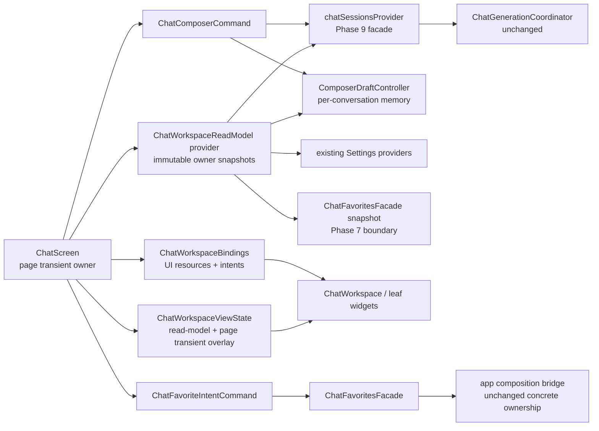

# Phase 10 - Chat Workspace 状态所有权 Implementation Plan

**Goal：** 在不改变聊天核心业务规则、Phase 7 收藏边界和 Phase 9 generation 生命周期的前提下，为 Chat workspace 的页面瞬态、会话内存态、持久态建立唯一 owner；将 `ChatScreen` 当前分散的 composer 草稿、模板、编辑快照和 20+ 参数链收敛为不可变 `ChatWorkspaceViewState` 与按职责分组的 `ChatWorkspaceBindings`，并让发送、编辑、停止、重试、收藏和撤销继续通过稳定 application command/facade 执行。

**Architecture：** `ChatConversation`/SQLite 继续拥有模型、预设 Prompt、reasoning、auto-retry、消息树和排除状态；SharedPreferences 继续拥有用户明确要求跨应用重启恢复的 composer 折叠与 sidebar UI 偏好；新的按 `conversationId` 隔离的 `ComposerDraftState` 只在 ProviderContainer 内保存正文、模板选择和模板变量草稿；焦点、滚动、`TextEditingController`、固定顺序弹窗游标及编辑事务仍由 `ChatScreen` 页面实例拥有。Chat application 提供纯不可变 workspace read-model 和 composer/favorite intent command；presentation 的 bindings 只组合 UI 资源与回调，不把 Flutter controller 塞进业务 state。Phase 9 的 `chatSessionsProvider` 仍是 generation/session command facade，Phase 7 的 `ChatFavoritesFacade` 仍是 Chat↔Favorites 唯一跨 feature mutation 边界。

**Tech Stack：** Flutter、Dart 3、Riverpod 3.4.2 `NotifierProvider`/derived `Provider`、Equatable、现有 sqlite3/SharedPreferences、现有 widget case-file decomposition。不得引入新的状态管理框架、代码生成、路由方案或持久化介质。

---

> 本 Plan 以 `Phase 10 - Chat Workspace 状态所有权.md` 为唯一完整审查输入。Phase 文档没有矛盾，因此**没有阅读完整** `architecure-review.md`；只用 `rg -n -C 18 "TD-11|TD-25"` 查看了 TD-11（约第 197 行）与 TD-25（约第 285 行）的附近证据。还只检索了 Phase 9 Implement Plan 中对公开 command 的约束，确认 `chatSessionsProvider` 必须继续作为兼容 facade，不能在本 Phase 重写 generation 状态机。
>
> 撰写时仓库现状已包含 Phase 7 的 `ChatFavoritesFacade`/composition binding 和 Phase 9 的 `ChatGenerationCoordinator`/显式 lifecycle。工作树另有一个与本 Plan 无关的未跟踪 Phase 9 文档，实施者不得修改、删除或暂存它。本 Plan 不重新实现 Phase 7/9，也不提前实施 Phase 11 ports、Phase 12 路由恢复、Phase 13 响应式断点或 Phase 15 存量测试治理。

## 一、当前事实与本 Phase 的闭环

### 1.1 已核对的现状

| 位置 | 当前事实 | 本 Phase 必须完成的闭环 |
|---|---|---|
| `chat_screen.dart` | 约 1308 行；`build` 同时 watch 会话、generation、Settings、favorites、sidebar 和 composer Provider；页面本地还持有 preset、template controllers、draft 恢复标志、编辑快照和固定顺序游标。 | `build` 只读取少量聚合 read-model，并组合页面资源/bindings；不再在 `_buildBody`/`_buildWorkspace` 逐项转发同一组值和回调。 |
| `_buildBody` / `_buildWorkspace` | 分别有约 26/23 个参数；`ChatWorkspace` 构造器又有 50+ 个 data/controller/callback 参数。 | `ChatWorkspace` 最终只有 `state`、`bindings`（及 `key`）三个构造参数；`_buildWorkspace` 删除；`_buildBody` 只接收 sidebar/history 所需少量参数和 workspace contract。 |
| preset selection | `_selectedPresetPromptId` 与 `ChatConversation.selectedPresetPromptId` 双写；`_presetPromptNeedsInit` 和 `ref.listen` 再人工同步。 | 删除本地 preset owner；SQLite-backed conversation 字段是唯一会话事实源。选择动作只写 conversation command，UI 直接从 read-model 显示。 |
| body draft | `ComposerDraftState.bodyByConversationId` 按会话保存，但 Screen 另存 `_draftConversationId`、`_restoredDraftForConversationId` 和 `_isRestoringDraft`。 | Provider state 是正文值的 owner；页面 controller 只是当前会话的可释放投影。恢复/切换通过一个明确同步入口完成，不在 `build` 内修改 controller/provider。 |
| template selection | 独立全局单值 `chatTemplatePromptSelectionProvider`；切换会话由 Screen 主动 `clear()`。 | 合并进按会话隔离的 composer draft；页面销毁/重建和 A→B→A 都能恢复各自选择，不会把 A 的选择带到首次进入的 B。删除独立单值 Provider。 |
| template variables | `ComposerDraftState` 以 `templateId::variableName` 为 key，未包含 conversation ID；同一模板在多个会话间共享值。已有 controller 若名称相同也不会在会话切换时重新赋值。 | 改为 `conversationId → templateId → variableName → value`；每次会话/模板/编辑事务切换都重新把正确值投影到 controller，并用恢复 guard 阻止回写。 |
| composer collapse | `composerCollapsedProvider` 写 `composer_isCollapsed` 到 SharedPreferences，已有跨 ProviderContainer 恢复测试。 | 明确这是“持久化 UI preference”，保留现有 key/语义；不得把它误迁成会话草稿，也不得把 `TextEditingController` 持久化。 |
| edit mode | `_editingMessageId` 和 `_ComposerSnapshot` 是本地值，但编辑时 controller listener 会覆盖正常 draft；页面销毁可能留下编辑内容、丢失编辑前快照。 | 编辑事务继续是页面瞬态；进入编辑后使用独立本地 `editingDraft`，正常 session draft 不被修改。取消、会话切换或页面销毁时丢弃编辑事务并恢复原草稿；提交成功才按明确规则更新/清理 session draft。 |
| send/edit | Screen 构造 templated content、清正文、判断 edit/send，再直接调用 controller；多处重复解析 template variables。 | `ChatComposerCommand.dispatch` 统一验证、模板拼接、draft 提交语义和 Phase 9 facade 调用；Screen 只处理 controller 清空、焦点和编辑 banner 等 UI 后续。 |
| favorite/undo | 已经通过 Phase 7 facade mutation，但 Screen 仍查找上一个 user message、构造完整 draft、区分 remove/add 并拼撤销数据。 | 新增 Chat-owned favorite intent command，复用 facade；application 构造 metadata/typed result，Screen 只展示 collection dialog 和 notification bubble。 |
| stop/retry | 已由 Phase 9 `ChatSessionsController`/coordinator 管理，但 Screen 直接散落 closure。 | 只把这些现有 command 绑定进 `ChatWorkspaceBindings`；不加第二套 generation owner、不改生命周期或兼容 state projection。 |
| scroll/focus | `ChatScrollController`、item controllers、notifiers 和 `FocusNode` 都是 UI 资源，已有 dispose。 | 保持页面 owner；只放入 presentation-only bindings 的 `scroll`/`composer` 分组，绝不进入 `ChatWorkspaceViewState` 或 Riverpod state。 |

### 1.2 状态 ownership 矩阵（实现时以此为准）

| 状态/资源 | 唯一 owner | 生命周期 | 恢复/清理契约 | 禁止做法 |
|---|---|---|---|---|
| 会话消息树、当前分支、标题、checkpoint、排除消息 | `ChatConversation` + `chatSessionsProvider` + SQLite | 跨页面、跨应用重启 | 仍由现有 repository/controller 恢复 | 不复制到 workspace/composer state；不改树算法 |
| 会话模型、preset、reasoning enabled/effort、auto-retry | `ChatConversation` + SQLite | 会话持久态 | 切换/重启读取当前 conversation | 不保留 `_selectedPresetPromptId` 等本地镜像 |
| “新会话默认模型”等最近选择 | 现有 `chatDefaultsProvider` + SharedPreferences | 应用持久态 | 保持现有 model/default 语义 | 不把“当前会话选择”和“新会话默认值”误判为同一个 owner |
| 正文草稿 | `ComposerDraftController`，按 conversation ID | ProviderContainer 内的会话态 | 页面销毁保留；A→B→A 恢复；App 重启清空；成功提交只清目标会话正文 | 不写 SQLite/SharedPreferences；不由 controller 文本充当事实源 |
| template selection | 同一 `ComposerDraftController`，按 conversation ID | ProviderContainer 内的会话态 | 页面销毁和会话往返恢复；新会话默认 null | 不保留全局单值 Provider；不在 Screen 切换时无条件清全局值 |
| template variable draft | 同一 `ComposerDraftController`，按 conversation+template+variable | ProviderContainer 内的会话态 | 同一会话恢复；不同会话隔离；模板默认值仅在没有 draft 时回退 | 不再用 `templateId::variableName` 全局 key |
| composer collapsed | `composerCollapsedProvider` + SharedPreferences | 持久化 UI preference | 保持 `composer_isCollapsed`、App 重启恢复 | 不按 conversation 拆；不把 controller 对象写入 prefs |
| sidebar function/width/expanded | 现有 `chatSidebarProvider` + SharedPreferences | 持久化 UI preference | 保持现状 | 本 Phase 不重写 sidebar controller |
| editing message ID、editing draft、pre-edit snapshot | `_ChatScreenState` | 页面瞬态 | 取消时恢复；切会话/页面销毁时丢弃；不得污染 session draft | 不写 Provider/SQLite；不在页面重建后继续显示“正在编辑” |
| 固定顺序提示词选中 sequence/step | `_ChatScreenState` | 页面实例瞬态 | 同一页面存活期保留；页面销毁重置 | 不新增持久化 key |
| message/body/template `TextEditingController`、FocusNode | `_ChatScreenState` / dialog State | 页面/弹窗资源 | 创建/监听/反监听/dispose 成对；从 owner state 投影 | 不放进 Equatable、Provider state 或 application read-model |
| item scroll controllers、anchor/show-bottom notifier | `ChatScrollController` | 页面瞬态 | 页面销毁 dispose；会话切换按已有 schedule sync | 不改为全局 Provider；不提前做路由 keep-alive |
| generation subscription、retry、cancel token | Phase 9 `ChatGenerationCoordinator` | 单次 generation | 完全沿用 Phase 9 | Workspace 不持有 subscription/completer/新布尔状态机 |
| favorites/collections | Favorites feature；Chat 只经 `ChatFavoritesFacade` snapshot/commands | 持久态 | 沿用 Phase 7 binding/repository | Chat application/presentation 不 import Favorites controller |

### 1.3 编辑事务的确定语义

编辑是最容易再次产生双 owner 的路径，必须按以下状态机实现，不允许执行者自行简化：

1. **进入编辑：** 从当前 session draft 拷贝不可变 `preEditDraft`，并把当前 composer collapsed preference 另存为 `preEditCollapsed`；根据目标 user message 的 `userMessageSegments`、`templatePromptId` 和 `templateVariableValues` 构造页面本地 `editingDraft`。不得在此时写 `ComposerDraftController`。collapsed 不属于 draft，不得为了快照方便把它加进 per-conversation `ComposerDraft`。
2. **编辑输入：** body/template/variable controller 的 listener 只更新本地 `editingDraft`；正常 session draft 保持进入编辑前的值。
3. **取消编辑：** 清除 message ID/editing draft，把 `preEditDraft` 重新投影到 controllers；Provider state 本来就未变，不执行“恢复写回”。composer collapsed 通过 `preEditCollapsed` 恢复到进入编辑前值，仍使用现有持久化 controller，因为它是显式 UI preference。
4. **编辑中切换会话：** 立即丢弃编辑事务；旧会话 session draft 保持原值；目标会话从其 session draft 恢复。不得把正在编辑的消息正文保存成旧会话或新会话普通草稿。
5. **编辑中销毁页面：** 与取消的持久结果相同：editing state 消失，session draft 未被覆盖；再次进入 ChatScreen 不显示编辑 banner。
6. **提交编辑：** `ChatComposerCommand` 使用 `editingDraft` 构造模板化消息并调用现有 `editMessage`。只有 dispatch 被接受时，session draft 才采用“保留本次 template selection/variables、正文清空”的提交后状态；页面同步退出编辑。generation 失败仍按现有 inline error/分支语义处理，不恢复输入框或发第二次请求。
7. **编辑保护：** 编辑且 composer 展开时继续禁止折叠；不得把这条 UI guard 搬入 generation coordinator。

## 二、目标 contract 与依赖方向

### 2.1 依赖图



允许的方向：

- presentation watch application read-model，read application command，并持有纯 UI controller。
- `ChatWorkspaceViewState` 可以引用 Chat/Settings domain model和不可变集合，但不得 import Flutter widgets、Favorites application/controller、SQLite 或 HTTP。
- `ChatWorkspaceBindings` 位于 presentation，可引用 `TextEditingController`、`FocusNode`、`ValueListenable`、`ItemScrollController` 及 callback typedef；它不得被任何 application/domain 文件 import。
- `ChatComposerCommand` 可以委托现有 `chatSessionsProvider`、`composerDraftProvider`、`chatDefaultsProvider`，但不得创建 completion client、repository、coordinator 或新的 generation flags。
- `ChatFavoriteIntentCommand` 只能依赖 Chat domain + `ChatFavoritesFacade`；不能 import `features/favorites/**`。

### 2.2 `ComposerDraftState` 的精确值模型

在 `composer_draft_controller.dart` 中将现有两个平行 Map 收敛为如下等价结构。名称可以在实现时轻微调整，但 key 层级、不可变性和行为不可改变：

```text
ComposerDraftState (Equatable)
  draftsByConversationId: Map<String, ComposerDraft>

ComposerDraft (Equatable)
  body: String
  selectedTemplatePromptId: String?
  templateVariableValuesByTemplateId:
    Map<String, Map<String, String>>
```

构造/copy 时必须对外层和每层嵌套 Map 做防御复制并 `Map.unmodifiable`。不得只把外层包成 unmodifiable 后继续暴露可变内层。

Controller 至少提供以下清晰 API：

```text
draftFor(conversationId) -> ComposerDraft.empty when absent
setBody(conversationId, body)
selectTemplate(conversationId, templatePromptId)
setTemplateVariable(conversationId, templateId, variableName, value)
replaceDraft(conversationId, draft)             // 仅恢复/提交事务使用
clearBody(conversationId)                        // send 后保留 template/variables
clearDraft(conversationId)                       // “新对话”显式重置使用
```

另提供只监听 template selection 的 derived family Provider；它必须用 `.select`，使每个正文字符写入不会让整个 `ChatScreen` rebuild：

```text
composerTemplateSelectionProvider(conversationId) -> String?
```

不要让 `ChatScreen` watch 完整 `ComposerDraftState` 或当前 draft body。body/variable 的实时 UI 更新由 controller 本地完成，Provider 是恢复事实源。

### 2.3 `ChatWorkspaceReadModel` / `ChatWorkspaceViewState` 的精确边界

新增 `lib/features/chat/application/chat_workspace_view_state.dart`，在同一文件定义两层不可变、Equatable 值对象，避免把页面瞬态伪装成 Provider owner：

```text
ChatWorkspaceReadModel                 // provider 产物；只含既有 owner 的快照
  messages: ChatWorkspaceMessagesState
  composer: ChatWorkspaceComposerReadModel

ChatWorkspaceViewState
  messages: ChatWorkspaceMessagesState
  composer: ChatWorkspaceComposerState

ChatWorkspaceMessagesState
  conversation
  messages                  // activeConversation 已合并 streaming reply
  userMessages
  hasModels
  isBusy
  errorMessage / errorMessageAssistantId / emptyReplyAssistantId
  errorModelDisplayName
  autoRetryCount
  favoritedAssistantContents

ChatWorkspaceComposerReadModel
  modelProviders            // only providers with selectable models
  modelConfigs              // only models for selected provider
  selectedProviderId
  selectedModel
  templatePrompts
  selectedTemplatePrompt    // normal session draft selection resolved value
  fixedPromptSequences
  isComposerCollapsed
  reasoningEnabled / reasoningEffort / supportsReasoning
  autoRetryEnabled
  isBusy / isStreaming / isAutoRetryWaiting
  excludedMessageCount

ChatWorkspaceComposerState               // effective values handed to widgets
  all fields from ChatWorkspaceComposerReadModel
  selectedTemplatePrompt                 // may be page-local editing override
  isEditingMessage                       // supplied explicitly by ChatScreen
```

`chatWorkspaceReadModelProvider` 只产出 `ChatWorkspaceReadModel`。`ChatScreen.build` 必须用一个纯 factory（例如 `ChatWorkspaceViewState.compose(readModel: ..., editingDraft: ..., isEditingMessage: ...)`）生成最终 view-state；不得让 Provider 用固定的 `isEditingMessage: false` 占位，也不得把 `_editingMessageId` 写进 application Provider。这样 DTO 可以传递页面值，但 owner 仍明确属于 Screen。

要求：

1. 列表和 Set 在构造时转为不可变集合，`props` 覆盖全部字段。
2. provider 复用当前 resolver 的 fallback 顺序：conversation model → remembered default model → first model；provider/model 过滤语义不变。
3. preset 只从 `conversation.selectedPresetPromptId` 解析，`noPresetPromptSelectedId`/null 均为未选；不得继续读取本地 preset 镜像。
4. normal template selection 从当前 conversation 的 composer draft derived Provider 解析；模板被删除或 ID 无效时 read-model 显示 null，但不得顺便修改 Settings repository。编辑时 effective selection 由 Screen 的 local `editingDraft` 覆盖，不写 normal draft。
5. `reasoningEnabled` 仍为 `supportsReasoning && conversation.reasoningEnabled`；不能改变不支持 reasoning 模型的请求语义。
6. excluded count、user messages、favorite content set 等当前 build 派生值移到 provider；消息树、搜索、标题和 request filter 规则不迁入这里。
7. read-model 不含 controller、FocusNode、BuildContext、Widget、callback、Ref、repository 或 facade 实例。
8. factory/copyWith 必须要求 Screen 显式传 `isEditingMessage`；编辑时按 `editingDraft.selectedTemplatePromptId` 在 read-model 的 template list 中解析 effective template。不要为了 edit state 创建全局 Provider。

### 2.4 `ChatWorkspaceBindings` 的精确边界

新增 `lib/features/chat/presentation/widgets/chat_workspace_bindings.dart`，按职责拆分，而不是创建一个 50 字段“参数垃圾袋”：

```text
ChatWorkspaceBindings
  messages: ChatWorkspaceMessageBindings
  composer: ChatWorkspaceComposerBindings
  scroll: ChatWorkspaceScrollBindings

ChatWorkspaceMessageBindings
  onEditMessage
  onRetryLatestAssistant
  onDeleteMessage
  onToggleRequestExclusion
  onSelectMessageVersion
  onFavoritePressed

ChatWorkspaceComposerBindings
  messageController
  messageFocusNode
  templateVariableControllers
  onProviderSelected / onModelSelected / onTemplatePromptSelected
  onToggleComposerCollapsed
  onReasoningEnabledChanged / onReasoningEffortChanged
  onAutoRetryEnabledChanged
  onOpenFixedPromptSequenceRunner / onOpenMessageFilter
  onSendPressed / onStopStreaming / onCancelEdit

ChatWorkspaceScrollBindings
  activeAnchorMessageIdListenable
  showScrollToBottomListenable
  messageItemScrollController
  messageItemPositionsListener
  onScrollToBottomPressed
  onSelectMessage
```

最终接口必须满足：

```dart
ChatWorkspace(
  state: workspaceState,
  bindings: workspaceBindings,
)
```

- `ChatWorkspace` 只做 messages panel + composer card 的布局组合。
- `ChatMessagesPanel` 和 `ChatComposerCard` 可以继续接收各自的 state/bindings 分组；不得由叶 widget watch 页面级 Provider。
- 旧 `ComposerData`/`ComposerCallbacks` 在所有调用迁移后删除；若实施中作为单个 commit 的兼容 adapter 暂留，最终不能与新 composer state/bindings 两套并存。
- bindings 每次 build 新建是允许的；它们不是 state，不要求 Equatable，也不得被持久化。

### 2.5 Composer command 的精确 API 与提交时序

新增 `lib/features/chat/application/chat_composer_command.dart`。它是现有 command 的薄编排层，不是新的 session/generation controller。

输入使用不可变 `ChatComposerSubmitIntent`，至少包含：

```text
conversationId
body
templatePrompt / resolved variable values
selectedModel
selectedPresetPrompt
editingMessageId (nullable)
```

command 自行重新读取 active conversation 和 busy projection，防止 UI disabled 状态与点击时刻之间竞态。它的同步 dispatch 结果必须区分“拒绝”与“已经启动”：

```text
ChatComposerDispatchResult (sealed)
  rejected(reason: empty | noModel | busy | staleConversation)
  accepted(completion: Future<void>, wasEdit: bool)
```

`accepted` 必须在 generation Future 完成前同步返回，以保持现有 UX：点击发送后输入框立即清空，streaming 同时开始；不能等整次 generation 结束才清输入框。推荐实现方式是完成同步校验和模板拼接后，调用现有 controller 方法取得 `Future<void>`，将该 Future 放进 accepted result。

dispatch 顺序固定如下：

1. 校验 active conversation ID、busy、selected model 和 trimmed body/template content。
2. 只调用一次 `buildTemplatedUserMessage`，只解析一次 variable values；不得在 Screen/command 分别解析造成不一致。
3. normal send 调现有 `ChatSessionsController.sendMessage`；edit 调现有 `editMessage`。参数、reasoning、preset、segments/template metadata 完全沿用当前逻辑。
4. accepted 后立即把目标 conversation draft 更新为“body 空、保留本次 selected template/variables”；rejected 不修改任何 draft/controller/edit state。
5. 返回 completion 给 Screen；Screen 立即清 controller/退出 edit，再选择性 await completion。completion error/empty/success 仍由 Phase 9 投影为 inline state。
6. 不 catch 并改成 SnackBar/Dialog；不自动重发；不持有 generation handle。

同一个 command 还可提供 composer toolbar 的明确方法：`selectProvider`、`selectModel`、`selectPreset`、`selectTemplate`、`setReasoningEnabled`、`setReasoningEffort`、`setAutoRetryEnabled`、`createConversationAndResetDraft`。这些方法只把当前 Screen 已有的两三行编排收拢：

- model：更新当前 conversation，并沿用 `chatDefaultsProvider.rememberModelId`；
- preset：只更新 conversation 的 `selectedPresetPromptId`，保持当前产品语义，不擅自新增 remember-default 行为；
- template：只更新目标 conversation 的内存 draft；
- provider：选择该 provider 的第一个有效 model，然后复用 model command；无 model 时 no-op；
- new conversation：调用现有 create command，读取调用后的 active ID，只清该 active conversation draft；无消息导致 controller 未新建会话时，仍保持当前“点击新建会清当前空输入区”的行为。

### 2.6 Favorite intent command 与撤销

新增 `lib/features/chat/application/chat_favorite_intent_command.dart`，构造时依赖 `ChatFavoritesFacade`，并由普通 Provider 从 `chatFavoritesFacadeProvider` 创建。不得新增 app composition concrete bridge。

`beginToggle(conversation, assistantMessage)` 返回 sealed result：

```text
ChatFavoriteRemoved
  removedEntry             // 已调用 facade.remove，可 restore

ChatFavoriteNeedsCollection
  draftWithoutCollection   // 完整 user/assistant/reasoning/model/source metadata
  collectionOptions
```

规则：

1. 仍以 assistant content 查找现有收藏，保持 Phase 7 既有去重/高亮行为；本 Phase 不改变 favorite identity。
2. 新收藏的 user content 算法必须原样搬迁当前行为：在 assistant 之前的消息中反向找最近一条 user；该前缀非空但没有 user 时回退前缀第一条消息；assistant 位于索引 0 或不存在时为 null，最终 content 为空字符串。这个 fallback 看似可疑但属于既有产品行为，本 Phase 不能顺便修正；如要改语义应另开缺陷。该算法从 Screen 移到 application command，并写纯单测锁定。
3. removed 分支调用 facade.remove 并返回完整 `ChatFavoriteEntry`；Screen 显示“已取消收藏”，撤销按钮调用 `restore(entry)`，其内部只执行 `facade.add(entry.draft)`。
4. addition 分支不在 showDialog 前 mutation；用户取消时不新增收藏。选择/新建 collection 后，Screen 调 `addToCollection(draft, selectedId)`；空字符串仍映射 null（未分类）。
5. `createCollection(name)` 继续委托 facade；空名称的 UI guard 保留在 dialog，command 也不能因空值创建 collection。
6. notification bubble 属 presentation，不能塞进 command；Favorites concrete controller/repository 仍只在 app composition bridge 内可见。

## 三、文件清单

### 3.1 新增生产文件

| 文件 | 责任 | 不得包含 |
|---|---|---|
| `lib/features/chat/application/chat_workspace_view_state.dart` | 不可变 messages/composer read-model、纯 resolver、derived provider | Flutter controller、Widget、BuildContext、mutation command |
| `lib/features/chat/application/chat_composer_command.dart` | composer toolbar intent、send/edit dispatch、draft commit | generation lifecycle、HTTP/repository、dialog/notification |
| `lib/features/chat/application/chat_favorite_intent_command.dart` | favorite toggle preparation/removal/restore/add metadata | Favorites concrete imports、Widget、notification bubble |
| `lib/features/chat/presentation/widgets/chat_workspace_bindings.dart` | messages/composer/scroll UI bindings | Provider watch/read、持久化、业务状态机 |

### 3.2 修改/删除生产文件

| 文件 | 修改 |
|---|---|
| `lib/features/chat/application/composer_draft_controller.dart` | 改为 per-conversation immutable aggregate；增加 derived selection family 和事务 API。 |
| `lib/features/chat/application/chat_template_prompt_selection_controller.dart` | 所有调用迁移后删除；不得保留 deprecated 双 owner。 |
| `lib/features/chat/application/composer_collapsed_controller.dart` | 仅更新 ownership doc/必要命名；保留 SharedPreferences key、存取行为和测试。 |
| `lib/features/chat/presentation/chat_screen.dart` | 删除本地 preset 镜像与 build 同步；隔离 edit draft；消费 read-model/commands；只组合 state/bindings 与 dialog/notification/page resources。 |
| `lib/features/chat/presentation/chat_scroll_controller.dart` | 原则上不改；仅在 bindings 类型需要明确 callback/暴露只读 listenable 时做最小签名调整。 |
| `lib/features/chat/presentation/widgets/chat_workspace.dart` | 构造器改为 state+bindings；按三个分组下传；删除参数爆炸。 |
| `lib/features/chat/presentation/widgets/chat_composer_card.dart` | 改收 composer state/bindings；UI/动画/文案不变。 |
| `lib/features/chat/presentation/widgets/chat_messages_panel.dart` | 改收 messages state、message+scroll bindings；缓存与消息渲染规则不变。 |
| `lib/features/chat/presentation/widgets/composer_data.dart` | 迁移完成后删除；不能继续保留第二套 data/callback contract。 |
| `lib/features/chat/presentation/widgets/widgets.dart` | export 新 bindings（仅若 Screen 通过 barrel 使用），删除旧 export。 |
| `lib/features/chat/application/chat_favorites_facade.dart` | 仅在 draft 需要 `copyWithCollectionId`/值相等时作 additive 修改；不改 provider binding 与跨 feature ownership。 |
| `lib/app/composition/cross_feature_bindings.dart` | 默认不改；仅当 additive facade signature 导致编译需要时做机械适配，不把 workspace command 绑定到 app。 |

### 3.3 测试文件

| 文件 | 计划 |
|---|---|
| `test/features/chat/application/composer_draft_controller_test.dart` | 重写为 conversation aggregate、嵌套不可变、selection derived rebuild、App-container reset tests。 |
| `test/features/chat/application/chat_template_prompt_selection_controller_test.dart` | 新 contract 覆盖后删除。 |
| `test/features/chat/application/chat_composer_command_test.dart` | 新增 dispatch reject/accept、normal/edit、draft commit、single builder call observable outcome tests。 |
| `test/features/chat/application/chat_favorite_intent_command_test.dart` | 新增 add/remove/restore/source metadata/collection mapping tests。 |
| `test/features/chat/application/chat_workspace_view_state_test.dart` | 新增 resolver/fallback/immutability/streaming projection contract tests，不断言 provider 私有调用顺序。 |
| `test/features/chat/chat_screen/chat_screen_workspace_ownership_cases.dart` | 新增页面销毁重建、A↔B 草稿、template vars、preset 单 owner、edit cancel/dispose cases。 |
| `test/features/chat/chat_screen_test.dart` | 注册新的 workspace ownership cases。 |
| `test/features/chat/chat_screen/chat_screen_test_helpers.dart` | 增加保持同一 ProviderScope 的页面 mount/unmount harness、可选 overrides；不新增 production key。 |
| 既有 basics/streaming/branching/favorites cases | 仅按 public finder/command fake 的必要变化机械适配，保留既有行为断言。 |
| `test/integration/chat_favorites_integration_test.dart` | 若当前文件存在则补/调整真实 facade bridge 的 add/remove/undo metadata；不存在时不得为了名字新建重复集成层，使用既有 Phase 7 integration 文件。 |

## 四、实施任务、红绿顺序与独立提交

每个任务都必须在完成时可编译、可运行对应测试。不要先删除旧 Provider/contract 再留待后续 task 修编译。每次提交前只格式化本次改动 Dart 文件；暂存后执行严格格式检查。

### Task 1：先冻结 ownership 行为，再收敛 composer session state

**Files：**

- Modify: `composer_draft_controller.dart` 及其 test
- Modify: `chat_screen_test_helpers.dart`, `chat_screen_test.dart`
- Add: `chat_screen_workspace_ownership_cases.dart`
- Modify/Delete later in same task: `chat_template_prompt_selection_controller.dart` 及 test
- Modify: `chat_screen.dart`（仅 draft/template/preset owner，不做 workspace 参数迁移）

- [ ] **Step 1：写会话草稿与页面生命周期红灯测试。**

  1. Controller test 创建 conv-A/conv-B，分别写 body、同一个 template ID 的同名 variable，断言互不覆盖；切回 A 读到 A 的完整 draft。
  2. 断言 selection 是 conversation-scoped：A 选择 tpl-A、B 初始 null、B 选择 tpl-B 后 A 仍为 tpl-A。
  3. 取出 state 暴露的外层/内层 Map 后尝试 mutation，预期抛 `UnsupportedError`；同时验证旧 state 未变化。
  4. 监听 `composerTemplateSelectionProvider('conv-a')`，只改 body/variable 时 selection listener 不触发；改 A selection 触发一次；改 B selection 不触发 A listener。
  5. dispose ProviderContainer 后新建 container，draft 为空，证明它不是 App 持久态。
  6. 新 widget harness 必须让 ChatScreen 被真正从树中移除再挂回，同时 ProviderScope/数据库/SharedPreferences 仍存活。输入正文、选择 template、填写 variable 后卸载/重挂，断言可见值恢复。
  7. A→B 首次切换时 B 不显示 A body/template/variable；B 输入后 B→A→B 分别恢复各自内容。通过 UI 文案、输入值和发送请求结果断言，不读取新 state 私有字段。

- [ ] **Step 2：实现不可变 per-conversation draft。**

  1. 新增 `ComposerDraft` 值对象与单一 `draftsByConversationId` Map；所有 update 都 copy-on-write，并对每层集合防御复制。
  2. 保持“相同值不发 state”优化；空 draft 是否从 Map 移除可以实现，但必须让 `draftFor` 对 absent/empty 等价且测试固定外部行为，不能让 UI依赖 Map 是否含 key。
  3. template variable 默认值不写入 Provider，直到用户实际输入或提交需要；`draftFor` 无 override 时由 presentation 使用 template 声明的 default。
  4. 增加 selection family derived Provider，正文输入不得触发 Screen rebuild。

- [ ] **Step 3：迁移 Screen 的恢复投影，消除模板双 owner。**

  1. 移除 `_draftConversationId`/`_restoredDraftForConversationId` 的分散职责，改成一个 `_applyDraftToControllers(conversationId, effectiveDraft)`；函数同时处理 body、template selection 对应的 variable controllers、selection 光标与 removed controller dispose。
  2. 为 body 和 variable controller 共用一个 `_isApplyingComposerDraft` guard；编程赋值时所有 listener 都不得写 Provider。
  3. Riverpod 3.4.2 当前源码明确 `ref.listenManual` 用于 `initState`/State lifecycle 且随 widget 自动释放。使用它监听 `activeConversationIdProvider`，`fireImmediately: true`，把首次挂载与会话切换统一为一个路径；不要继续在 build 中重复注册 `ref.listen`/post-frame 恢复。如果 controller 赋值需要等首帧，只在 listener 内调度一个带 mounted 和 conversation ID 校验的 post-frame callback。
  4. template controller 已存在时也必须按目标 draft 重新赋值，不能因 key 已存在直接 `continue`；这一步是阻止同名 template variable 跨会话泄漏的关键。
  5. 删除 `chatTemplatePromptSelectionProvider` 的所有 read/watch/clear；当前 template ID 来自 active conversation draft。
  6. 删除 `_selectedPresetPromptId`、`_presetPromptNeedsInit` 及同步 listener。`PresetPromptPanel` 的值直接使用 conversation 字段；handler 只调用 `updateActiveConversationPreferences`。选择 null 时继续写 `noPresetPromptSelectedId`，不要改变持久化表示。
  7. 新建会话、普通 send 后清理规则严格按 2.2：new intent 清整个目标 draft；send/edit accepted 只清 body并保留 template/variables。

- [ ] **Step 4：先保留编辑现状的编译兼容，不在此 task 半迁编辑。**

  如果旧 `_ComposerSnapshot` 暂时需要适配新 `ComposerDraft`，用页面私有 wrapper 继续保存 `draft + collapsed`，不得把 collapsed 加进 `ComposerDraft`；真正的 editing draft 隔离在 Task 3 一次完成。Task 1 结束时不能出现 template selection 两个 Provider，但可以暂时保留编辑期间写 session draft 的旧行为。Task 1 的测试必须全绿；Task 3 Step 1 再添加能暴露该旧行为的红灯测试，不能提前提交 failing test。

- [ ] **Step 5：运行定向测试。**

  ```powershell
  flutter test test/features/chat/application/composer_draft_controller_test.dart --reporter compact 2>&1 | Out-File -Encoding utf8 fltest-phase10-composer-state.log; $E = $LASTEXITCODE; Write-Host "EXIT=$E"; Get-Content -Tail 150 fltest-phase10-composer-state.log
  flutter test test/features/chat/chat_screen_test.dart --reporter compact 2>&1 | Out-File -Encoding utf8 fltest-phase10-screen-ownership.log; $E = $LASTEXITCODE; Write-Host "EXIT=$E"; Get-Content -Tail 150 fltest-phase10-screen-ownership.log
  ```

  两条均要求 `EXIT=0`。删除旧 selection test 前用 `rg` 证明 production/test 无调用。

- [ ] **Step 6：格式化并提交。**

  ```bash
  git add lib/features/chat/application/composer_draft_controller.dart \
          lib/features/chat/application/chat_template_prompt_selection_controller.dart \
          lib/features/chat/presentation/chat_screen.dart \
          test/features/chat/application/composer_draft_controller_test.dart \
          test/features/chat/application/chat_template_prompt_selection_controller_test.dart \
          test/features/chat/chat_screen_test.dart \
          test/features/chat/chat_screen/chat_screen_test_helpers.dart \
          test/features/chat/chat_screen/chat_screen_workspace_ownership_cases.dart
  git commit -m "refactor(chat): 明确输入草稿状态所有权"
  ```

  删除文件也用以上精确 path stage；不要 `git add docs/第一轮审查`，避免带入无关 Phase 9 文档。

### Task 2：建立不可变 workspace read-model 和 bindings，消除参数链

**Files：**

- Add: `chat_workspace_view_state.dart`, `chat_workspace_bindings.dart`
- Add: `chat_workspace_view_state_test.dart`
- Modify: `chat_screen.dart`, `chat_workspace.dart`, `chat_messages_panel.dart`, `chat_composer_card.dart`, `widgets.dart`
- Delete after migration: `composer_data.dart`
- Modify existing ChatScreen cases only as required by public constructor changes

- [ ] **Step 1：写 view-state 纯 contract 红灯测试。**

  1. model resolver 覆盖 conversation selected、remembered default、first fallback、empty 四分支；provider 没有 models 时从 selectable list 排除。
  2. preset null/sentinel/valid/missing ID 四分支；missing 只显示未选，不 mutation source。
  3. reasoning capability false 时 effective enabled false，但原 conversation flag不被改写。
  4. active messages 使用已合并 streaming conversation；userMessages 只含 user；excluded count 按当前 visible active path 计算。
  5. favorite content set、lists 都不可从外部 mutation。
  6. page edit overlay 只替换 composer selected template/`isEditingMessage`，messages state 和 base read-model 不变。

- [ ] **Step 2：实现 read-model provider。**

  1. 把当前 `ChatScreen.build` 中纯 resolver/filter/selection 代码搬入该文件，命名为可单测纯函数；Provider 只 watch 输入并调用纯函数。
  2. 对 `chatSessionsProvider` 使用已有细粒度派生 Provider/`.select`，不要重新 watch 同一全量 state 多次；active messages 仍 watch `activeChatConversationProvider` 以保留 300ms streaming UI。
  3. watch current conversation template selection derived Provider，不 watch完整 draft body。
  4. favorites 只 watch `chatFavoritesFacadeProvider.snapshot` 并投影 content set；不能 import Favorites feature。
  5. 不把 conversation summaries/sidebar state 纳入 workspace read-model；它们是 shell/side panel concern，避免制造新的 God state。

- [ ] **Step 3：引入 bindings 并迁移叶 widget。**

  1. 先让 `ChatWorkspace` 同时支持新 contract 和旧参数的兼容构造仅限本地未提交过程；提交前删除旧构造器。
  2. `ChatMessagesPanel` 从 `state.messages` 取显示值，从 `bindings.messages/scroll` 取 callbacks/controller；现有 O(n) cache、inline error、empty reply、anchor、favorite highlight 全部原样保留。
  3. `ChatComposerCard` 从 `state.composer` 取值，从 `bindings.composer` 取 controller/callback；AnimatedCrossFade、compact 680 breakpoint、按钮 disable 和快捷键行为不变。
  4. `ChatWorkspace` 构造 `ChatMessagesPanel`/`ChatComposerCard` 时不得重新拼回 40 个局部变量；直接下传对应分组。
  5. 所有 call site 迁移后删除 `ComposerData`/`ComposerCallbacks` 和 `composer_data.dart`；用 `rg` 验证零引用。

- [ ] **Step 4：收缩 ChatScreen build/body。**

  1. `build` 读取 `ChatWorkspaceReadModel`，用本地 edit state 经纯 factory 生成 effective `ChatWorkspaceViewState`，再创建一次 bindings。
  2. 删除 `_buildWorkspace`；`_buildBody` 仅保留 `sidebarState`、history summaries/active ID/draft/busy 和 `workspaceState/workspaceBindings`。若参数仍超过 8 个，增加只包含 history/sidebar 值的 `ChatScreenPanelsState`，不要把它们塞进 workspace。
  3. `_buildBody` 的 LayoutBuilder、`AppBreakpoints.compact`、padding 与 side panel show/hide 逻辑原样保留；本 Phase 不统一断点。
  4. `ChatScreen` 仍负责 AppShellScaffold、dialogs、focus/scroll、page edit state；不要为了减少行数把这些塞进 application read-model。

- [ ] **Step 5：回归 workspace/composer UI。**

  ```powershell
  flutter test test/features/chat/application/chat_workspace_view_state_test.dart --reporter compact 2>&1 | Out-File -Encoding utf8 fltest-phase10-workspace-state.log; $E = $LASTEXITCODE; Write-Host "EXIT=$E"; Get-Content -Tail 150 fltest-phase10-workspace-state.log
  flutter test test/features/chat/chat_screen_test.dart --reporter compact 2>&1 | Out-File -Encoding utf8 fltest-phase10-workspace-widget.log; $E = $LASTEXITCODE; Write-Host "EXIT=$E"; Get-Content -Tail 150 fltest-phase10-workspace-widget.log
  ```

- [ ] **Step 6：格式化并提交。**

  ```bash
  git add lib/features/chat/application/chat_workspace_view_state.dart \
          lib/features/chat/presentation/chat_screen.dart \
          lib/features/chat/presentation/widgets/chat_workspace_bindings.dart \
          lib/features/chat/presentation/widgets/chat_workspace.dart \
          lib/features/chat/presentation/widgets/chat_messages_panel.dart \
          lib/features/chat/presentation/widgets/chat_composer_card.dart \
          lib/features/chat/presentation/widgets/composer_data.dart \
          lib/features/chat/presentation/widgets/widgets.dart \
          test/features/chat/application/chat_workspace_view_state_test.dart \
          test/features/chat/chat_screen_test.dart \
          test/features/chat/chat_screen/chat_screen_basics_cases.dart \
          test/features/chat/chat_screen/chat_screen_branching_cases.dart \
          test/features/chat/chat_screen/chat_screen_favorites_cases.dart \
          test/features/chat/chat_screen/chat_screen_streaming_cases.dart \
          test/features/chat/chat_screen/chat_screen_test_helpers.dart \
          test/features/chat/chat_screen/chat_screen_workspace_ownership_cases.dart
  git commit -m "refactor(chat): 收敛工作区视图绑定"
  ```

### Task 3：把 composer 提交与编辑事务移到明确 command

**Files：**

- Add: `chat_composer_command.dart`, `chat_composer_command_test.dart`
- Modify: `chat_screen.dart`, `composer_draft_controller.dart`
- Modify: `chat_screen_workspace_ownership_cases.dart`, branching/basics cases only where behavior is covered

- [ ] **Step 1：写 command 和编辑事务红灯测试。**

  Command tests 至少逐项覆盖：

  1. empty/no model/busy/stale conversation 返回 typed rejected，request history、message tree和 draft 都不变。
  2. normal accepted 立即返回 completion，draft body 已清、template/variables 保留；completion 完成后只产生一次 user/assistant 路径和一次 client request。
  3. templated body、segments、template ID/values 与当前纯 builder 完全一致；模板值 trim/default 规则不改变。
  4. edit accepted 调现有 `editMessage` 并创建新分支；不调用 normal send；draft 提交后状态按 1.3 第 6 条。
  5. `selectProvider` 无模型 no-op，有模型选择 first；`selectModel` 同时更新 conversation 和 remembered default；`selectPreset` 不写 template/default；`selectTemplate` 只写目标 conversation draft。
  6. create command 在非空会话创建新会话并清新 draft；当前会话本来为空时不创建第二个 conversation，但清空当前 draft。

  Widget ownership cases 至少覆盖：

  1. 先输入“未发送草稿”并设置 template variables，再进入旧 user message edit；取消后完整恢复未发送草稿。
  2. 编辑中修改 body/template/variables 后切换会话，目标会话无污染；切回后恢复原未发送草稿且没有“正在编辑”banner。
  3. 编辑中卸载/re挂 ChatScreen，同上恢复普通草稿，不恢复 edit mode。
  4. 提交 edit 后生成分支行为与既有 branching tests 一致；输入区立即退出 edit、正文清空。
  5. dispatch rejected 时输入内容和 edit banner 保留，不假装发送成功。

- [ ] **Step 2：实现 command，不复制 Phase 9。**

  1. 用 sealed result 明确 accepted/rejected；accepted 包含已启动的 completion Future。
  2. 复用 `buildTemplatedUserMessage` 和 `ChatSessionsController.sendMessage/editMessage`；不得复制 request builder、tree append、retry、stop 或 persistence 代码。
  3. 任何 guard 都同时在 command 检查，不能只依赖按钮 disabled；原因只用于测试/未来 UI，当前不增加 SnackBar。
  4. composer selection/preferences 方法只委托现有 owner，保留现有异步返回；不把 `Ref` 或 provider 暴露给 presentation contract。

- [ ] **Step 3：实现本地 editing draft。**

  1. `_ComposerSnapshot` 的 draft 部分改为/复用不可变 `ComposerDraft`；另以独立 `bool _preEditCollapsed`（或包含 `draft + collapsed` 的页面私有 snapshot）保存进入编辑前的折叠偏好。增加 `_editingDraft`，并以 `editingMessageId != null` 为唯一路径开关；绝不能把 collapsed 字段加入会话级 `ComposerDraft`。
  2. 所有 body/template/variable change 经过同一个 page handler：normal 时写 `ComposerDraftController`，editing 时 `setState` 更新 `_editingDraft`；禁止 listener 同时写两边。
  3. `_applyDraftToControllers` 接受 effective draft，normal/edit 切换都走同一投影，避免手写两份 controller 赋值循环。
  4. cancel 只丢弃 local editing state并投影 pre-edit draft；conversation switch/page disposal 不需要 Provider restore write，因为 normal draft从未被覆盖。
  5. send click 构造 intent，调用 command；只有 accepted 才清 UI controller、退出 edit 并 await completion。rejected 原样保留。
  6. fixed sequence `fillComposer` 走 normal body change handler；`sendStep` 使用同一 dispatch engine 的 `ChatDirectSubmitIntent`（或等价明确类型），其 content 是步骤文本、segments/template metadata 为空，但 model/preset/reasoning 仍来自当前 workspace 快照。必须保留当前行为：若普通正文草稿 trim 后恰好等于步骤 content 才清该正文；否则步骤直接发送时原普通草稿完整保留。不要为了统一入口让 direct send 无条件消费 composer draft，也不能保留第二套 `_sendMessageContent` 请求拼装逻辑。

- [ ] **Step 4：迁移 composer toolbar callbacks。**

  `onProviderSelected`、`onModelSelected`、`onTemplatePromptSelected`、preset panel、reasoning/effort/auto-retry 和 create conversation 都改调用 command 的命名方法。Screen 可以在命令后处理 focus/scroll/controller，但不能再直接组合两个业务 Provider 写入。

- [ ] **Step 5：运行定向回归。**

  ```powershell
  flutter test test/features/chat/application/chat_composer_command_test.dart --reporter compact 2>&1 | Out-File -Encoding utf8 fltest-phase10-composer-command.log; $E = $LASTEXITCODE; Write-Host "EXIT=$E"; Get-Content -Tail 150 fltest-phase10-composer-command.log
  flutter test test/features/chat/chat_screen_test.dart --reporter compact 2>&1 | Out-File -Encoding utf8 fltest-phase10-composer-widget.log; $E = $LASTEXITCODE; Write-Host "EXIT=$E"; Get-Content -Tail 150 fltest-phase10-composer-widget.log
  flutter test test/features/chat/application/chat_sessions_controller_test.dart --reporter compact 2>&1 | Out-File -Encoding utf8 fltest-phase10-sessions-regression.log; $E = $LASTEXITCODE; Write-Host "EXIT=$E"; Get-Content -Tail 150 fltest-phase10-sessions-regression.log
  ```

- [ ] **Step 6：格式化并提交。**

  ```bash
  git add lib/features/chat/application/chat_composer_command.dart \
          lib/features/chat/application/composer_draft_controller.dart \
          lib/features/chat/presentation/chat_screen.dart \
          test/features/chat/application/chat_composer_command_test.dart \
          test/features/chat/chat_screen_test.dart \
          test/features/chat/chat_screen/chat_screen_basics_cases.dart \
          test/features/chat/chat_screen/chat_screen_branching_cases.dart \
          test/features/chat/chat_screen/chat_screen_test_helpers.dart \
          test/features/chat/chat_screen/chat_screen_workspace_ownership_cases.dart
  git commit -m "refactor(chat): 收敛输入与编辑命令"
  ```

### Task 4：迁移 favorites、stop/retry 与撤销 intent，完成 Screen 编排收缩

**Files：**

- Add: `chat_favorite_intent_command.dart`, `chat_favorite_intent_command_test.dart`
- Modify: `chat_favorites_facade.dart`, `chat_screen.dart`, workspace bindings as needed
- Modify: favorites/streaming/branching widget cases and existing Chat/Favorites integration only as needed
- `cross_feature_bindings.dart` only for additive signature compile adaptation

- [ ] **Step 1：写 favorite intent 红灯测试。**

  1. 无现有 favorite 时，command 返回 needs-collection；draft 含最近 user、assistant content/reasoning/model、assistant ID、conversation ID/title，且尚未调用 add。
  2. 参数化锁定 user metadata 的三个现有分支：前缀有 user 取最近 user；前缀非空但无 user 回退前缀第一条；assistant 为首条/不存在时为空。这里只搬迁，不重新定义 fallback。
  3. 已存在 favorite 时调用 remove 一次并返回完整 entry；restore 调 add 一次且 draft 全字段相同。
  4. addToCollection：`''` 转 null、正常 ID 原样；cancel 由 widget 不调用 add。
  5. create collection 委托一次；空 trimmed name no-op/返回明确失败，不产生空收藏夹。

- [ ] **Step 2：实现 command 并迁移 dialog/notification orchestration。**

  1. command 只 import Chat application/domain；fake facade 单测无需 Favorites feature。
  2. Screen 的 `_showAddToFavoritesDialog` 只 pattern-match typed result：removed 显示 notification+undo；needsCollection 显示 dialog，选择后 add。删除 Screen 中查 previous user 和构造 `ChatFavoriteDraft` 的代码。
  3. `AddToFavoritesDialog` 继续只接收不可变 collection options 和 `onCreateCollection`；不得 watch Favorites Provider。
  4. existing Phase 7 app bridge 仍是 concrete mutations 唯一位置；若 facade DTO 加 Equatable/copyWith，只机械适配 bridge。

- [ ] **Step 3：将 generation/message intent 只绑定到 Phase 9 facade。**

  1. `onRetryLatestAssistant`、确认后的 `onStopStreaming`、message version、request exclusion、delete 继续调用 `chatSessionsProvider.notifier` 公开 command，但统一在 `ChatWorkspaceMessageBindings`/`ComposerBindings` 构造处出现一次。
  2. Screen 可保留 stop/delete confirmation dialogs；确认是 presentation concern。网络/持久化错误仍为 inline message。
  3. 不新增 `isStopping`、subscription、retry counter、generation ID 或并行 provider；不改 Phase 9 lifecycle/state tests。
  4. favorite undo 只恢复 favorite，不和消息 generation 的“retry”混为一个 generic undo command。

- [ ] **Step 4：删除 Screen 中已失效的 resolver/handler/参数。**

  用 `rg` 逐个确认后删除：本地 model/preset/template resolver、重复 template values resolver、`_sendMessageContent`、favorite draft builder、旧 `_buildWorkspace` 及不再使用的 cross-feature imports。保留真正属于 Screen 的 dialog、scroll/focus 和 edit UI handlers。

- [ ] **Step 5：运行 intent 与集成回归。**

  ```powershell
  flutter test test/features/chat/application/chat_favorite_intent_command_test.dart --reporter compact 2>&1 | Out-File -Encoding utf8 fltest-phase10-favorite-command.log; $E = $LASTEXITCODE; Write-Host "EXIT=$E"; Get-Content -Tail 150 fltest-phase10-favorite-command.log
  flutter test test/features/chat/chat_screen_test.dart --reporter compact 2>&1 | Out-File -Encoding utf8 fltest-phase10-screen-intents.log; $E = $LASTEXITCODE; Write-Host "EXIT=$E"; Get-Content -Tail 150 fltest-phase10-screen-intents.log
  flutter test test/integration/chat_favorites_integration_test.dart --reporter compact 2>&1 | Out-File -Encoding utf8 fltest-phase10-chat-favorites-integration.log; $E = $LASTEXITCODE; Write-Host "EXIT=$E"; Get-Content -Tail 150 fltest-phase10-chat-favorites-integration.log
  ```

  若仓库实际 integration 文件名不同，先 `rg --files test/integration | rg "chat.*favorite|favorite.*chat"`，运行现有文件；不得因为命令示例路径不同复制一套测试。

- [ ] **Step 6：格式化并提交。**

  ```bash
  git add lib/features/chat/application/chat_favorite_intent_command.dart \
          lib/features/chat/application/chat_favorites_facade.dart \
          lib/features/chat/presentation/chat_screen.dart \
          lib/features/chat/presentation/widgets/chat_workspace_bindings.dart \
          lib/features/chat/presentation/widgets/dialogs/add_to_favorites_dialog.dart \
          lib/app/composition/cross_feature_bindings.dart \
          test/features/chat/application/chat_favorite_intent_command_test.dart \
          test/features/chat/chat_screen/chat_screen_favorites_cases.dart \
          test/features/chat/chat_screen/chat_screen_streaming_cases.dart \
          test/features/chat/chat_screen/chat_screen_branching_cases.dart \
          test/features/chat/chat_screen/chat_screen_workspace_ownership_cases.dart \
          test/integration/chat_favorites_integration_test.dart
  git commit -m "refactor(chat): 统一工作区业务意图"
  ```

  只 stage 实际存在且确有 diff 的路径；若 composition/dialog/integration 无改动，从命令移除，不能为了匹配清单制造空改动。

### Task 5：范围审计、格式门禁与全量验证

**Files：** 只允许修复 Task 1–4 引入的直接回归；不得借最终门禁开始后续 Phase。

- [ ] **Step 1：检查参数、双 owner 和废弃 contract 已真正消失。**

  ```powershell
  rg -n "_selectedPresetPromptId|_presetPromptNeedsInit|chatTemplatePromptSelectionProvider|_draftConversationId|_restoredDraftForConversationId|_sendMessageContent" lib/features/chat
  rg -n "ComposerData|ComposerCallbacks|composer_data.dart" lib test
  rg -n "ChatWorkspace\(" lib test
  rg -n "templateId::|readTemplateVariable\(|setTemplateVariable\(" lib/features/chat test/features/chat
  rg -n "TextEditingController|FocusNode|ItemScrollController|BuildContext|Widget" lib/features/chat/application/chat_workspace_view_state.dart lib/features/chat/application/composer_draft_controller.dart
  rg -n "features/favorites" lib/features/chat/application lib/features/chat/presentation
  ```

  预期：

  - 前两条旧 owner/contract 搜索零结果（文档引用不在此路径）。
  - `ChatWorkspace(` production call site 只有一个，构造只传 `state`/`bindings`。
  - template variable API 每次都有 conversation ID；不得保留全局 key helper。
  - application state 无 Flutter UI controller/widget 类型。
  - Chat feature 不 import Favorites concrete feature；只使用自身 facade。

- [ ] **Step 2：检查 Screen responsibility 而非只看行数。**

  手工 review `chat_screen.dart`，逐项确认：

  - build 不再解析 model/preset/template/favorites metadata；只 watch read-model、sidebar/history shell state并组合 bindings。
  - `_buildBody` 不再有 20+ 参数，`_buildWorkspace` 已删除。
  - Screen 未持有与 conversation/provider 等价的 preset/template/body事实值；本地只剩 controllers、edit transaction、fixed-sequence cursor、scroll/focus。
  - showDialog/notification/focus/scroll 仍在 presentation，没有被错误下沉 application。
  - 不设“必须降到 N 行”的机械目标；若责任已清晰，不为行数把同一大类拆成无意义 extension/mixin。

- [ ] **Step 3：执行本 Phase Dart 格式化与暂存后检查。**

  1. `git diff --name-only -- '*.dart'` 得到本 Phase 精确文件清单。
  2. 对清单执行 `dart format <files>`。
  3. 精确 `git add` 后，用暂存 Dart 清单执行：

  ```powershell
  $dartFiles = git diff --cached --name-only --diff-filter=ACMR -- '*.dart'
  if ($dartFiles) { dart format --output=none --set-exit-if-changed $dartFiles }
  ```

  非零退出不得提交；修正后重新 stage/检查。不要格式化整个 `lib/` 或用户无关 Dart 改动。

- [ ] **Step 4：运行 analyze。**

  ```powershell
  flutter analyze 2>&1 | Out-File -Encoding utf8 flanalyze-phase10.log; $E = $LASTEXITCODE; Write-Host "EXIT=$E"; Get-Content -Tail 150 flanalyze-phase10.log
  ```

  要求 `EXIT=0`、`No issues found!`。

- [ ] **Step 5：按仓库强制格式运行全量测试。**

  ```powershell
  flutter test --reporter compact 2>&1 | Out-File -Encoding utf8 fltest.log; $E = $LASTEXITCODE; Write-Host "EXIT=$E"; Get-Content -Tail 150 fltest.log
  ```

  要求 `EXIT=0` 和末尾 `All tests passed!`。失败时只从 `fltest.log` 查：

  ```powershell
  Select-String -Pattern " -[1-9]" -Path fltest.log
  Select-String -Pattern "失败测试名" -Path fltest.log -Context 0,30
  ```

  修复后先重跑失败文件，再重跑 analyze 和全量测试。禁止直接不重定向运行全量 `flutter test`，禁止用 `tee`。

- [ ] **Step 6：执行严格反范围审计。**

  ```powershell
  rg -n "ChatGenerationCoordinator|ChatGenerationPhase|StreamSubscription|Completer" lib/features/chat/presentation lib/features/chat/application/chat_composer_command.dart lib/features/chat/application/chat_workspace_view_state.dart
  rg -n "GoRoute|StatefulShellRoute|ShellRoute|AppDestination" lib/features/chat/application lib/features/chat/presentation/widgets/chat_workspace* lib/features/chat/presentation/chat_screen.dart
  rg -n "AppBreakpoints|compactComposerBreakpoint" lib/features/chat/presentation/chat_screen.dart lib/features/chat/presentation/widgets/chat_*
  rg -n "chat_completion_client|chat_conversation_repository|openai_compatible" lib/features/chat/application/chat_composer_command.dart lib/features/chat/application/chat_workspace_view_state.dart
  rg -n "CREATE TABLE|ALTER TABLE|user_version|reasoning_content|finish_reason" lib/features/chat/application lib/features/chat/presentation
  git diff --check
  git status --short
  ```

  审计解释：

  - presentation 可能因类型/doc提到 coordinator 名称而命中；任何实际 lifecycle import/字段均越界。
  - route 搜索不得出现本 Phase 新增改动；ChatScreen 原有 destination/shell import 可存在，不改全局导航。
  - breakpoint 常量可以保留原样，但 diff 不得统一/重命名阈值。
  - command/read-model 不得绕过 Phase 9 facade import data client/repository（当前 `ChatSessionsController` 自身的旧 imports 属 Phase 11，不在本 Phase处理）。
  - 不得有 schema/migration/SQL 改动。
  - status 中无关未跟踪 Phase 9 文档仍保持未触碰/未暂存。

- [ ] **Step 7：仅在必要时提交最小门禁修复。**

  只有 Step 1–6 发现本 Phase 直接回归才创建：

  ```bash
  git commit -m "fix(chat): 修复工作区所有权回归"
  ```

  `git add` 必须是导致回归的最小精确文件集；没有修复不创建空提交。

## 五、测试矩阵与可观察契约

### 5.1 Ownership/recovery

| 场景 | 可观察结果 | 测试层 |
|---|---|---|
| 同一页面正常输入 | body/variable 可见且无额外全页行为变化 | Widget |
| ChatScreen 卸载后在同 ProviderScope 重挂 | body、template、variable 恢复 | Widget |
| ProviderContainer/App 重建 | 内存 composer draft 清空 | Unit |
| A 有 draft，首次进入 B | B 空/null/default，不显示 A 值 | Widget + unit |
| A→B→A | A/B 分别恢复自己的 body/template/variables | Widget |
| preset 选择后页面重建 | 从 conversation 显示相同 preset | Widget/repository existing test |
| composer collapsed 后页面/App 重建 | 沿用 SharedPreferences 恢复 | Existing unit + widget smoke |
| fixed sequence runner 游标页面销毁 | 重置为页面初始态 | Widget（仅若可由稳定文案观察，不新增内部 key） |

### 5.2 Editing

| 场景 | 可观察结果 |
|---|---|
| 有普通 draft 时进入编辑 | 输入区显示目标 message 内容，普通 draft仍安全保存 |
| 取消编辑 | 原 body/template/variables 全恢复 |
| 编辑中切会话 | edit banner 消失，两个会话 draft 不污染 |
| 编辑中页面销毁/重建 | edit banner 不恢复，原普通 draft 恢复 |
| 编辑提交 | 现有消息树创建新分支；输入区立即退出 edit；只发一次请求 |
| edit dispatch rejected | banner和输入保留，无消息树/request 改动 |

### 5.3 Commands/intents

| Intent | 必须证明 |
|---|---|
| normal send | 模板拼接、segments、reasoning/preset 参数不变；accepted 与 completion 分离；inline terminal 语义不变 |
| fixed sequence send | 复用同一 send boundary，不产生第二套 request 拼装 |
| stop | 先确认后调用 Phase 9 stop；部分回复/取消持久化仍由现有 lifecycle 负责 |
| retry | 只调用 Phase 9 retry；仅最新 assistant 可重试规则不变 |
| favorite add | cancel 不 mutation；未分类/collection/新建 collection metadata 完整 |
| favorite remove + undo | remove 一次，undo 以原 draft 恢复；icon/snapshot随 facade 更新 |
| message exclusion/version/delete | bindings 只转发现有 command；树与 request filter 规则不变 |

### 5.4 Widget 测试约束

- 新 setup 使用 `pump()`；只有实际动画/dialog/streaming 等待才 `pumpAndSettle()`。
- 新 ownership tests 不用 production internal `find.byKey`、像素位置、`getRect`、私有 widget 属性或新 DTO 字段作契约。现有 helper 的旧 key 使用不在本 Phase 做全仓治理；新测试优先用 label/tooltip/type/用户可见文本。
- 不以 `findsNothing` on implementation widget type 证明 owner；用输入是否恢复、请求是否发出、编辑 banner/可见消息等行为证明。
- 流式测试继续使用 `FakeChatCompletionClient` queue；不加 `Future.delayed` 微时序断言。
- controller tests 测输入→state/result，不断言内部调用顺序；favorite fake 只记录跨 feature facade command。
- 不写 raw SQL 种子；使用 `pumpTestApp`、repository API 和 `TestFixtures`。

## 六、提交序列总览

| 节点 | Commit message | 可独立回滚的价值 |
|---|---|---|
| 1 | `refactor(chat): 明确输入草稿状态所有权` | composer input 成为 per-conversation 内存 state，preset/template 双 owner消失。 |
| 2 | `refactor(chat): 收敛工作区视图绑定` | workspace 获得不可变 state + UI bindings，20+ 参数链消失，行为未迁 command。 |
| 3 | `refactor(chat): 收敛输入与编辑命令` | send/edit/template toolbar 编排离开 Screen，编辑事务不再污染普通 draft。 |
| 4 | `refactor(chat): 统一工作区业务意图` | favorites/undo metadata 和 generation/message callbacks 经既有稳定 command/facade 绑定。 |
| 5（仅必要） | `fix(chat): 修复工作区所有权回归` | 只含最终门禁发现的最小回归修复。 |

每个 commit 都会触发仓库 post-commit version bump；不要手工提前改 `pubspec.yaml`。提交必须在 Bash 使用上表第一行 conventional message；提交前遵守暂存后 `dart format --output=none --set-exit-if-changed`。

## 七、验收映射

| Phase 10 验收项 | 本 Plan 的证据 |
|---|---|
| 状态 owner 可清晰说明 | 1.2 ownership 矩阵；Task 1 controller/widget tests；Screen 手工责任审计。 |
| 删除本地/Provider 双写 | preset local mirror 与 global template selection Provider 删除；edit input不再写普通 draft。 |
| 页面销毁不丢会话/持久态 | 同 ProviderScope 重挂恢复 composer session；conversation/SharedPreferences 既有持久测试。 |
| 页面销毁不错误保留瞬态 | edit mode/fixed runner/scroll/focus 不进 Provider；edit dispose case。 |
| Workspace/body 不再 20+ 参数 | `ChatWorkspace(state, bindings)`；`_buildWorkspace` 删除；参数 audit。 |
| view-state 不隐藏 UI controller | application grep + contract type review；controllers 只在 presentation bindings。 |
| composer 渐进迁移 | Task 1 state → Task 2 contract → Task 3 command，每步可运行/独立提交。 |
| favorites/send/stop/undo 走 command | composer/favorite command tests；Phase 7 facade和 Phase 9 sessions facade保持唯一 mutation/lifecycle边界。 |
| 核心 Chat 规则不变 | 既有 branching/streaming/request/checkpoint tests + 全量 `EXIT=0`。 |
| 可独立回滚 | 四个行为完整提交；无 schema/route/generation state machine混入。 |

## 八、严格 Out of Scope / 停止条件

以下任一改动出现时，执行者必须停止并把它从本 Phase diff 拆除；不能以“顺手清理”保留：

1. 修改 `ChatGenerationCoordinator`、generation phases/outcomes、retry scheduler、SSE parser、300ms flush、stop持久化或 Phase 9 tests 的产品语义。
2. 修改消息树 parent/branch/select/retry-latest 规则，Prompt 五步顺序，Reasoning/Content 分离，标题/搜索，inline error/empty reply 或 finish reason。
3. 搬迁 `ChatCompletionClient`/repository ports、修 application→data imports或增加 architecture gate；属于 Phase 11。
4. 引入 StatefulShellRoute、页面 keep-alive、route extra/ID 恢复或跨顶层导航状态；属于 Phase 12。
5. 统一 560/600/640/680/720/840 等 breakpoint、补全 viewport matrix；属于 Phase 13。
6. 全仓替换 `pumpAndSettle`、internal Key、timing tests；属于 Phase 15。只修本 Phase 新增/直接触及测试。
7. 修改 SQLite schema/migration/user_version、SharedPreferences versioned codec、background writer 或 persistence Future 语义。
8. 让 Chat import Favorites concrete controllers/repositories，或让 app composition吸收 composer内部状态。
9. 把 `TextEditingController`、FocusNode、scroll controller、BuildContext、Widget、callback 存入 Riverpod state/Equatable/SQLite/SharedPreferences。
10. 为减少 `ChatScreen` 行数一次重写全部 dialogs/sidebar/checkpoints/scroll，或创建另一个共享可变 God controller。

**完成定义：** 只有当 Task 1–4 的定向测试、`flutter analyze`、暂存格式检查和强制重定向的全量测试全部通过，旧 selection/data-clump contract 零引用，ownership/参数/依赖审计满足要求，且 diff 不含以上越界项时，Phase 10 才算完成。
