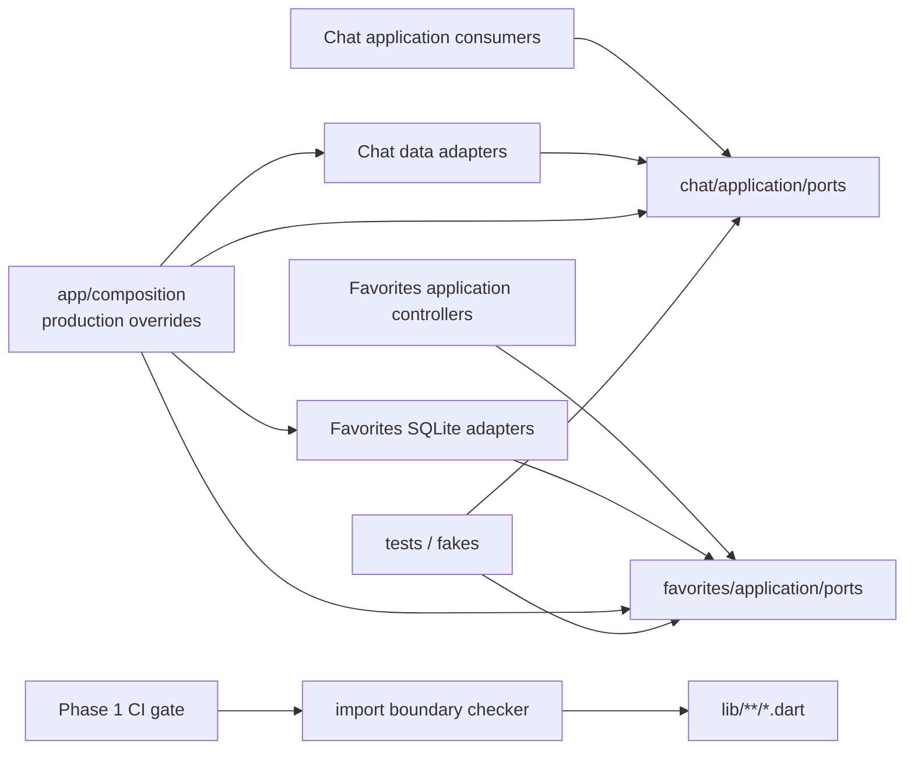

# Phase 11 - Ports 所有权与依赖门禁 Implement Plan

**Goal：** 在不改变 Chat generation、持久化、Favorites 行为和现有跨 Feature facade 的前提下，将被 application 实际消费、且本 Phase 能完整迁移的 Chat/Favorites 抽象从 `data` 移到 `application/ports`；把 provider token、具体实现和生产绑定拆开；再用一个无第三方依赖、可单测、可由 CI 独立执行的 import boundary checker 固化当前分层规则，并以精确基线冻结本 Phase 明确不搬迁的存量 application→data 边。

**Architecture：** application-owned port 文件只包含上层所需的 contract、相关 DTO/异常和一个默认失败的 Riverpod provider token；`data` 只保留 SQLite/HTTP/background 等 concrete adapter；`lib/app/composition/cross_feature_bindings.dart` 是生产环境选择 concrete implementation 的唯一位置，测试可以在组合 override 之后用 fake 覆盖。架构检查器解析 `lib/**/*.dart` 的 `import`/`export` URI，统一解析 package/relative path，执行 presentation、application、domain、core 四类高信号规则；合法 app composition 不进例外表，只有仍在本 Phase Out Of Scope 内的 8 条 Settings application→data 旧边使用精确 source→target 例外。

**Tech Stack：** Flutter、Dart 3.11.5、Riverpod 3.4.2、现有 sqlite3/http、Dart SDK `dart:io`。不新增 analyzer/custom_lint/riverpod_lint/path 等依赖，不修改状态管理、持久化 schema、网络协议或现有业务 contract。

---

> 本 Plan 以 `Phase 11 - Ports 所有权与依赖门禁.md` 为完整审查输入。Phase 文件没有内部矛盾或关键事实缺失，因此**没有读取或重新解释** `architecure-review.md`。
>
> 编写前已检查 Phase File Scope 内的当前源码、provider binding、测试 helpers、`analysis_options.yaml`、`pubspec.yaml`、`.github/workflows/ci.yml`，并检查所有 `application→data`、`presentation→data/core persistence`、`core→feature` 和 domain framework imports。当前源码已包含 Phase 4 的 durable repository 语义、Phase 5 workflow、Phase 7 facade/composition、Phase 9 generation boundary 和 Phase 10 workspace ownership；本 Plan 只消费这些既有边界，不重复实现或改写它们。

## 一、当前事实、范围判定与停止线

### 1.1 前置 Phase 已满足

| 前置依赖 | 当前源码证据 | Phase 11 使用方式 | 本 Phase 禁止事项 |
|---|---|---|---|
| Phase 4：Chat data ownership / durable completion | `BackgroundChatConversationRepository` 已实现 80ms debounce、ACK completion、`flush`/`close` contract；`ChatConversationRepository.save*` 返回 `Future<void>`。 | 原样移动 repository contract 的 ownership；adapter 和完成语义不变。 | 不改 debounce、Isolate、ACK、SQLite codec、schema 或保存时序。 |
| Phase 5：Settings workflow | Settings application 已有 workflow/controller；当前仍存在若干 Settings application→data 旧边。 | 旧边只进入精确架构基线，不在本 Phase 搬迁。 | 不重构 Settings repository/client，不新增 use case。 |
| Phase 7：cross-feature facade/composition | `ChatFavoritesFacade`、Sync ports 和 `appCompositionOverrides()` 已存在；具体跨 Feature 实现集中在 `lib/app/composition/cross_feature_bindings.dart`。 | 复用同一“unbound port + composition override”模式；不新建第二个 composition root。 | 不改 facade DTO、Favorites intent、Sync/Media 路由组合。 |
| Phase 9：generation boundary | `ChatGenerationCoordinator`、run、lifecycle、host contract 已存在。 | 只把它们使用的 completion 类型 import 改到 application port。 | 不改 generation phase/outcome、stop/retry、stream subscription 或 durable terminal 语义。 |
| Phase 10：workspace ownership | Chat workspace read-model/command/bindings 已存在，测试中广泛 fake completion/repository。 | 更新 contract/provider import，并用现有 fake override 证明可替换性。 | 不重开 workspace 状态所有权、composer/edit/favorite intent 设计。 |

### 1.2 实际 port inventory 与迁移判定

| 当前文件 | 当前混合职责 | application consumers | 本 Phase 结论 |
|---|---|---|---|
| `lib/features/chat/data/chat_completion_client.dart` | `ChatCompletionException`、`ChatCompletionClient`、chunk/result/request DTO 全在 data；生产 provider 却定义在 `openai_compatible_chat_client.dart`。 | generation coordinator/lifecycle/run、request builder、streaming mixin、sessions controller、checkpoint context；大量 application/widget/integration fake。 | **迁移完整闭环。** contract/DTO/异常/provider token 全部进入 `chat/application/ports/chat_completion_client.dart`；data concrete 和 app binding 分离。 |
| `lib/features/chat/data/chat_conversation_repository.dart` | provider、abstract interface、SQLite/background concrete imports 同文件。 | sessions controller/support、history pagination；测试 fake/controllable/flaky repository。 | **迁移完整闭环。** interface/provider token 进入 `chat/application/ports/chat_conversation_repository.dart`；两个 concrete adapter 反向实现该 port；生产 factory 进 app composition。 |
| `lib/features/favorites/data/favorites_repository.dart` | abstract interface、provider 和 SQLite factory 同文件。 | `FavoritesController`。 | **迁移完整闭环。** 这是除 Chat 外确实被上层消费的现有抽象，规模小且 binding/tests 可一次闭合；进入 `favorites/application/ports/`。 |
| `lib/features/favorites/data/collections_repository.dart` | abstract interface、provider 和 SQLite factory 同文件。 | `CollectionsController`。 | **迁移完整闭环。** 与 FavoritesRepository 同一提交完成，避免只迁一半。 |
| Settings 的 8 条 application→data import | 多数是 concrete repository、top-level `SqliteEntityRepository`、URL helper 或 concrete `ModelListClient`，不是本 Phase 已知 port 闭环。 | Settings controllers/workflow。 | **不迁移。** 写入精确基线，禁止新增同类边；后续触及时再归还 ownership。 |
| data-only strategy/adapter 抽象 | `ChunkParseStrategy`、`VendorPayloadAdapter`、`SyncSecureStore`、`ThumbnailProcessRunner` 等只在 data/composition 内协作。 | 没有 application consumer。 | **不迁移。** 它们是实现内部 seam，不因名字是 abstract 就成为 application port。 |

迁移范围不是“所有含 `Repository`/`Client`/`abstract` 的类”。执行者只能移动上表标记为“迁移完整闭环”的四个 port；发现其他 data 抽象时不得顺手搬迁。

### 1.3 当前 boundary baseline

已按源码路径与 import 目标检查，当前结果如下：

| 规则 | 当前违规数 | 计划处理 |
|---|---:|---|
| `features/*/presentation/**` → 任意 `features/*/data/**` | 0 | 直接设为零容忍规则，不建例外。 |
| `features/*/presentation/**` → `core/persistence/**` | 0 | 直接设为零容忍规则，不建例外。 |
| `core/**` → `features/**` | 0 | 直接设为零容忍规则，不建例外。 |
| 任意 `domain/**` → Flutter/Riverpod/sqlite3 | 0 | 直接设为零容忍规则，不建例外。 |
| `features/*/application/**` → 同/其他 feature `data/**` | Chat 11 条边（9 个文件）、Favorites 2 条边、Settings 8 条边 | 先删除 Chat/Favorites 边；Settings 8 条精确基线。任何新边失败。 |

`lib/app/composition/**` 导入 feature data 是合法 composition，不属于例外；`lib/bootstrap.dart` 继续只挂载 `appCompositionOverrides()`，无需直接知道 Chat/Favorites concrete 类型。

### 1.4 本 Phase 的硬停止线

实施中遇到以下情况必须停止扩张，并把越界改动移出本 Phase：

1. 需要改 Chat/Favorites 方法签名、返回值、同步/异步语义或 domain model 才能移动 port。
2. 需要改 SQLite schema、`PRAGMA user_version`、SQL、background worker、SSE parser、payload adapter 或日志脱敏。
3. 需要重写 Settings/Favorites/Chat controller、增加 use case、改状态管理或 provider 生命周期。
4. 架构规则为了通过而需要宽泛目录/通配符豁免，或需要把整层排除扫描。
5. 架构规则开始限制 Phase 未要求的 cross-feature domain/presentation 复用、application→core persistence，或开始清理存量测试风格。
6. 为架构检查引入 `custom_lint`、`riverpod_lint`、`analyzer` 直接依赖或新的代码生成。
7. 修改 Phase 12 路由恢复、Phase 13 breakpoint、Phase 14 accessibility、Phase 15 测试韧性或 Phase 17 migration ownership。

## 二、目标 ownership、binding 与依赖方向

### 2.1 最终依赖图



允许的方向：

- application consumer → 自己 feature 的 `application/ports`。
- data adapter → 自己 feature 的 `application/ports`，实现上层定义的 contract。
- app composition → application port + concrete data adapter + core provider，选择生产实现。
- test → application port；只有直接测试/构造 concrete adapter 时才同时 import data concrete。
- presentation → application/domain/presentation/shared core widget/util；不得直达 data 或 core persistence。
- domain → Dart SDK 和允许的纯 Dart值库（例如当前已有 Equatable）；不得导入 Flutter、Riverpod、sqlite3。

禁止的方向：

- application 为取得 provider token 而 import `data/openai_compatible_chat_client.dart` 或 data repository 文件。
- data port 文件自己 new concrete implementation 或 watch `AppDatabase`/HTTP/logger provider。
- bootstrap/presentation/controller 直接选择 SQLite/HTTP concrete。
- 通过 `export` data 文件绕过 import 检查。

### 2.2 Chat completion port 的精确内容

新增 `lib/features/chat/application/ports/chat_completion_client.dart`，从旧 data 文件原样迁入下列公开 API：

- `ChatCompletionException`，所有字段、`toString()` 和诊断语义不变。
- `abstract class ChatCompletionClient`，继续保留 `streamCompletion()` 抽象方法与基于 stream 的默认 `complete()` 实现。**不得**改为 `abstract interface class`，否则现有 fake 无法通过 `extends` 继承默认 `complete()`，会违反测试约定。
- `ChatCompletionChunk`、`ChatCompletionResult`、`ChatCompletionRequestMessage`，字段、默认值和 JSON 结构不变。
- `chatCompletionClientProvider`，类型仍是 `Provider<ChatCompletionClient>`，默认实现只抛带清晰文案的 `StateError`，不得 import 或构造 `OpenAiCompatibleChatClient`。

该文件只允许依赖：

- `flutter_riverpod`（provider token 位于 application port，允许）。
- Chat domain 的 `ChatMessageRole`，从 port 目录使用 `../../domain/models/chat_message.dart`。
- Settings domain 的 `LlmModelConfig`/`ReasoningEffort`（保留当前跨 Feature domain contract，不在本 Phase重构）。

### 2.3 Chat conversation repository port 的精确内容

新增 `lib/features/chat/application/ports/chat_conversation_repository.dart`：

- 原样迁入 `ChatConversationRepository` 的全部 9 个公开方法及中文 doc；不改变同步读取、异步写入、`flush`、`close` 的语义。
- 定义 `chatConversationRepositoryProvider = Provider<ChatConversationRepository>`，默认只抛 `StateError`。
- 只依赖 Riverpod 与 Chat domain 的 `ChatConversation`/`ChatConversationSummary`；port 到 domain 使用 `../../domain/...` 相对路径。
- 不允许 import `AppDatabaseProvider`、`BackgroundChatConversationRepository` 或 `SqliteChatConversationRepository`。

### 2.4 Favorites ports 的精确内容

新增：

- `lib/features/favorites/application/ports/favorites_repository.dart`
- `lib/features/favorites/application/ports/collections_repository.dart`

每个文件原样保留当前 abstract interface 的公开方法和 domain 类型，并定义同名 provider token；provider 默认抛 `StateError`。SQLite factory、`AppDatabaseProvider` 和 concrete import 全部离开 port 文件。Controller 只把原 `../data/...` import 改为 `ports/...`，不得改业务实现。

同一 feature 的固定 import 方向为：application consumer 使用 `ports/<port>.dart`；data concrete 使用 `../application/ports/<port>.dart`；port 使用 `../../domain/...`；app composition 和 tests 使用 `package:oh_my_llm/...`。不得混入跨层深相对路径或为迁移新增 barrel export。

### 2.5 Production composition 的精确绑定

修改现有 `lib/app/composition/cross_feature_bindings.dart`，在 `appCompositionOverrides()` 中加入四个 override。保留现有 `List<dynamic>` 签名和 override 顺序语义，不趁机重构整个 composition 文件。

1. `chatCompletionClientProvider.overrideWith`：
   - `httpClient` 使用 `ref.read(httpClientProvider)`，保持当前单例读取语义。
   - `logger` 使用 `ref.watch(appNetworkLoggerProvider)`。
   - `extraHeadersFactory` 闭包每次调用 `ref.read(customHeadersMapProvider)`，保持请求时读取最新 header。
   - 返回 `OpenAiCompatibleChatClient`；不改 constructor 参数、logger 或 adapter 默认值。
2. `chatConversationRepositoryProvider.overrideWith`：
   - `database = ref.watch(appDatabaseProvider)`。
   - 创建 `SqliteChatConversationRepository(database)`，再包成 `BackgroundChatConversationRepository(inner, database.path)`。
   - 不新增第二个 debounce、wrapper 或生命周期 owner。
3. `favoritesRepositoryProvider.overrideWith`：返回 `SqliteFavoritesRepository(ref.watch(appDatabaseProvider))`。
4. `collectionsRepositoryProvider.overrideWith`：返回 `SqliteCollectionsRepository(ref.watch(appDatabaseProvider))`。

四个 production override 必须位于现有 app composition 列表中，并排在测试传入的 `extraOverrides` 之前。现有 `pumpTestApp()` 已按 `...appCompositionOverrides(), ...extraOverrides` 排序，因此 fake 可以最后覆盖；不得反转这个顺序。

`lib/bootstrap.dart` 已挂载 `...appCompositionOverrides()`，所以生产启动无需新增 Chat/Favorites concrete import。实施者应检查但**不修改** bootstrap，除非实际编译证明现有挂载无法生效；不能为了“File Scope 中列了 bootstrap”制造无意义 diff。

### 2.6 迁移后的旧文件处理

所有 call site 更新后删除：

- `lib/features/chat/data/chat_completion_client.dart`
- `lib/features/chat/data/chat_conversation_repository.dart`
- `lib/features/favorites/data/favorites_repository.dart`
- `lib/features/favorites/data/collections_repository.dart`

不得保留 re-export shim。保留旧路径会让未来代码继续从 data 取 port，且会削弱 application→data 门禁。删除前必须用 `rg` 确认零 import；删除后由 analyze/architecture checker 双重保证。

## 三、可执行 import boundary 设计

### 3.1 文件结构与职责

新增：

```text
tool/
  architecture/
    import_boundary_checker.dart   # 纯 Dart 扫描、路径解析、规则和结果类型
  check_import_boundaries.dart     # CLI 入口，只负责输出与 exitCode
test/
  architecture/
    import_boundary_checker_test.dart
```

不把 checker 放进 `lib/`，避免把工程工具暴露为应用运行时代码；不把全部逻辑塞在 test 中，确保本地和 CI 能用独立命令快速失败。

### 3.2 Directive 解析与路径归一规则

`import_boundary_checker.dart` 必须实现以下确定行为：

1. 递归读取 `<repo>/lib/**/*.dart`，按规范化相对路径排序后检查，输出顺序在 Windows/Linux 一致。
2. 同时扫描 `import` 与 `export`；export 也会建立依赖，不能成为绕过手段。
3. 支持普通和 conditional directive；一个 directive 中所有 URI literal 都要检查。
4. 忽略注释中的伪 import/export；不得用会把注释示例当依赖的裸全文正则。
5. `package:oh_my_llm/foo.dart` 解析为 `lib/foo.dart`。
6. 相对 URI 按 source 所在目录解析 `.`/`..`，再转换为 `/` 分隔的仓库相对路径。
7. `dart:*` 和外部 `package:*` 保留 package identity，供 domain framework rule 判断；它们不参与内部 layer path rule。
8. 不跟随或扫描 build/generated/coverage；扫描根固定为 `lib`。
9. 缺失文件、语法错误由 `flutter analyze` 负责；checker 只判断依赖方向，不实现第二个 Dart analyzer。

建议公开最小可测 API（命名可微调，职责不可变）：

```text
ArchitecturePolicy
  legacyApplicationDataEdges: Map<ImportEdge, String>

ImportBoundaryChecker
  checkSources(Map<String, String> sources, {bool verifyAllowlistUsage})
  checkDirectory(Directory libDirectory, {bool verifyAllowlistUsage})

ArchitectureViolation
  ruleId, sourcePath, line, importUri, resolvedTarget, message
```

结果按 `sourcePath → line → ruleId → resolvedTarget` 排序。CLI 每条输出 `source:line [RULE_ID] message`，有任何 violation 或 stale allowlist 时设置 `exitCode = 1`；无问题输出检查文件数与 `0 violations`，退出 0。

### 3.3 必须实现的规则

| Rule ID | Source | 禁止 target | 例外 |
|---|---|---|---|
| `PRESENTATION_TO_DATA` | `lib/features/*/presentation/**` | `lib/features/*/data/**`，同 feature/跨 feature 都禁止 | 无 |
| `PRESENTATION_TO_CORE_PERSISTENCE` | `lib/features/*/presentation/**` | `lib/core/persistence/**` | 无 |
| `CORE_TO_FEATURE` | `lib/core/**` | `lib/features/**` | 无 |
| `DOMAIN_FRAMEWORK_DEPENDENCY` | 任意 `lib/**/domain/**` | package 名 `flutter`、`flutter_riverpod`、`riverpod`、`riverpod_annotation`、`sqlite3` | 无 |
| `APPLICATION_TO_DATA` | `lib/features/*/application/**` | `lib/features/*/data/**` | 仅 3.4 的 8 个精确 source→target pair |

规则刻意**不**做以下检查：

- 不禁止 feature presentation/application 使用其他 feature 的 application/domain；Phase 7 已通过 facade/contract 渐进治理，Phase 11 未要求全仓横向 import 清零。
- 不禁止 application 使用 `core/persistence`；当前 Settings/Chat/Sync/Media 仍有存量依赖，迁移它们属于更大 ownership 重构。
- 不禁止 domain 当前使用 `core/persistence/has_id_and_updated_at.dart`；Phase 17 才处理 schema/domain metadata ownership。
- 不扫描 test imports；测试可以直接构造 SQLite/HTTP concrete 以验证 adapter，但 production `lib` 仍受门禁。
- 不增加命名、文件行数、lint 风格或 coverage 规则。

### 3.4 Settings legacy application→data 精确基线

checker 内使用**路径对**而非目录/文件名通配符，并为每项保存非空原因。迁移 Chat/Favorites 后只允许以下 8 条：

| Source | Target | 保留原因 |
|---|---|---|
| `lib/features/settings/application/chat_defaults_controller.dart` | `lib/features/settings/data/chat_defaults_repository.dart` | 现有 concrete SharedPreferences repository；不属于本 Phase 已知 port 闭环。 |
| `lib/features/settings/application/fixed_prompt_sequences_controller.dart` | `lib/features/settings/data/fixed_prompt_sequence_repository.dart` | 现有 concrete/top-level SQLite repository；Phase 5 行为保持。 |
| `lib/features/settings/application/llm_model_configs_controller.dart` | `lib/features/settings/data/llm_model_config_repository.dart` | 现有 concrete repository；本 Phase 不迁 Settings 全组。 |
| `lib/features/settings/application/memory_prompts_controller.dart` | `lib/features/settings/data/sqlite_memory_prompt_repository.dart` | 现有 SQLite repository object；Phase 17 前不改 metadata/persistence ownership。 |
| `lib/features/settings/application/model_catalog_workflow.dart` | `lib/features/settings/data/model_list_client.dart` | 现有 concrete HTTP client；没有 application-owned port。 |
| `lib/features/settings/application/model_catalog_workflow.dart` | `lib/features/settings/data/model_list_url.dart` | data helper；不以本 Phase 为由创建无收益 port。 |
| `lib/features/settings/application/preset_prompts_controller.dart` | `lib/features/settings/data/preset_prompt_repository.dart` | 现有 concrete/top-level SQLite repository。 |
| `lib/features/settings/application/template_prompts_controller.dart` | `lib/features/settings/data/template_prompt_repository.dart` | 现有 concrete/top-level SQLite repository。 |

基线行为必须满足：

- source 和 target 必须同时精确匹配才放行；同一 source 新增另一个 data import 仍失败。
- 新增 exception 必须改 checker source、补 reason、补测试并经过 review；不得从配置文件读取任意通配符。
- real-repo scan 开启 `verifyAllowlistUsage`：例外若已不再出现，报告 `STALE_ALLOWANCE` 并失败，迫使删除已还清债务的豁免。
- fixture unit tests 默认使用空/自定义 policy，不因仓库 8 条例外而要求每个小 fixture 伪造全部 import。

### 3.5 Architecture test matrix

`test/architecture/import_boundary_checker_test.dart` 至少包含以下行为测试；使用内存 source map 或临时目录均可，但不得依赖当前机器绝对路径：

| Case | 输入 | 期望 |
|---|---|---|
| legal same-feature layering | presentation import application/domain；data import application port | 0 violation |
| legal composition | `lib/app/composition/*.dart` import port + data concrete | 0 violation，无需 allowlist |
| legal pure domain | domain import `dart:*` 与 `package:equatable/equatable.dart` | 0 violation |
| illegal presentation→data | 分别用 package URI 与 relative URI | `PRESENTATION_TO_DATA`，路径解析一致 |
| illegal presentation→persistence | presentation import `core/persistence/app_database.dart` | `PRESENTATION_TO_CORE_PERSISTENCE` |
| illegal core→feature | core import feature application/domain 任一文件 | `CORE_TO_FEATURE` |
| illegal domain frameworks | 参数化 `flutter`、`flutter_riverpod`、`riverpod`、`riverpod_annotation`、`sqlite3` | 每项 `DOMAIN_FRAMEWORK_DEPENDENCY` |
| illegal application→data | 非 allowlist 的 package/relative import | `APPLICATION_TO_DATA` |
| legacy exact allow | 3.4 中一个精确 pair | 0 violation |
| no wildcard leak | allowlisted source import另一个 data target | 仍为 `APPLICATION_TO_DATA` |
| stale allow | policy 有 pair 但 sources 不再出现 | `STALE_ALLOWANCE` |
| export bypass | 将非法 `import` 换为 `export` | 同一规则仍失败 |
| comments/conditional | 注释中的伪 import 忽略；conditional URI 每个检查 | 无假阳性且非法分支不漏检 |
| deterministic output | 输入 map/文件顺序打乱 | violations 排序完全一致 |
| current repository | 扫描真实 `lib`，启用标准 policy 与 stale 检查 | 0 violation、8 个例外均被消费 |

测试只断言公开结果（rule/path/line/数量），不依赖 checker 私有 regex 或内部方法。

## 四、文件修改清单

### 4.1 新增

| 文件 | 内容 |
|---|---|
| `lib/features/chat/application/ports/chat_completion_client.dart` | Completion contract、DTO/异常、unbound provider token。 |
| `lib/features/chat/application/ports/chat_conversation_repository.dart` | Conversation repository contract、unbound provider token。 |
| `lib/features/favorites/application/ports/favorites_repository.dart` | Favorites repository contract、unbound provider token。 |
| `lib/features/favorites/application/ports/collections_repository.dart` | Collections repository contract、unbound provider token。 |
| `tool/architecture/import_boundary_checker.dart` | 纯 Dart directive scanner、规则、allowlist、结果。 |
| `tool/check_import_boundaries.dart` | 仓库根 CLI。 |
| `test/architecture/import_boundary_checker_test.dart` | 合法/非法 fixture、allowlist、真实仓库扫描。 |

### 4.2 删除（仅在零引用后）

- `lib/features/chat/data/chat_completion_client.dart`
- `lib/features/chat/data/chat_conversation_repository.dart`
- `lib/features/favorites/data/favorites_repository.dart`
- `lib/features/favorites/data/collections_repository.dart`

### 4.3 修改 production source

**Chat application imports：**

- `lib/features/chat/application/chat_generation_coordinator.dart`
- `lib/features/chat/application/chat_generation_lifecycle.dart`
- `lib/features/chat/application/chat_generation_run.dart`
- `lib/features/chat/application/chat_request_message_builder.dart`
- `lib/features/chat/application/chat_sessions_controller.dart`
- `lib/features/chat/application/chat_sessions_controller_streaming.dart`
- `lib/features/chat/application/chat_sessions_controller_support.dart`
- `lib/features/chat/application/checkpoint_request_context.dart`
- `lib/features/chat/application/history_pagination_controller.dart`

这些文件只改到 `application/ports/...` 的 import。`chat_sessions_controller.dart` 还要删除为了 provider token 而存在的 `../data/openai_compatible_chat_client.dart` import；不得改 controller body。

**Chat data imports/provider factory：**

- `lib/features/chat/data/openai_compatible_chat_client.dart`：改为实现 application port；删除 Riverpod、HTTP/logger/header provider imports 和文件顶部 `chatCompletionClientProvider` factory；保留 concrete client 全部行为。
- `lib/features/chat/data/chat_chunk_parser.dart`：chunk/exception 类型改从 application port 导入。
- `lib/features/chat/data/sqlite_chat_conversation_repository.dart`：实现 application repository port。
- `lib/features/chat/data/background_chat_repository.dart`：实现 application repository port；doc link 更新到新 contract，行为不变。

**Favorites：**

- `lib/features/favorites/application/favorites_controller.dart`
- `lib/features/favorites/application/collections_controller.dart`
- `lib/features/favorites/data/sqlite_favorites_repository.dart`
- `lib/features/favorites/data/sqlite_collections_repository.dart`

只改 import；controllers/SQL/method bodies 不变。

**Composition/CI：**

- `lib/app/composition/cross_feature_bindings.dart`：增加四个 production override 及所需 core/port/concrete imports。
- `.github/workflows/ci.yml`：format scope 加 `tool`；增加独立 architecture boundary step；后续 step 编号/注释顺延。

### 4.4 修改 tests/helpers 的规则

以下不是业务测试重写，只做 contract 路径迁移和必要的显式 binding：

1. 凡只使用 `ChatCompletionClient`、chunk/result/request/exception 或 provider token 的测试，import 改为 `features/chat/application/ports/chat_completion_client.dart`。
2. 凡只使用 `ChatConversationRepository` 或 provider token 的测试，import 改为 `features/chat/application/ports/chat_conversation_repository.dart`。
3. 只有直接 `OpenAiCompatibleChatClient(...)` 的测试/helper 保留 data concrete import；只有直接 `Sqlite*Repository(...)` 的测试/helper 保留 data concrete import。
4. `test/helpers/fake_chat_completion_client.dart` 必须继续 `extends ChatCompletionClient` 且只 override `streamCompletion()`；不为迁移重写 fake。
5. `test/helpers/integration_test_helpers.dart` 与 `ControllerTestHarness` 当前依赖 repository 的 data-owned默认 binding。迁移后在标准 composition overrides 之后放 fake completion override，或显式绑定 repository；优先复用 `appCompositionOverrides(useInMemorySyncSecureStore: true)`，不得在多个 helper 复制生产 factory。
6. `test/features/favorites/application/favorites_controller_test.dart` 不加载整套 app composition；直接用两个 application port provider override 注入当前 SQLite repositories，保持 controller test 聚焦。
7. 现有 `pumpTestApp()`、`test/widget_test.dart` 已使用 `appCompositionOverrides()`，无需新增重复 binding；只修编译所需 import。
8. `test/integration/bootstrap_integration_test.dart` 在现有“ProviderScope override 正确注入”用例中增加四个 production binding 断言：completion 为 `OpenAiCompatibleChatClient`、conversation 为 `BackgroundChatConversationRepository`、favorites/collections 为对应 SQLite concrete。这里的具体类型断言是 composition contract，不推广到 controller/widget tests。

### 4.5 受 Chat port import 影响的测试文件清单

执行者先用 `rg -l` 重新生成清单；当前至少包括：

- `test/helpers/fake_chat_completion_client.dart`
- `test/helpers/controllable_chat_conversation_repository.dart`
- `test/helpers/flaky_chat_conversation_repository.dart`
- `test/helpers/fake_history_repository.dart`
- `test/helpers/fixtures.dart`
- `test/helpers/integration_test_helpers.dart`
- `test/features/chat/application/chat_composer_command_test.dart`
- `test/features/chat/application/chat_generation_coordinator_test.dart`
- `test/features/chat/application/chat_generation_lifecycle_test.dart`
- `test/features/chat/application/chat_generation_race_contract_test.dart`
- `test/features/chat/application/chat_generation_run_test.dart`
- `test/features/chat/application/chat_sessions_controller_persistence_test.dart`
- `test/features/chat/application/chat_workspace_view_state_test.dart`
- `test/features/chat/application/history_pagination_controller_test.dart`
- `test/features/chat/application/chat_sessions_controller/chat_sessions_controller_branching_cases.dart`
- `test/features/chat/application/chat_sessions_controller/chat_sessions_controller_checkpoint_cases.dart`
- `test/features/chat/application/chat_sessions_controller/chat_sessions_controller_crud_cases.dart`
- `test/features/chat/application/chat_sessions_controller/chat_sessions_controller_generation_cases.dart`
- `test/features/chat/application/chat_sessions_controller/chat_sessions_controller_retry_cases.dart`
- `test/features/chat/application/chat_sessions_controller/chat_sessions_controller_stop_cases.dart`
- `test/features/chat/application/chat_sessions_controller/chat_sessions_controller_test_helpers.dart`
- `test/features/chat/chat_screen/chat_screen_branching_cases.dart`
- `test/features/chat/chat_screen/chat_screen_streaming_cases.dart`
- `test/features/chat/chat_screen/chat_screen_test_helpers.dart`
- `test/features/chat/data/chat_chunk_parser_test.dart`
- `test/features/chat/data/openai_compatible_chat_client_test.dart`
- `test/features/history/history_screen/history_screen_pagination_bar_cases.dart`
- `test/integration/chat_lifecycle_integration_test.dart`
- `test/integration/chat_multi_conversation_integration_test.dart`
- `test/integration/preset_prompt_request_integration_test.dart`
- `test/integration/chat_favorites_integration_test.dart`
- `test/integration/vendor_payload_integration_test.dart`

部分文件同时保留 concrete import；判断标准是使用符号，不按目录机械替换。

### 4.6 受 Favorites port import 影响的测试文件

- `test/features/favorites/application/favorites_controller_test.dart`
- `test/integration/chat_favorites_integration_test.dart`
- `test/integration/collections_cascade_integration_test.dart`

Favorites data repository tests和 screen seed helpers若只直接构造 `Sqlite*Repository`，继续只 import concrete 文件，不需要为了 interface 添加 port import。

### 4.7 明确保持不变

- `analysis_options.yaml`：当前 `flutter_lints` 保留；没有能精确表达本 Phase boundary 的内建 lint，不开启低信号规则。
- `pubspec.yaml`/`pubspec.lock`：checker 只用 Dart SDK，不新增依赖。
- `lib/bootstrap.dart`：现有 composition 挂载已足够。
- Chat generation、message tree、request builder 逻辑、SSE/payload adapter、SQLite/worker 文件内容（除 port import）。
- Favorites/Collections controller 行为、SQL 与跨 Feature facade DTO。
- `dart_test.yaml`、coverage 脚本、版本 hook。
- Phase 文档原文与 Architecture Review Report。

## 五、实施顺序与独立提交

### Task 1：迁移 Chat completion/conversation ports，并建立 production binding

**Commit：** `refactor(chat): 将聊天端口归属 application`

**Files：** 2 个新 Chat port；4 个旧 Chat data port/concrete 相关文件中的 2 个删除、4 个改 import/factory；9 个 Chat application consumer；app composition；4 个 shared test helper；4 类 Chat/History/Integration tests；bootstrap integration binding 断言。

- [ ] **Step 1：建立迁移前符号/引用快照。**

  ```powershell
  rg -n "chat_completion_client\.dart|chat_conversation_repository\.dart|chatCompletionClientProvider|chatConversationRepositoryProvider|ChatCompletionClient|ChatConversationRepository" lib test
  ```

  把输出按 contract、provider、concrete 三类核对。不得遗漏通过 `openai_compatible_chat_client.dart` 间接取得 provider token 的文件。

- [ ] **Step 2：先添加 application port 文件和 composition contract 测试改动。**

  1. 复制公开 contract/DTO/doc，不改 API。
  2. 添加默认失败 provider token。
  3. 更新 `bootstrap_integration_test.dart` 的 imports/断言，使未完成 binding 时测试先编译失败或运行失败，形成明确红灯。
  4. 不删除旧 data 文件，直到所有 production/test call site 已指向新 port。

- [ ] **Step 3：迁移 application consumers。**

  1. 同 feature import 使用 `ports/...`。
  2. `chat_sessions_controller.dart` 删除 `openai_compatible_chat_client.dart` import，provider token 来自 port。
  3. 对 generation/run/lifecycle/request builder 文件逐一检查 diff：只允许 import 与因 import 排序产生的格式变化。
  4. 禁止改方法签名、状态字段、switch 分支、错误字符串或 timeout。

- [ ] **Step 4：迁移 data adapters，移出 concrete factory。**

  1. `OpenAiCompatibleChatClient` 改实现新 port，移除文件顶部 provider 和只为 factory 使用的 Riverpod/core provider imports。
  2. parser 改 chunk/exception import。
  3. SQLite/background repositories 改实现新 repository port。
  4. 在 `appCompositionOverrides()` 增加两个 Chat override，逐项保持 2.5 的 read/watch/factory 语义。

- [ ] **Step 5：迁移 tests/helpers，显式处理默认 binding 消失。**

  1. contract/fake imports 指向 application ports。
  2. `ControllerTestHarness` 和 `createTestContainer` 使用标准 app composition，再让 fake completion override 位于列表最后；已有显式 fake repository 的测试继续显式 override。
  3. History fake 与 pagination cases 只导入 repository port。
  4. data tests若直接构造 OpenAI/SQLite concrete，保留 data import并另加 port import（仅在使用 DTO/provider 时）。
  5. 不修改现有测试断言、时序、case-file decomposition 或 fake 行为。

- [ ] **Step 6：确认零旧引用后删除两个 data port 文件。**

  ```powershell
  rg -n 'data/(chat_completion_client|chat_conversation_repository)\.dart' lib test
  rg -n '^import .(chat_completion_client|chat_conversation_repository)\.dart.;' lib/features
  ```

  删除前预期只剩待删文件自身；删除后两条都必须零结果。若仍有引用，先分类修正，不能保留 re-export。新 `application/ports` 文件名相同，但不含 `data/` 且不会被第二条“同目录裸文件 import”命中。

- [ ] **Step 7：运行 Chat 定向回归。** 每条命令都必须使用仓库要求的重定向模式。

  ```powershell
  flutter test test/features/chat/application --reporter compact 2>&1 | Out-File -Encoding utf8 fltest-phase11-chat-application.log; $E = $LASTEXITCODE; Write-Host "EXIT=$E"; Get-Content -Tail 150 fltest-phase11-chat-application.log
  flutter test test/features/chat/data --reporter compact 2>&1 | Out-File -Encoding utf8 fltest-phase11-chat-data.log; $E = $LASTEXITCODE; Write-Host "EXIT=$E"; Get-Content -Tail 150 fltest-phase11-chat-data.log
  flutter test test/features/chat/chat_screen_test.dart --reporter compact 2>&1 | Out-File -Encoding utf8 fltest-phase11-chat-screen.log; $E = $LASTEXITCODE; Write-Host "EXIT=$E"; Get-Content -Tail 150 fltest-phase11-chat-screen.log
  flutter test test/features/history/history_screen_test.dart --reporter compact 2>&1 | Out-File -Encoding utf8 fltest-phase11-history.log; $E = $LASTEXITCODE; Write-Host "EXIT=$E"; Get-Content -Tail 150 fltest-phase11-history.log
  flutter test test/integration/chat_lifecycle_integration_test.dart test/integration/chat_multi_conversation_integration_test.dart test/integration/preset_prompt_request_integration_test.dart test/integration/vendor_payload_integration_test.dart --reporter compact 2>&1 | Out-File -Encoding utf8 fltest-phase11-chat-integration.log; $E = $LASTEXITCODE; Write-Host "EXIT=$E"; Get-Content -Tail 150 fltest-phase11-chat-integration.log
  flutter test test/integration/bootstrap_integration_test.dart --reporter compact 2>&1 | Out-File -Encoding utf8 fltest-phase11-bootstrap.log; $E = $LASTEXITCODE; Write-Host "EXIT=$E"; Get-Content -Tail 150 fltest-phase11-bootstrap.log
  ```

  每条均要求 `EXIT=0`。若 Flutter test 当前版本不接受多个文件参数，把 integration 命令拆成四条同格式命令，不改变测试集。

- [ ] **Step 8：格式化、检查并提交。**

  对本 Task 所有 Dart diff 执行 `dart format`，暂存后执行仓库规定的 `dart format --output=none --set-exit-if-changed`。确认 staged diff 没有 Favorites port或架构 checker 后提交。

### Task 2：迁移 Favorites/Collections repository ports

**Commit：** `refactor(favorites): 将收藏仓库端口归属 application`

**Files：** 2 个新 Favorites port、2 个旧 data port 删除、2 个 controller、2 个 SQLite adapter、app composition、Favorites controller test、2 个 integration tests、bootstrap integration binding 断言。

- [ ] **Step 1：新增两个 application port 与默认失败 provider。**

  保持接口方法、参数和同步语义不变；不要把 Phase 7 的 `ChatFavoritesFacade` 合并进 repository port。Facade 是跨 Feature intent，repository 是 Favorites 内部持久化 port，二者职责不同。

- [ ] **Step 2：更新 controller 与 SQLite adapter imports。**

  Controllers 改为依赖 `application/ports`；SQLite repositories 反向实现 port。除 import 外零业务 diff。

- [ ] **Step 3：把两个 SQLite factory 放入 app composition。**

  与 Chat overrides 同处 `appCompositionOverrides()`。`ChatFavoritesFacade` composition override继续 watch `favoritesProvider`/`collectionsProvider`，不直接读 repository。

- [ ] **Step 4：更新测试 binding。**

  1. `favorites_controller_test.dart` 显式 override 两个 port provider为当前 in-memory SQLite concrete。
  2. `chat_favorites_integration_test.dart`、`collections_cascade_integration_test.dart` 的 provider imports 指向 application ports，concrete imports保持 data 路径。
  3. bootstrap integration 增加/完成两个 concrete 类型断言。

- [ ] **Step 5：零引用后删除旧 data port 文件。**

  ```powershell
  rg -n "features/favorites/data/(favorites_repository|collections_repository)\.dart|\.\./data/(favorites_repository|collections_repository)\.dart" lib test
  ```

  预期零结果；不留 re-export。

- [ ] **Step 6：运行 Favorites 与跨 Feature 回归。**

  ```powershell
  flutter test test/features/favorites/application/favorites_controller_test.dart --reporter compact 2>&1 | Out-File -Encoding utf8 fltest-phase11-favorites-application.log; $E = $LASTEXITCODE; Write-Host "EXIT=$E"; Get-Content -Tail 150 fltest-phase11-favorites-application.log
  flutter test test/features/favorites/data --reporter compact 2>&1 | Out-File -Encoding utf8 fltest-phase11-favorites-data.log; $E = $LASTEXITCODE; Write-Host "EXIT=$E"; Get-Content -Tail 150 fltest-phase11-favorites-data.log
  flutter test test/features/favorites/favorites_screen_test.dart --reporter compact 2>&1 | Out-File -Encoding utf8 fltest-phase11-favorites-screen.log; $E = $LASTEXITCODE; Write-Host "EXIT=$E"; Get-Content -Tail 150 fltest-phase11-favorites-screen.log
  flutter test test/integration/chat_favorites_integration_test.dart --reporter compact 2>&1 | Out-File -Encoding utf8 fltest-phase11-chat-favorites.log; $E = $LASTEXITCODE; Write-Host "EXIT=$E"; Get-Content -Tail 150 fltest-phase11-chat-favorites.log
  flutter test test/integration/collections_cascade_integration_test.dart --reporter compact 2>&1 | Out-File -Encoding utf8 fltest-phase11-collections-cascade.log; $E = $LASTEXITCODE; Write-Host "EXIT=$E"; Get-Content -Tail 150 fltest-phase11-collections-cascade.log
  flutter test test/integration/bootstrap_integration_test.dart --reporter compact 2>&1 | Out-File -Encoding utf8 fltest-phase11-bootstrap-favorites.log; $E = $LASTEXITCODE; Write-Host "EXIT=$E"; Get-Content -Tail 150 fltest-phase11-bootstrap-favorites.log
  ```

- [ ] **Step 7：格式化并提交。**

  暂存只包含 Task 2；不得将 architecture tooling 提前混入该提交。

### Task 3：实现并验证 import boundary checker

**Commit：** `test(architecture): 增加依赖边界检查器`

**Files：** `tool/architecture/import_boundary_checker.dart`、`tool/check_import_boundaries.dart`、`test/architecture/import_boundary_checker_test.dart`。

- [ ] **Step 1：先写 fixture tests。**

  按 3.5 建立 legal/illegal/allowlist/conditional/export/deterministic cases。此时 checker 文件可以只有 API 骨架，测试应明确失败；不要先用当前仓库“刚好是绿的”替代负例。

- [ ] **Step 2：实现 directive scanner 与 path resolver。**

  先让注释、package/relative、conditional、Windows/Unix separators 测试通过，再写 layer policy；不要在规则函数中散落字符串替换。

- [ ] **Step 3：实现五条规则与精确 allowlist。**

  规则判断基于解析后的 source/target path segments，不用 `contains('data')` 这类会误判文件名的模糊字符串。例外 key 是完整规范化 source→target pair；reason 非空。

- [ ] **Step 4：增加真实仓库 conformance test。**

  `Directory('lib')` 扫描必须返回零 violation、零 stale allowance。该测试若发现迁移遗漏，只修 Task 1/2 的 import；不得扩大 allowlist掩盖遗漏。

- [ ] **Step 5：实现 CLI。**

  CLI 从当前工作目录定位 `lib`；若 `lib` 不存在，输出明确错误并退出 2（工具配置/运行目录错误与架构违规区分）；违规退出 1；成功退出 0。

- [ ] **Step 6：运行 checker tests 与 CLI。**

  ```powershell
  flutter test test/architecture/import_boundary_checker_test.dart --reporter compact 2>&1 | Out-File -Encoding utf8 fltest-phase11-architecture.log; $E = $LASTEXITCODE; Write-Host "EXIT=$E"; Get-Content -Tail 150 fltest-phase11-architecture.log
  dart run tool/check_import_boundaries.dart
  ```

  第一条与第二条均要求退出 0。手工把 fixture 改成非法 import验证失败后必须恢复 fixture；不要在 production `lib` 临时写违规文件。

- [ ] **Step 7：格式化并提交。**

  ```powershell
  dart format tool test/architecture
  dart format --output=none --set-exit-if-changed tool test/architecture
  ```

  `git diff --check` 必须通过；不修改 `pubspec.yaml`/`analysis_options.yaml`。

### Task 4：接入 Phase 1 CI 门禁

**Commit：** `ci: 执行架构依赖门禁`

**Files：** `.github/workflows/ci.yml`。

- [ ] **Step 1：扩展 format 门禁。**

  将：

  ```yaml
  dart format --set-exit-if-changed lib test
  ```

  改为：

  ```yaml
  dart format --set-exit-if-changed lib test tool
  ```

  不格式化 docs/assets/generated artifacts。

- [ ] **Step 2：新增独立 architecture step。**

  放在 format 后、`flutter analyze` 前：

  ```yaml
  - name: architecture boundaries
    run: dart run tool/check_import_boundaries.dart
  ```

  该 step 不使用 `continue-on-error`，不把输出重定向吞掉，不仅依赖后续 full test 偶然发现。

- [ ] **Step 3：顺延注释编号。**

  analyze/version hook/test/coverage 的原命令、UDP 排除、日志上传、coverage 逻辑不变；只调整编号，使流水线注释与实际顺序一致。

- [ ] **Step 4：本地复现 CI 前半段。**

  ```powershell
  dart format --output=none --set-exit-if-changed lib test tool
  dart run tool/check_import_boundaries.dart
  flutter analyze 2>&1 | Out-File -Encoding utf8 flanalyze-phase11-ci.log; $E = $LASTEXITCODE; Write-Host "EXIT=$E"; Get-Content -Tail 150 flanalyze-phase11-ci.log
  ```

  三项均为 0 后提交。CI hosted runner 的最终成功只能在 push/PR 后观察；若 Linux path 解析失败，只修 checker 的跨平台 path normalization，不放宽规则。

### Task 5：全量验证、范围审计与仅必要修复

**Commit（仅发现直接回归时）：** `fix(architecture): 修复端口迁移门禁回归`

没有回归时不创建空提交。

- [ ] **Step 1：旧 ownership 零引用审计。**

  ```powershell
  rg -n 'data/(chat_completion_client|chat_conversation_repository|favorites_repository|collections_repository)\.dart' lib test
  rg -n '^import .(chat_completion_client|chat_conversation_repository|favorites_repository|collections_repository)\.dart.;' lib/features
  rg -n "chatCompletionClientProvider|chatConversationRepositoryProvider|favoritesRepositoryProvider|collectionsRepositoryProvider" lib/features lib/app
  ```

  前两条必须零结果；第三条预期 provider 声明只在 application ports，production concrete factory只在 app composition，consumers只读 token。

- [ ] **Step 2：依赖边与 allowlist 审计。**

  ```powershell
  dart run tool/check_import_boundaries.dart
  rg -n '^import .*data/' lib/features -g '**/application/**/*.dart'
  rg -n '^import .*core/persistence/' lib/features -g '**/presentation/**/*.dart'
  rg -n '^import .*features/' lib/core
  rg -n '^import .*package:(flutter|flutter_riverpod|riverpod|riverpod_annotation|sqlite3)' lib -g '**/domain/**/*.dart'
  ```

  application→data 搜索最终只能出现 3.4 的 8 条 Settings 边；其他三条搜索零结果。若 rg 因无匹配返回 1，这是预期“零结果”，不是命令失败。

- [ ] **Step 3：composition 与 fake override审计。**

  手工确认：

  - 四个 port provider 默认不构造 concrete。
  - app composition 是 `OpenAiCompatible`、`Background+SqliteChat`、`SqliteFavorites`、`SqliteCollections` 的唯一 production selection 点。
  - `bootstrap_integration_test` 证明 production binding。
  - fake completion 仍只 override stream；controllable/flaky/history fake仍实现 application repository port。
  - `pumpTestApp` 的 `extraOverrides` 位于 app composition 后，fake precedence不变。

- [ ] **Step 4：反范围 diff 审计。**

  ```powershell
  git diff -- analysis_options.yaml pubspec.yaml pubspec.lock dart_test.yaml
  git diff -- lib/features/chat/domain lib/features/favorites/domain lib/core/persistence
  git diff --stat
  git diff --check
  git status --short
  ```

  前两条预期空；production diff除 port 文件、imports、composition factory外不得有业务 body变化。不得把测试日志、coverage、临时 fixture或无关用户文件暂存。

- [ ] **Step 5：执行 `flutter analyze`。**

  ```powershell
  flutter analyze 2>&1 | Out-File -Encoding utf8 flanalyze-phase11.log; $E = $LASTEXITCODE; Write-Host "EXIT=$E"; Get-Content -Tail 150 flanalyze-phase11.log
  ```

  要求 `EXIT=0` 和 `No issues found!`。

- [ ] **Step 6：按仓库强制格式执行全量测试。**

  ```powershell
  flutter test --reporter compact 2>&1 | Out-File -Encoding utf8 fltest.log; $E = $LASTEXITCODE; Write-Host "EXIT=$E"; Get-Content -Tail 150 fltest.log
  ```

  要求 `EXIT=0` 和末尾 `All tests passed!`。失败时只从日志定位：

  ```powershell
  Select-String -Pattern " -[1-9]" -Path fltest.log
  Select-String -Pattern "失败测试名" -Path fltest.log -Context 0,30
  ```

  修复后先重跑失败文件，再重跑 architecture CLI、analyze 和全量测试。禁止不重定向直接跑全量 `flutter test`，禁止用 `tee`。

- [ ] **Step 7：验证 hosted CI。**

  push/PR 后确认 `format check → architecture boundaries → analyze → version hook → test → coverage` 全绿；architecture step 必须在 full test 前单独可见。若执行者没有 push 权限，在交付中明确“CI 配置已本地复现，hosted run 待有权限者验证”，不得宣称已完成远端验证。

## 六、测试策略与可观察契约

### 6.1 Port ownership

| 场景 | 可观察结果 | 证据层 |
|---|---|---|
| application import completion/repository | 所有 Chat application 文件只指向 `application/ports` | architecture CLI + rg |
| data adapter实现上层 port | OpenAI/SQLite/background concrete可赋给 port | compile + existing adapter tests |
| production启动 | 四个 port解析为预期 concrete | bootstrap integration |
| fake completion override | controller/widget/integration 请求由 `FakeChatCompletionClient`记录 | 现有 Chat tests |
| fake repository override | controllable/flaky/history fake可覆盖 provider且行为保持 | persistence/race/history tests |
| 未绑定 port | 不存在 data 默认 factory；绕过 app composition时快速抛明确 StateError | port实现 review；可在 architecture/composition test补最小断言 |
| Favorites facade | Chat仍只看 `ChatFavoritesFacade`，不知道 Favorites repository | Chat/Favorites integration + import audit |

### 6.2 行为回归

| 领域 | 必须保持 |
|---|---|
| Completion | stream/complete 聚合、reasoning/content分离、finish reason、idle timeout、异常诊断。 |
| Conversation persistence | 同步读取、异步 durable save、80ms debounce、flush/close、历史分页与搜索。 |
| Generation | coordinator单 owner、stop幂等、retry、finalizing durable窗口、inline error。 |
| Favorites | add/remove/move/rename/filter、collection cascade、Chat favorite/undo intent。 |
| Composition | 生产 concrete可解析；测试 override优先级不变；bootstrap未直接依赖 feature data。 |

### 6.3 Architecture checker

checker 的测试重点是规则决策与路径解析，不追实现覆盖率数字。每个非法分支必须有一个独立 expect；结构相同的 framework package/URI form 使用参数化循环。不得用 early-return 跳过 Windows/Linux path case。

### 6.4 测试规范继续适用

- Widget setup 使用 `pump()`；只有已有动画/dialog/stream需要才 `pumpAndSettle()`。
- 不新增 production internal key、像素位置或 widget 私有属性断言。
- 不写 raw SQL seed；现有 data repository tests除外，其职责本来就是验证 concrete SQL adapter。
- 不改变 FakeChatCompletionClient contract，不用真实网络或微时序 delay证明 port ownership。
- Architecture fixture不写入 `lib`，防止并发测试看到临时违规文件。

## 七、提交序列总览

| 节点 | Commit message | 独立价值 | 必须在提交前通过 |
|---|---|---|---|
| 1 | `refactor(chat): 将聊天端口归属 application` | Chat application不再通过 data取得 completion/repository抽象；生产和 fake binding闭环。 | Chat application/data/screen/history/integration + bootstrap定向测试 |
| 2 | `refactor(favorites): 将收藏仓库端口归属 application` | 两个额外被上层消费的 repository abstraction完成同样闭环，不留下半迁移。 | Favorites application/data/screen + 2 integration + bootstrap |
| 3 | `test(architecture): 增加依赖边界检查器` | 五条规则、负例、精确 debt baseline可本地执行；full test已会运行。 | architecture test + CLI |
| 4 | `ci: 执行架构依赖门禁` | Phase 1 CI在 analyze/full test前快速阻断新穿透，tool格式也受控。 | format + CLI + analyze |
| 5（仅必要） | `fix(architecture): 修复端口迁移门禁回归` | 只含最终门禁暴露的最小直接回归。 | 失败定向测试 + 全部门禁 |

每个 commit 都会触发 post-commit version bump；不得手工预改 `pubspec.yaml`。提交前对该 commit 的全部 Dart 文件执行 `dart format`，精确暂存后再次执行：

```powershell
$dartFiles = git diff --cached --name-only --diff-filter=ACMR -- '*.dart'
if ($dartFiles) { dart format --output=none --set-exit-if-changed $dartFiles }
```

非零退出不得提交。Commit message 在 Bash 中使用，不能用 PowerShell here-string。

## 八、验收映射

| Phase 11 Completion / Verification | 本 Plan 的证据 |
|---|---|
| 已触及 application ports不由 data拥有 | 四个 `application/ports` 文件；四个旧 data port删除；application→data门禁。 |
| port、binding、implementation分离 | unbound application provider + data adapter + app composition三段式。 |
| provider binding不留在 data-owned port | old files删除；OpenAI/data repository文件无 Riverpod factory。 |
| presentation不依赖 data/core persistence | 两条零容忍规则、负例测试、真实仓库扫描。 |
| core不依赖 feature | `CORE_TO_FEATURE` 规则、负例测试、真实仓库扫描。 |
| domain零 Flutter/Riverpod/sqlite3 | package identity规则、五项参数化负例、真实仓库扫描。 |
| 新 port遵循一致 ownership | `APPLICATION_TO_DATA` 默认禁止，只有8个精确旧边；Chat/Favorites不在 allowlist。 |
| 合法 composition可用 | app composition源路径不受 feature layer误判；legal fixture + bootstrap integration。 |
| 合法与非法 architecture示例都有验证 | 3.5 完整 matrix。 |
| CI执行 architecture check | dedicated workflow step，非 continue-on-error；format覆盖 tool。 |
| fake可override、production concrete可选择 | 现有 fake tests + bootstrap concrete binding断言。 |
| 不全仓搬迁旧 repository/client | 只迁四个可闭环抽象；8条 Settings旧边精确冻结。 |
| 不引入低价值 lint/新架构 | analysis/pubspec零 diff；纯 Dart checker；无新 state/use case/layer。 |
| analyze/full test通过 | Task 5 强制命令，均要求 EXIT=0。 |

## 九、严格 Out Of Scope 审计

以下改动即使“顺手”也必须从 Phase 11 diff 移除：

1. 将 Settings 的 8 条旧边全部迁移，或搬迁任何没有 application consumer 的 data strategy/runner。
2. 为简单 repository/controller 新建 use case、service locator、DI container或新的 Provider family。
3. 更改 `ChatCompletionClient`、`ChatConversationRepository`、`FavoritesRepository`、`CollectionsRepository` 的公开行为/异步语义。
4. 修改 `ChatGenerationCoordinator`/run/lifecycle 的代码 body；这些文件只允许 import变更。
5. 修改 SQLite SQL/schema/migration、background writer、SSE解析、vendor payload、HTTP trust/logging。
6. 重构 `cross_feature_bindings.dart` 现有 Sync/Media/ChatFavorites实现，或新建第二个 app composition入口。
7. 禁止所有 cross-feature imports、所有 application→core persistence，或清理 domain metadata；这些会越过 Phase 7/17 的渐进边界。
8. 添加 wildcard allowlist、目录级 ignore、`// ignore` 或 CI `continue-on-error`。
9. 引入 custom lint/analyzer package、riverpod_lint规则集、代码生成或全仓目录重排。
10. 修改路由恢复、响应式阈值、accessibility、存量 widget测试实现细节或 coverage基线。
11. 因移动文件而修改业务注释为带有 `Phase 11`/`TD-05` 等临时编号；production注释只描述为什么。
12. 修改或回查完整 Architecture Review Report；本 Phase 文档上下文已足够。

**完成定义：** 只有当四个旧 data port 文件已删除、Chat/Favorites application只依赖新 ports、四个 production override在 app composition解析、8条 Settings旧边是唯一 application→data例外、architecture合法/非法/真实仓库测试和独立 CLI均通过、CI显式执行该 CLI、`flutter analyze`与强制重定向的全量测试均 `EXIT=0`，且最终 diff不含上述 Out Of Scope 项时，Phase 11 才算完成。
