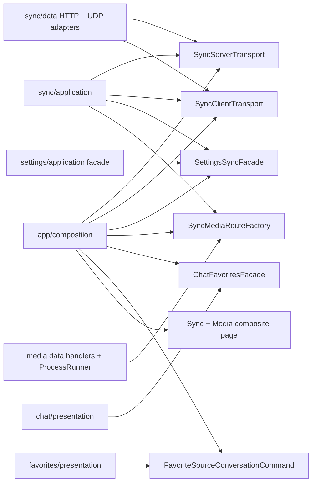

# Phase 7 - 跨 Feature 组合边界 Implementation Plan

**Goal:** 将 Sync 的 socket/HTTP/media 组装、Settings 同步读写和 Chat/Favorites 跨 feature intent 收敛到少量可替换的 port/facade 与 app composition；消除已知的 presentation→data/persistence 穿透，并明确 History 是 Chat 的 read model。

**Architecture:** `sync/application` 只认识 client/server transport、Settings 同步 facade 与 media route factory 三个显式协作契约，不再直接 new HTTP server、UDP discovery、scanner、cache、thumbnail generator 或读取每个 Settings controller。具体 HTTP/UDP adapter 留在 Sync data，ffmpeg 调用留在 Media data 的 process runner，Sync+Media 的 route 组装和 provider override 留在 `app/composition`。app composite 负责同时放置 Sync tabs 与 Media tab；Sync feature UI 不再自己读 SharedPreferences 或 import Media presentation。Chat 与 Favorites 各自暴露面向用户 intent 的 facade/command，实际 controller 连接只在 app composition；不重写 ChatScreen 其余 workspace/generation 职责。

**Tech Stack:** Flutter、Dart 3、Riverpod 3（`NotifierProvider` / `ProviderScope` override）、`package:http`、`dart:io`、`sqlite3`、`Equatable`。

---

> 本 Plan 以 `Phase 7 - 跨 Feature 组合边界.md` 为唯一完整审查输入。其 TD-06、TD-08、TD-14、TD-15、TD-27 的范围、前置依赖及验收条件没有矛盾；仅核对了 `architecure-review.md` 中上述五项缺陷所在的局部行，**没有重新阅读完整 Review Report**。现有工作树在计划撰写时为 clean。严格保持 Phase 3 的 peer HTTP 信任域、Phase 5 的 settings workflow、Phase 6 的 Provider 生命周期结论；不实施 Phase 8 的协议/认证，不实施 Phase 9/10 的 Chat generation/整页拆分。

## 一、现状核对与边界目标

| 已知点 | 当前事实 | 本 Phase 的最小收敛动作 |
|---|---|---|
| Sync server construction | `SyncServerController` 直接构造 `SyncHttpServer`、`SyncHttpHandler`、UDP broadcaster、所有 media handlers/scanner/cache/generator，并用静态 `SyncUdpDiscovery` 启动广播。 | Server controller 改为调用 `SyncServerTransport` 与 `SyncMediaRouteFactory`；HTTP/UDP concrete adapter 移入 `sync/data`，media route 组装移到 `app/composition`。 |
| Sync client transport | `SyncClientController` 直接订阅 `SyncUdpDiscovery`，并直接使用 `peerHttpClientProvider` 编解码/发送 HTTP。 | 通过 `SyncClientTransport` 发现与发请求；controller 继续管理已有 phase、generation guard 和 legacy `SyncMessage` 业务分支。 |
| Settings 同步扇出 | server `_buildExportData()`、client `_deduplicate()` 分别读取八类 Settings controller；client import 虽已用类型化 `SettingsImportExecutor`，仍从 Sync controller 直接触发。 | `SettingsSyncFacade` 在 Settings application 聚合 snapshot、deduplicate、import；Sync 仅读取该一个 facade，且 tests 可整体替换。 |
| Media 组合与 ffmpeg | `MediaBrowserTab` 从 `data/media_mime_types.dart` 导入分类函数；缩略图 generator 直接 `Process.run`；SyncScreen 读 SharedPreferences 并嵌入 media tab。 | MIME 纯函数移到 media domain；generator 接收 data-level `ThumbnailProcessRunner`；app composite 组装 Sync+Media，tab 选择记忆经 Sync application provider。 |
| Chat/Favorites 双向知道 | ChatScreen/AddToFavoritesDialog 直接 read Favorites/Collections controller；FavoriteDetailScreen 直接 read `ChatSessionsController` 再导航。 | Chat 使用 `ChatFavoritesFacade`，Favorites 使用 `FavoriteSourceConversationCommand`；两个 concrete bridge 都只在 app composition，通过 Provider override 绑定。 |
| History ownership | `history` 仅有 presentation，直接使用 chat application/domain。 | 保持目录与所有查询/分页/搜索行为；新增紧邻代码的 ownership 声明，明确其为 Chat read model，而非独立 domain/data feature。 |

### 1.1 最终依赖图



`app/composition` 是唯一允许同时 import Sync、Media、Chat 与 Favorites concrete implementation 的位置。它不是新的业务 service：只负责 Provider binding、页面组合和把 UI intent 转交给已存在的 controller。所有 contract 的方法数量必须仅覆盖本 Phase 已有用户行为；不要为 `HttpRouteHandler`、纯 MIME 函数、单个 widget callback 或每个 repository 机械建 interface。

### 1.2 Contract 细节与保留语义

1. **Sync transport contracts** 放在 `lib/features/sync/application/ports/`：
   - `SyncClientTransport`：`discoverServers()` 返回既有 `Stream<DiscoveredServer>`；`send(server, request)` 返回已解码的 `SyncMessage`。HTTP status、不可解码响应与超时以明确的 `SyncTransportException`（含安全的用户可显示原因）表达，controller 保留现有 phase/error 译文及 generation guard。
   - `SyncServerTransport`：`start(SyncServerStartRequest)` 接收 device name、已计算的 broadcast address、sync request callback 与附加 media routes，并返回仅含 `httpPort` 的运行句柄；`stop()` 幂等关闭 UDP 与 HTTP。adapter 内部构造 `SyncHttpServer`、`SyncHttpHandler` 和调用 `SyncUdpDiscovery`，controller 不 import 它们。
   - 这两个 contract 保持现有 `/sync`、`SyncMessageCodec`、30s client timeout、15s handler timeout、UDP 广播及随机端口行为；**不**引入 pairing、auth、session、protocol version、typed payload 或新 API path（Phase 8）。

2. **SettingsSyncFacade** 位于 Sync application port，具体实现位于 Settings application：
   - 输入使用 Settings-owned 的不可变 `SettingsSyncSelection`（providers/presets/prompts/other 四个 bool），Sync 仅把现有 `SyncCategory` 映射到 selection，Settings 不 import Sync domain。
   - 提供 `exportSelected(selection)`、`deduplicateIncoming(data)`、`importDeduplicated(data)` 三个方法。实现封装当前八类读取及既有 `SettingsImportDeduplicator` / `SettingsImportExecutor`；保持当前导出字段集合（不趁机新增 output-processing 同步字段）。
   - `SettingsExportData` 继续是当前 legacy sync payload；其 JSON 与 format version 不在本 Phase 变动。

3. **Media routes 与 thumbnail backend**：
   - `SyncMediaRouteFactory.createRoutes()` 是 Sync application port；app composition adapter 在 Windows 且 root directory 非空时创建共享 `MediaDirectoryScanner`、list/image/video/recursive/thumbnail handler，在其他情况返回空 route list。root directory 的读写仍由 media application 配置 provider 拥有，Sync controller 不读取它。
   - `MediaThumbnailGenerator` 只依赖 `ThumbnailProcessRunner` data contract；默认 `DartThumbnailProcessRunner` 封装唯一的 `Process.run`。runner 返回测试可构造的进程结果并保留 `ProcessException`、exit code、stdout/stderr 与 timeout 的既有错误语义。图片缩放不增加无意义 backend。

4. **Chat/Favorites intent contracts**：
   - `ChatFavoritesFacade` 提供收藏内容快照、收藏夹选项、创建收藏夹、添加助手回复、按助手回复取消收藏；参数使用 Chat-owned `ChatFavoriteDraft` 和 facade-owned简单 collection option，不让 Chat UI import Favorites controller/model。
   - `FavoriteSourceConversationCommand` 只执行“选择来源 conversation 并定位 assistant message”这一 command。Favorites UI 仍自行用 GoRouter 跳往既有 Chat destination；不会泄漏 `ChatSessionsController`。
   - 以 assistant content 判定已收藏、未分类空字符串、创建后立即选中、收藏 title/推理/模型/来源 metadata、详情页来源跳转及不存在来源时隐藏入口，均保持现有行为。

5. **页面与 ownership**：
   - 新 `SyncWorkspaceScreen` 放在 `app/composition`，拥有 2/3 Tab、Android media tab 生命周期编排和 `AppShellScaffold`。现有 feature `sync_screen.dart` 被删除或缩为无 Media/Persistence 依赖的 sync-only 子视图；app router 只指向 composite。
   - 新 `SyncWorkspaceTabPreferenceController` 在 sync application 读写现有 `sync.tab.last_index` key，按平台 clamp tab index。不得改 key、默认值或 Phase 6 的 media `reset()/initWithServer()` 时机。
   - `lib/features/history/README.md` 与 `HistoryScreen` doc comment 声明：History 是 chat read model，允许依赖 Chat 的 query/pagination/selection；不得为目录整齐移动文件，也不得改变“标题 + 用户消息”搜索、15 字标题或分页规则。

## 二、文件清单

### 新增

| 文件 | 职责 |
|---|---|
| `lib/features/sync/application/ports/sync_client_transport.dart` | client discovery/request port、request/response value objects、可显示 transport failure。 |
| `lib/features/sync/application/ports/sync_server_transport.dart` | server start/stop port 与运行句柄；只暴露 controller 所需参数。 |
| `lib/features/sync/application/ports/settings_sync_facade.dart` | `SettingsSyncFacade`、`SettingsSyncSelection` 和未绑定 provider。 |
| `lib/features/sync/application/ports/sync_media_route_factory.dart` | media route factory port 与未绑定 provider。 |
| `lib/features/sync/application/sync_workspace_tab_preference_controller.dart` | 应用层持久化 tab selection，隔离 SharedPreferences。 |
| `lib/features/sync/data/http_sync_client_transport.dart` | `package:http` + peer client 的 concrete client transport。 |
| `lib/features/sync/data/http_udp_sync_server_transport.dart` | `SyncHttpServer` / `SyncHttpHandler` / UDP broadcaster 的 concrete server transport。 |
| `lib/features/settings/application/settings_sync_facade.dart` | 八类 settings snapshot、dedupe、import 的 Settings application adapter。 |
| `lib/features/media/domain/media_file_classification.dart` | 图片/视频扩展名、MIME 与分类纯函数。 |
| `lib/features/media/data/thumbnail_process_runner.dart` | `ThumbnailProcessRunner`、默认 Dart process runner、可 fake 的进程结果。 |
| `lib/features/chat/application/chat_favorites_facade.dart` | Chat 消费的收藏 intent contract、draft/collection option 与未绑定 provider。 |
| `lib/features/favorites/application/favorite_source_conversation_command.dart` | Favorites 消费的来源对话 command contract 与未绑定 provider。 |
| `lib/app/composition/cross_feature_bindings.dart` | 全部 concrete port/facade binding，及 Sync+Media route factory、Chat/Favorites bridge 的唯一实现。 |
| `lib/app/composition/sync_workspace_screen.dart` | Sync + Media 页面组合、tabs、app lifecycle 编排与 shell owner。 |
| `lib/features/history/README.md` | History 为 Chat read model 的 ownership 声明和允许依赖。 |
| `test/features/settings/application/settings_sync_facade_test.dart` | snapshot/dedupe/import facade 行为测试。 |
| `test/features/sync/application/sync_transport_controller_test.dart` | fake transport/media/settings facade 下的 Sync controller contract。 |
| `test/app/composition/cross_feature_bindings_test.dart` | 生产 binding 的 route/facade 组装与明确无配置行为。 |
| `test/features/chat/application/chat_favorites_facade_test.dart` | Chat side fake facade 下的 add/remove/collection intent contract。 |
| `test/features/favorites/application/favorite_source_conversation_command_test.dart` | Favorites side source-conversation command contract。 |

### 修改 / 移动

| 文件 | 修改职责 |
|---|---|
| `lib/features/sync/application/sync_server_controller.dart` | 删除 data/media/settings controller imports、直接 construction 和 `_buildExportData()`；改调三个 port，保留 device name、network selection、state/keep-alive/generation/restart 行为。 |
| `lib/features/sync/application/sync_client_controller.dart` | 删除 UDP/http/settings controller imports与 `_deduplicate()`；改调 client transport 与 settings facade，保留 phase 与 cancellation semantics。 |
| `lib/features/sync/presentation/sync_screen.dart` | 移除 SharedPreferences、Media presentation/application imports 和 composite page responsibility；删除此文件或改为仅由 app composite 使用的 sync-only child，不保留废弃双重页面入口。 |
| `lib/features/sync/presentation/widgets/sync_connection_tab.dart` | 如保留媒体根目录配置控件，改只接收 app composite 注入的配置 section/callback；不得再让 Sync presentation 直接 import media application。未涉及的 server/client UI 不重写。 |
| `lib/app/router/app_router.dart` | Sync route 改为 `SyncWorkspaceScreen`；其他 route（尤其 Favorite `extra` route）不在本 Phase 改造。 |
| `lib/bootstrap.dart` | 将 `appCompositionOverrides()` 与既有 infrastructure overrides 一并装入 `ProviderScope`；启动顺序不变。 |
| `test/helpers/test_harness.dart` | 使用同一 composition override helper，允许现有 widget tests 获得真实 bindings；保留 DB/preferences 注入及 caller `extraOverrides` 的最高优先级。 |
| `lib/features/media/data/media_mime_types.dart` | 用 `git mv` 迁至 `domain/media_file_classification.dart`，更新所有 data/presentation imports。 |
| `lib/features/media/data/media_thumbnail_generator.dart` | 注入 process runner，删除直接 `Process.run`，保留生成算法和异常文本。 |
| `lib/features/media/presentation/media_browser_tab.dart` | 改 import domain MIME；保持导航、Media route 与播放器行为。 |
| `lib/features/chat/presentation/chat_screen.dart` | watch/read Chat-owned favorites facade，移除 `favorites_controller.dart` import；不拆 workspace 参数/状态机。 |
| `lib/features/chat/presentation/widgets/dialogs/add_to_favorites_dialog.dart` | 接受 facade snapshot/callback 或 Chat-owned facade，不直接 import/read Collections controller。 |
| `lib/features/favorites/presentation/favorite_detail_screen.dart` | 通过 Favorite-owned source command 选择对话，移除 `chat_sessions_controller.dart` import；保留 `context.go(AppDestination.chat.path)`。 |
| `lib/features/history/presentation/history_screen.dart` | doc 明确 read-model ownership；查询、搜索、分页、rename/delete 行为不变。 |
| Sync/media/chat/favorites/history 现有相关 tests | 改由 fake port 或 composition override 驱动，删除 controller test 对真实 socket/process 的依赖；保留外部行为断言。 |

### 明确不修改

- `SyncMessage` 的动态 payload、`SyncMessageCodec` wire format、配对、认证、敏感设置确认、协议版本协商、同步 session：均属 **Phase 8**。
- `ChatSessionsController` 的 streaming/generation 状态机、`ChatScreen` 的 workspace/view-state 拆分、路由恢复：分别属 **Phase 9、10、12**。
- `FavoriteDetailScreen` 的 `state.extra` 路由问题、顶层 shell 路由策略：属 Phase 12，不随 command 注入改成 ID route。
- `MediaBrowserController`、shuffle、video player 的 Phase 6 生命周期契约、媒体 API 路径、cache key、thumbnail 算法、随机播放产品行为。
- Settings 已完成的 import workflow、SharedPreferences JSON 格式、SQLite schema/migration；facade 仅聚合现有调用。
- History 目录移动、搜索规则、标题逻辑或分页产品功能。
- 全项目 port ownership 搬迁、lint rule、所有横向 import 清零（Phase 11 才把本 Phase 新 port 纳入自动依赖门禁）。

## 三、实施任务与独立提交

> 每个任务先加失败测试，再写最小实现。所有 Flutter test 命令均使用项目要求的 PowerShell 重定向模式；不要直接运行全量 `flutter test`，不要使用 `tee`。提交命令在 Bash 执行。任何已有的未提交用户改动均不 stage、不改写。

### Task 1：建立 Settings/Sync transport 的可替换 application contract

**Files:**

- Add: `lib/features/sync/application/ports/sync_client_transport.dart`
- Add: `lib/features/sync/application/ports/sync_server_transport.dart`
- Add: `lib/features/sync/application/ports/settings_sync_facade.dart`
- Add: `lib/features/settings/application/settings_sync_facade.dart`
- Modify: `lib/features/sync/application/sync_client_controller.dart`
- Modify: `lib/features/sync/application/sync_server_controller.dart`
- Add: `test/features/settings/application/settings_sync_facade_test.dart`
- Add/Modify: `test/features/sync/application/sync_transport_controller_test.dart`, `sync_client_controller_test.dart`, `sync_server_controller_test.dart`, `sync_client_controller_execute_test.dart`

- [ ] **Step 1: 写 facade 与 fake-port 红灯测试。**

  1. `SettingsSyncFacade` test 用 `ProviderContainer` + 现有 Settings repositories/fixtures：验证四类 selection 精确产生当前字段；incoming data 的 dedupe 和 import 与当前 controller 路径一致；未选 category 不会读取/写入对应数据。不要手写 settings JSON，使用 `TestFixtures` 和真实模型 `toJson()`。
  2. client controller test 注入受控 `FakeSyncClientTransport`：其 `StreamController` 产生发现结果、其 `send` 记录 `SyncMessage` 并完成预设 response。断言 controller 仍得到 `connected`/`received`/`noNewData`/`error` 等当前 phase，但不启动 UDP 或本地 HTTP server。
  3. server controller test 注入 `FakeSyncServerTransport` 和 `FakeSyncMediaRouteFactory`；调用 `start()` 后断言 transport 收到 device/broadcast/request callback、state 使用 fake port；调用其 captured callback 后断言只调用一次 fake Settings snapshot、`servedRequestCount` 增加。测试 fake transport stop、restart 与 Phase 6 keep-alive release 语义仍成立。
  4. import test 给 Sync controller 注入 fake Settings facade，断言只请求 `importDeduplicated(data)` 并保持成功/异常 phase；Settings facade unit test 是真实 import 行为的唯一测试层。

- [ ] **Step 2: 运行定向红灯。**

  ```powershell
  flutter test test/features/settings/application/settings_sync_facade_test.dart --reporter compact 2>&1 | Out-File -Encoding utf8 fltest-phase7-settings-facade.log; $E = $LASTEXITCODE; Write-Host "EXIT=$E"; Get-Content -Tail 150 fltest-phase7-settings-facade.log
  flutter test test/features/sync/application/sync_transport_controller_test.dart --reporter compact 2>&1 | Out-File -Encoding utf8 fltest-phase7-sync-ports.log; $E = $LASTEXITCODE; Write-Host "EXIT=$E"; Get-Content -Tail 150 fltest-phase7-sync-ports.log
  ```

  预期：新 contracts/overrides 尚不存在，测试因编译或未替换 direct dependency 失败。

- [ ] **Step 3: 实现最小 contracts 与 controller 改造。**

  1. 定义两个 transport port 和 `SettingsSyncFacade`，provider 默认抛出具有明确中文说明的 `StateError`，强制 production 与 test 在 composition 绑定；不要提供偷偷 new concrete adapter 的 fallback。
  2. 在 Settings application 实现 facade。将现有 Sync server 的 eight reads 与 client deduplicator / executor 原样迁入；按现有 `SyncCategory.payloadKey` 的语义在 Sync side 创建 `SettingsSyncSelection`。`outputProcessingSettings` 仍不被 sync selection 导出或 dedupe，避免静默扩大同步 payload。
  3. Sync server 只读取 Settings facade 以生成 response；Sync client 只读取 Settings facade 以 dedupe/import。保留 `SettingsExportData` 作为 controller state 的当前类型，保留所有 response type 判断和错误文案。
  4. 将 transport 注入视作唯一 discovery/request/server lifecycle backend。controller 不再 import `package:http`、`SyncUdpDiscovery`、`SyncHttpServer`、`SyncHttpHandler`；保留 Phase 6 的 `_generation`、`_cleanup` 调用顺序和 keep-alive link。未实施 concrete data adapter 前，以 fakes 通过 controller tests。
  5. controller 内的少量 Sync 自身状态读取（device-name preference、network interface/prefix）可暂保留；doc comment 枚举它们。不得为这几个局部值制造单方法 interface。

- [ ] **Step 4: 定向回归。**

  ```powershell
  flutter test test/features/settings/application/settings_sync_facade_test.dart --reporter compact 2>&1 | Out-File -Encoding utf8 fltest-phase7-settings-facade.log; $E = $LASTEXITCODE; Write-Host "EXIT=$E"; Get-Content -Tail 150 fltest-phase7-settings-facade.log
  flutter test test/features/sync/application/sync_client_controller_test.dart --reporter compact 2>&1 | Out-File -Encoding utf8 fltest-phase7-client.log; $E = $LASTEXITCODE; Write-Host "EXIT=$E"; Get-Content -Tail 150 fltest-phase7-client.log
  flutter test test/features/sync/application/sync_client_controller_execute_test.dart --reporter compact 2>&1 | Out-File -Encoding utf8 fltest-phase7-client-import.log; $E = $LASTEXITCODE; Write-Host "EXIT=$E"; Get-Content -Tail 150 fltest-phase7-client-import.log
  flutter test test/features/sync/application/sync_server_controller_test.dart --reporter compact 2>&1 | Out-File -Encoding utf8 fltest-phase7-server.log; $E = $LASTEXITCODE; Write-Host "EXIT=$E"; Get-Content -Tail 150 fltest-phase7-server.log
  ```

- [ ] **Step 5: 提交 contracts。**

  ```bash
  git add lib/features/sync/application/ports \
          lib/features/settings/application/settings_sync_facade.dart \
          lib/features/sync/application/sync_client_controller.dart \
          lib/features/sync/application/sync_server_controller.dart \
          test/features/settings/application/settings_sync_facade_test.dart \
          test/features/sync/application/sync_transport_controller_test.dart \
          test/features/sync/application/sync_client_controller_test.dart \
          test/features/sync/application/sync_client_controller_execute_test.dart \
          test/features/sync/application/sync_server_controller_test.dart
  git commit -m "refactor(sync): 收敛传输与设置同步边界"
  ```

### Task 2：实现 data adapters、media route/process boundary 与 app binding

**Files:**

- Add: `lib/features/sync/data/http_sync_client_transport.dart`
- Add: `lib/features/sync/data/http_udp_sync_server_transport.dart`
- Add: `lib/features/media/data/thumbnail_process_runner.dart`
- Add: `lib/app/composition/cross_feature_bindings.dart`
- Move: `lib/features/media/data/media_mime_types.dart` → `lib/features/media/domain/media_file_classification.dart`
- Modify: `lib/features/media/data/media_thumbnail_generator.dart`
- Modify: media data handlers/scanner imports, `media_browser_tab.dart`, MIME tests
- Modify: `lib/bootstrap.dart`, `test/helpers/test_harness.dart`
- Add/Modify: `test/features/media/data/media_thumbnail_generator_test.dart`, Sync transport/data tests, `test/app/composition/cross_feature_bindings_test.dart`, bootstrap integration test

- [ ] **Step 1: 写 concrete adapter / process runner 红灯测试。**

  1. `HttpSyncClientTransport` test 用 `MockClient` 验证 request URI、content type、codec、timeout/failure mapping 和已解码 response；不把 response type 的业务 phase 测回 adapter。
  2. `HttpUdpSyncServerTransport` test 只验证它把 captured sync callback 与额外 routes 交给 router、成功 start 后 broadcaster 接收 router port、`stop()` 幂等且 UDP 在 HTTP 前停止。若 adapter 集成测试需要随机本地端口，限定在 data adapter test；controller tests 一律 fake transport。
  3. thumbnail test 用 `FakeThumbnailProcessRunner` 返回可控 ffprobe/ffmpeg result，断言视频 seek 参数、stderr/exit code/空 stdout/runner exception 都映射为既有 `ThumbnailException`；测试不得依赖开发机是否安装 ffmpeg/ffprobe。
  4. composition binding test 对 media root 为空、非 Windows、Windows 有 root 三个分支断言 routes 数量与共享 scanner 行为；将 platform/root/cache/process runner 作为 adapter 的构造注入，避免 test 写真实用户目录或启动 process。

- [ ] **Step 2: 实现 adapters 与唯一 composition binding。**

  1. HTTP client adapter 独占 `peerHttpClientProvider`、`package:http`、`SyncMessageCodec` 的 request/response I/O；HTTP trust domain 仍使用 Phase 3 的 peer client，绝不能回退到 LLM client。
  2. HTTP/UDP server adapter 独占 `SyncHttpServer`、`SyncHttpHandler`、`SyncUdpDiscovery` construction。其 stop 实现复用当前 UDP → HTTP 顺序且可重复调用；controller 不拥有 concrete server 字段。
  3. 新 thumbnail process runner 是 data 层 seam，默认实现中才 import/use `Process.run`。保留 image package 直接图片缩放；不抽 scanner、cache 或每个 handler 的 interface。
  4. 以 `git mv` 将 MIME 分类移到 domain，更新 scanner/generator/handlers/presentation/tests 的 import。执行 `rg` 确认任意 `presentation` 下没有 `media/data/media_mime_types.dart` 或新建 data MIME import。
  5. `cross_feature_bindings.dart` 是唯一 production binding：创建两个 concrete Sync transport，绑定 Settings facade，创建 media route factory（从 media application root-directory configuration 读取、组装共享 scanner/routes），但不在 controller 里 new。以同一 helper 返回 override list；`bootstrap()` 和 `pumpTestApp()` 均加载它，调用方 `extraOverrides` 放在最后以便 fake 覆盖。
  6. `bootstrap()` 既有 preferences/database/logger/custom headers 顺序与 override 保持；只添加 composition override list。不要令 app root watch 新 provider 来维持时序。

- [ ] **Step 3: 运行 adapter 与 bootstrap 回归。**

  ```powershell
  flutter test test/features/media/data/media_thumbnail_generator_test.dart --reporter compact 2>&1 | Out-File -Encoding utf8 fltest-phase7-thumbnail.log; $E = $LASTEXITCODE; Write-Host "EXIT=$E"; Get-Content -Tail 150 fltest-phase7-thumbnail.log
  flutter test test/features/media/data/media_mime_types_test.dart --reporter compact 2>&1 | Out-File -Encoding utf8 fltest-phase7-mime.log; $E = $LASTEXITCODE; Write-Host "EXIT=$E"; Get-Content -Tail 150 fltest-phase7-mime.log
  flutter test test/app/composition/cross_feature_bindings_test.dart --reporter compact 2>&1 | Out-File -Encoding utf8 fltest-phase7-bindings.log; $E = $LASTEXITCODE; Write-Host "EXIT=$E"; Get-Content -Tail 150 fltest-phase7-bindings.log
  flutter test test/integration/bootstrap_integration_test.dart --reporter compact 2>&1 | Out-File -Encoding utf8 fltest-phase7-bootstrap.log; $E = $LASTEXITCODE; Write-Host "EXIT=$E"; Get-Content -Tail 150 fltest-phase7-bootstrap.log
  ```

  若 MIME test 路径随 production 文件移动而改为 `test/features/media/domain/media_file_classification_test.dart`，相应替换上面的单文件命令；测试 discovery 规则仍只认一个 `*_test.dart` 文件。

- [ ] **Step 4: 提交 data/composition binding。**

  ```bash
  git add lib/features/sync/data/http_sync_client_transport.dart \
          lib/features/sync/data/http_udp_sync_server_transport.dart \
          lib/features/media/domain/media_file_classification.dart \
          lib/features/media/data/thumbnail_process_runner.dart \
          lib/features/media/data/media_thumbnail_generator.dart \
          lib/features/media/data \
          lib/features/media/presentation/media_browser_tab.dart \
          lib/app/composition/cross_feature_bindings.dart \
          lib/bootstrap.dart test/helpers/test_harness.dart \
          test/features/media test/features/sync/data test/app/composition \
          test/integration/bootstrap_integration_test.dart
  git commit -m "refactor(sync-media): 下沉传输与媒体组合"
  ```

  提交前将 `git add lib/features/media/data` 替换为本任务实际变更的精确文件列表；不要误 stage 未相关 media data 改动。

### Task 3：将 Sync + Media 页面归入 app composite，并声明 History ownership

**Files:**

- Add: `lib/features/sync/application/sync_workspace_tab_preference_controller.dart`
- Add: `lib/app/composition/sync_workspace_screen.dart`
- Add: `lib/features/history/README.md`
- Modify/Delete: `lib/features/sync/presentation/sync_screen.dart`
- Modify: `sync_connection_tab.dart`（仅在 Task 2 binding 需要注入 root 配置 section 时）
- Modify: `lib/app/router/app_router.dart`, `lib/features/history/presentation/history_screen.dart`
- Modify: Sync widget helpers/render cases, history tests only as needed

- [ ] **Step 1: 写 composition page 红灯测试。**

  1. 将既有 SyncScreen widget cases 的主入口换为 app composite。Android case 继续验证：从 media tab 切到连接会 reset browser/shuffle、再进入会重新初始化；通过 fake `MediaBrowserController`/fake transport 和 provider state 断言，不用 `TabController` 私有属性或像素位置。
  2. 新 case 预置 `sync.tab.last_index=2` 时，仅 Android composite 初始 media tab 并调用一次 init；非 Android 将值 clamp 到现有两 tab。点击 tab 后验证由 application tab preference 写入相同 key，而非 screen 直接 `SharedPreferences` read/write。
  3. `HistoryScreen` tests 保留现有搜索、标题、分页 assertion；添加一个最小 source-level/doc presence test **仅当项目现有测试规范允许**。否则以 code review checklist + README 和既有行为回归证明 ownership，不为了文档造脆弱 widget test。

- [ ] **Step 2: 实现 composite ownership。**

  1. `SyncWorkspaceTabPreferenceController` 把当前 `_syncLastTabIndexKey` 与 clamp 语义从 screen 移入 sync application；其依赖只读/写 SharedPreferences，中文 doc 说明这是持久化 UI preference、不是 socket/process owner。
  2. `SyncWorkspaceScreen` 复制而不改变当前 TabBar/TabBarView、AppLifecycle server stop/restart、Android-only media init/reset 和 shuffle AppBar actions 行为；它是唯一同时 import Sync presentation 与 Media presentation/application 的页面。将 `AppShellScaffold` 也留在此 owner。
  3. 移除旧 `SyncScreen` 中 `shared_preferences_provider.dart`、`MediaBrowserTab`、shuffle 和 media application imports。优先删除旧文件、由 composite 直接承接，避免两个页面各自维护 tab state；若为保留 feature-local UI 而留下 child，名称/接口必须表明它不拥有 shell、preferences 或 Media composition。
  4. `SyncConnectionTab` 若含 media root picker，改成由 composite 注入的 media server configuration widget/callback，使 Sync presentation 不 import Media application。保留 FilePicker 的用户流程与原 preference key，不新增媒体配置产品功能。
  5. History README 和 `HistoryScreen` 中文 doc 明确 read-model 所有权；不搬目录，不调整 import 到 repository/data，不修改搜索/分页实现。

- [ ] **Step 3: 回归。**

  ```powershell
  flutter test test/features/sync/sync_screen_test.dart --reporter compact 2>&1 | Out-File -Encoding utf8 fltest-phase7-sync-composite.log; $E = $LASTEXITCODE; Write-Host "EXIT=$E"; Get-Content -Tail 150 fltest-phase7-sync-composite.log
  flutter test test/features/history/history_screen_test.dart --reporter compact 2>&1 | Out-File -Encoding utf8 fltest-phase7-history.log; $E = $LASTEXITCODE; Write-Host "EXIT=$E"; Get-Content -Tail 150 fltest-phase7-history.log
  ```

- [ ] **Step 4: 提交 page ownership。**

  ```bash
  git add lib/features/sync/application/sync_workspace_tab_preference_controller.dart \
          lib/app/composition/sync_workspace_screen.dart \
          lib/features/sync/presentation lib/app/router/app_router.dart \
          lib/features/history/README.md \
          lib/features/history/presentation/history_screen.dart \
          test/features/sync test/features/history
  git commit -m "refactor(app): 明确同步媒体组合所有权"
  ```

  如删除 `sync_screen.dart`，先以 `git status --short` 确认仅该确切文件被删除；不要以目录级删除代替。

### Task 4：以 stable command/facade 收敛 Chat ↔ Favorites intent

**Files:**

- Add: `lib/features/chat/application/chat_favorites_facade.dart`
- Add: `lib/features/favorites/application/favorite_source_conversation_command.dart`
- Modify: `lib/app/composition/cross_feature_bindings.dart`
- Modify: `lib/features/chat/presentation/chat_screen.dart`
- Modify: `lib/features/chat/presentation/widgets/dialogs/add_to_favorites_dialog.dart`
- Modify: `lib/features/favorites/presentation/favorite_detail_screen.dart`
- Modify: chat/favorites helper/case tests and `test/integration/chat_favorites_integration_test.dart`
- Add: facade/command tests listed in section two

- [ ] **Step 1: 写 intent contract 红灯测试。**

  1. `ChatFavoritesFacade` fake 记录 draft、collection selection、create/remove 调用；ChatScreen cases 保持现有“打开对话框、未分类收藏、创建收藏夹后收藏、再次点击取消收藏”的用户行为，但断言 facade intent，而不是直接 read `favoritesProvider` 的内部实现。
  2. composition binding integration case 使用真实 Favorites repository/controller：从 Chat assistant reply 创建收藏后，收藏列表仍出现完整 metadata；重复 bookmark 仍移除；所有测试使用 `pumpTestApp()`/fixtures/repository API，禁止 raw SQL。
  3. `FavoriteSourceConversationCommand` fake 记录 conversation/message id。Favorite detail 点击来源对话时断言 command 先收到正确 ID，再导航至现有 Chat destination；无 source conversation 时入口仍不显示。不要断言 widget key 或路由内部 `extra`。

- [ ] **Step 2: 实现 facade 与 composition bridge。**

  1. Chat application 定义 facade/draft/collection-option，不 import Favorites；Favorites application 定义 source command，不 import Chat。
  2. 在 `cross_feature_bindings.dart` 用 Riverpod bridge 实现两个接口：bridge watch Favorites/Collections state 产生不可变 snapshot，并只在 command 执行时 read notifier；另一个 bridge 调现有 `selectConversationAndNavigateToMessage`。这两处 `ref.read` 是显式 composition wiring，doc 必须说明，不扩散回 presentation。
  3. ChatScreen watch facade 取得 favorited content snapshot，所有 bookmark callback 都走 facade。`AddToFavoritesDialog` 接收 snapshot 与 `onCreateCollection` / facade，不自行访问 provider。保持 dialog cancel、空 collection name、未分类 `''` 和 "新建并收藏" 行为。
  4. FavoriteDetailScreen 改调 source command 后仍在成功 intent 后 `context.go(AppDestination.chat.path)`；不借机改变 route extra、收藏详情 CRUD 或卡片中的 Chat presentation visual reuse。

- [ ] **Step 3: 运行 Chat/Favorites 回归。**

  ```powershell
  flutter test test/features/chat/chat_screen_test.dart --reporter compact 2>&1 | Out-File -Encoding utf8 fltest-phase7-chat-favorites.log; $E = $LASTEXITCODE; Write-Host "EXIT=$E"; Get-Content -Tail 150 fltest-phase7-chat-favorites.log
  flutter test test/features/favorites/favorites_screen_test.dart --reporter compact 2>&1 | Out-File -Encoding utf8 fltest-phase7-favorites-screen.log; $E = $LASTEXITCODE; Write-Host "EXIT=$E"; Get-Content -Tail 150 fltest-phase7-favorites-screen.log
  flutter test test/integration/chat_favorites_integration_test.dart --reporter compact 2>&1 | Out-File -Encoding utf8 fltest-phase7-chat-favorites-integration.log; $E = $LASTEXITCODE; Write-Host "EXIT=$E"; Get-Content -Tail 150 fltest-phase7-chat-favorites-integration.log
  flutter test test/features/chat/application/chat_favorites_facade_test.dart test/features/favorites/application/favorite_source_conversation_command_test.dart --reporter compact 2>&1 | Out-File -Encoding utf8 fltest-phase7-intent-contracts.log; $E = $LASTEXITCODE; Write-Host "EXIT=$E"; Get-Content -Tail 150 fltest-phase7-intent-contracts.log
  ```

- [ ] **Step 4: 提交 intent boundary。**

  ```bash
  git add lib/features/chat/application/chat_favorites_facade.dart \
          lib/features/favorites/application/favorite_source_conversation_command.dart \
          lib/app/composition/cross_feature_bindings.dart \
          lib/features/chat/presentation/chat_screen.dart \
          lib/features/chat/presentation/widgets/dialogs/add_to_favorites_dialog.dart \
          lib/features/favorites/presentation/favorite_detail_screen.dart \
          test/features/chat test/features/favorites \
          test/integration/chat_favorites_integration_test.dart
  git commit -m "refactor(chat-favorites): 收敛跨功能操作边界"
  ```

### Task 5：范围审计与最终质量门禁

**Files:** 仅在前述文件中修复由本 Phase 引入的直接回归；不借最终门禁开始 Phase 8–12 工作。

- [ ] **Step 1: 格式化本 Phase Dart 改动。**

  使用 `git diff --name-only -- '*.dart'` 逐个确认后执行 `dart format`。不要把文档、未关联文件或整个 `lib/` 作为格式化目标。

- [ ] **Step 2: 执行 static analysis。**

  ```powershell
  flutter analyze 2>&1 | Out-File -Encoding utf8 flanalyze-phase7.log; $E = $LASTEXITCODE; Write-Host "EXIT=$E"; Get-Content -Tail 150 flanalyze-phase7.log
  ```

  预期：`EXIT=0` 且 `No issues found!`。

- [ ] **Step 3: 执行强制格式的全量测试。**

  ```powershell
  flutter test --reporter compact 2>&1 | Out-File -Encoding utf8 fltest.log; $E = $LASTEXITCODE; Write-Host "EXIT=$E"; Get-Content -Tail 150 fltest.log
  ```

  预期：`EXIT=0`、末尾 `All tests passed!`。若失败，用 `Select-String -Pattern "失败测试名" -Path fltest.log -Context 0,30` 查找，只修复本 Plan 文件范围内的直接问题，再重跑失败文件、analyze 和全量测试。

- [ ] **Step 4: 执行边界与范围审计。**

  ```powershell
  rg -n "^import .*features/(settings/application/(auto_retry|custom_headers|fixed_prompt_sequences|font_size|llm_model_configs|memory_prompts|preset_prompts|template_prompts)|media/(data|application)|sync/data)" lib/features/sync/application
  rg -n "^import .*favorites/application" lib/features/chat/presentation
  rg -n "^import .*chat/application" lib/features/favorites/presentation
  rg -n "media_mime_types|features/media/data" lib/features/media/presentation
  rg -n "shared_preferences_provider|media_browser_tab|shuffle_playback|media_browser_controller" lib/features/sync/presentation/sync_screen.dart lib/features/sync/presentation/widgets
  rg -n "Process\.run" lib/features/media
  rg -n "pair|auth|session|protocolVersion|version negotiation" lib/features/sync/application lib/features/sync/data
  git diff --check
  git status --short
  ```

  审计标准：

  - Sync application 对 Settings 是单一 facade，对 HTTP/UDP 是 transport，对 media 是 route factory；没有 direct imports/`new` concrete infrastructure。
  - Chat presentation 不 import Favorites application，Favorites presentation 不 import Chat application；concrete cross-feature controller read 只在 app composition binding。
  - Media presentation 不 import media data；唯一 `Process.run` 只在 default process runner。
  - Sync feature presentation 不再拥有 SharedPreferences tab persistence 或嵌入 Media presentation；app composition 是唯一 Sync+Media 页面 owner。
  - History README/Screen 已清楚声明 Chat read-model ownership，既有 history behavior tests 通过。
  - 未出现 Phase 8 pairing/auth/protocol migration，Phase 9 generation state machine，Phase 10 ChatScreen 大拆分，或无关 route/schema/repository 迁移。

- [ ] **Step 5: 仅在必要时提交最小门禁修复。**

  仅当 Step 2–4 发现本 Phase 回归时，使用 `fix(boundaries): 修复跨功能组合回归` 提交。`git add` 必须为导致失败的最小明确文件集；没有失败不创建空提交。

## 四、提交序列总览

| 节点 | Commit message | 独立价值 |
|---|---|---|
| 1 | `refactor(sync): 收敛传输与设置同步边界` | Sync controller 可在 fake transport/settings facade 下测试，不再承担八类 settings service locator。 |
| 2 | `refactor(sync-media): 下沉传输与媒体组合` | HTTP/UDP、ffmpeg/process 与 media route construction 各在 data/composition 的明确 owner。 |
| 3 | `refactor(app): 明确同步媒体组合所有权` | SyncScreen 不再穿透 persistence/media，History ownership 有可发现声明。 |
| 4 | `refactor(chat-favorites): 收敛跨功能操作边界` | 两个 presentation 不再调对方 internal application controller，用户行为不变。 |
| 5（仅必要时） | `fix(boundaries): 修复跨功能组合回归` | 只包含最终门禁揭示的最小修复。 |

## 五、验收矩阵

| Phase 7 验收项 | 计划证据 |
|---|---|
| Sync controller 可 fake transport/snapshot/media backend 测主要路径，不启动真实 socket/process | Task 1 fake controller tests；Task 2 将真实 socket/process 测限定到 adapter/data test。 |
| ffmpeg/process 与 media route construction 在 data/composition boundary | Task 2 的 `ThumbnailProcessRunner`、default runner、app route factory 和 binding test。 |
| Sync 对多类 settings controller 的读取收敛为聚合 facade | Task 1 `SettingsSyncFacade`，sync application import audit。 |
| Media presentation 不再 import media data | MIME move、Task 2 import audit与 media unit regression。 |
| SyncScreen 不直接读 persistence 或嵌入 feature-internal Media composition | Task 3 app composite + tab preference controller，source import audit。 |
| Chat/Favorites integration 保持收藏和导航 intent | Task 4 facade/command widget + integration tests；不测试 controller 调用顺序。 |
| History 被识别为 Chat read model，行为不变 | Task 3 ownership README/doc 和既有 history search/title/pagination regression。 |
| 不提前后续 Phase | “明确不修改”、Task 5 protocol/state-machine/import 审计。 |
| `flutter analyze` 与全量测试通过 | Task 5 指定的重定向命令要求 `EXIT=0`。 |

**自检结果：** 本计划以五个小而稳定的 boundary（两个 transport、Settings facade、media route factory、两侧 intent command/facade）替换当前 controller/presentation 直连；具体 adapter 与 composite owner 均有唯一位置和 fake 测试路径。它保留现有 Riverpod、HTTP handler、legacy sync payload、媒体 API 和交互规则，且没有将 Phase 8 协议升级、Phase 9 generation state machine、Phase 10 ChatScreen 拆分或无关全局 port 迁移夹带进来。
