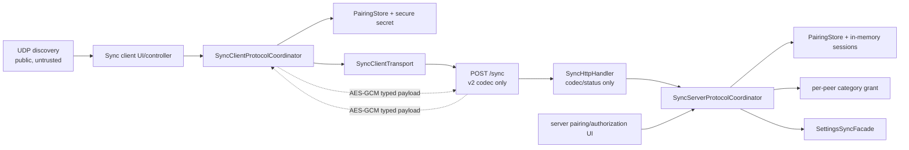

# Phase 8 - Sync 协议安全与版本契约 Implementation Plan

**Goal:** 将局域网 Sync 从“发现到端口即可读取设置”的 v1 匿名 JSON 接口升级为 v2 的已配对、会话受限、按分类授权且可验证版本的协议；传输中的 provider API key / custom header secret 不再以明文或二次 JSON 字符串出现，同时保留当前 Settings 与 Media 的已授权基本同步能力。

**Architecture:** UDP 只发布不含凭据的服务发现信息；HTTP 是唯一的配对、会话和同步入口。一次性高熵配对码只在两端本地显示/输入，其 HMAC proof 才会传输。配对成功后，双方持久化 peer identity、共享密钥和授权范围；每次 Sync 先建立短寿命 session，再用从配对密钥派生的 AES-GCM session key 封装 typed request/response。`SyncServerProtocolCoordinator` 在 application 层统一执行版本、配对、session、授权、敏感确认和 Settings snapshot 的顺序，HTTP handler 只做 wire codec / status 映射，controller 只编排生命周期与 UI 命令。Settings export 改为有结果类型的结构化 codec，v5 可以迁移到 v6，过旧、过新和 malformed 输入明确拒绝。

**Tech Stack:** Flutter、Dart 3、Riverpod 3、`package:http`、`dart:io`、现有 `crypto`（配对 HMAC / HKDF）；新增轻量、纯 Dart 的 `cryptography` 用于 AES-GCM（不引入云、账户、厂商 SDK 或网络服务），以及一个以 Android Keystore / Windows DPAPI 为后端的 secure-storage adapter 保存本机长期配对密钥。HTTP 仍使用 Phase 3 的 `peerHttpClientProvider`，不会重新合并外部 LLM 的 Header 信任域。

---

> 本 Plan 以 `Phase 8 - Sync 协议安全与版本契约.md` 为唯一完整审查输入。Phase 8 的范围和验收条件没有矛盾，因此**没有阅读完整** `architecure-review.md`；只核对了 TD-02（约第 235 行）和 TD-24（约第 268 行）所在的局部证据。计划撰写时工作树 clean。现状已包含 Phase 7 的 `SyncClientTransport`、`SyncServerTransport`、`SettingsSyncFacade` 与 app composition binding，因此本 Plan 只在这些既有边界内升级 wire/auth contract；不重新实现 Phase 3/5/6/7，也不提前改动 Phase 9+ 的 Chat、路由、响应式或 release 工作。

## 一、现状、边界与必须消除的风险

| 审查项 | 当前事实 | 本 Phase 的闭环 |
|---|---|---|
| TD-02：匿名 LAN HTTP | `SyncHttpServer` 绑定 `InternetAddress.anyIPv4`；任意人只要 POST `/sync`，即可请求 `providers`，并从 `payload.data` 的二次 JSON 取得 API key。 | 保留 LAN 所需的 all-IPv4 listen，但所有 v2 数据请求必须通过 `paired peer → valid session → granted categories → sensitive confirmation`。任一前置条件失败时，snapshot facade **不得调用**。 |
| TD-24：装饰性版本 | `SyncMessage.version` 缺失时默认为 1，`SettingsExportData.formatVersion` 只写不验；新字段可能被静默忽略。 | 以可测试的 supported range / migration registry 决定 accept、migrate 或 reject；旧的匿名 v1 不迁移，直接拒绝。 |
| 二次 JSON | server `toJsonString()` 后放进 `SyncMessage.payload['data']`，client 再 `tryParseJson()`。 | `/sync` 内只传 typed envelope + typed `SettingsSnapshotPayload`；JSON 仅在 codec 边界产生一次。`toJsonString()` 仅保留给本地剪贴板 export/import。 |
| 发现被误认为信任 | UDP datagram 目前即可诱导 client 对任意 IP POST。 | UDP 只能给出地址、设备显示名、稳定 server ID 和 protocol range；不含 pairing code、secret、session token、已授权分类或设置数据，也不授予请求权限。 |
| 现有传输/资源边界 | Phase 7 已使 controller 不再直接构造 HTTP/UDP 和 Settings controller。 | 升级 `SyncClientTransport` / `SyncServerTransport` 的 typed 输入输出；HTTP/UDP adapter 仍留在 `sync/data`，Settings 仍只经 `SettingsSyncFacade`。 |

### 1.1 目标依赖图与数据流



`sync/application` may know the typed protocol, peer/session ports and `SettingsSyncFacade`; it must not import `dart:io` server objects, `http`, secure-storage concrete classes or `cryptography` concrete implementation. `sync/data` owns HTTP/UDP and crypto/storage adapters. `app/composition/cross_feature_bindings.dart` remains the only production binding site. Pairing/security state is Sync-owned; Settings remains the owner of what a typed snapshot contains and how it is imported.

### 1.2 Threat model and explicit security decisions

| 威胁 / 假设 | 本 Phase 的处理 | 明确不承诺 |
|---|---|---|
| 同一 Wi-Fi / Ethernet 上的未配对设备直接请求 `/sync` | v1 和未建立 session 的 settings request 在 handler/coordinator 的授权 gate 被拒绝，HTTP body 不含 snapshot 或 API key。 | 不因“私有网段”或 source IP allowlist 自动信任请求者。 |
| 恶意 UDP 广播或伪造 device name | 只影响发现列表；真正配对、session 和消息 AEAD 认证均不信任 UDP 字段。UI 以 stable server ID 匹配已配对设备，并把 display name 当作可变显示信息。 | UDP 不提供真实性、保密性或授权。 |
| 被动监听 HTTP | 配对码不在线上传；配对 proof 不泄露 code。已配对后的 settings request/response payload 使用 AES-GCM，provider key 和 custom header value 不以明文经过 LAN。 | 不在此 Phase 部署公网 CA、互联网入口或全站 TLS/certificate 管理。 |
| 抓取/重放 bearer token | session token 只定位 session，不能单独授权；每条业务消息同时需要未知 session key 的有效 AEAD tag、时间窗口和未使用 nonce。server 对 session nonce 作有界 replay cache。 | 不把“token 很长”当作重放保护。 |
| 已配对 peer 越权取全部设置 | 授权记录按 `SyncCategory` 保存；未授权分类拒绝，server 不调用 export。credential-bearing 分类还要显式批准。 | 不新增云账户、组织角色或第三方 IdP。 |
| 用户无意传出 API key / header secret | `providers` 和 `other`（后者可能包含 custom headers）标为 credential-bearing；发送端按 peer 显式 grant，接收端在请求这些分类前再作本地确认，导入前的对话框清晰标识敏感内容。 | 不把“已连接”或“曾经同步过其他分类”推断成 credential consent。 |
| 本机文件被读取 | 长期 pairing secret 不写进普通 SharedPreferences、日志或 UDP；通过平台 secure storage adapter 保存。 | 不防御已解锁设备被完全控制、进程内 memory scraping 或用户主动导出其设置。 |

**协议安全结论：** v2 必须采用 authenticated encryption 和 replay check；不能只加 Bearer token。配对 bootstrap 使用 HMAC-SHA256 proof，正常 session message 使用 AES-GCM（其 tag 覆盖密文和 AAD，因此无需再叠加一个 detached request signature）。必须使用 `Random.secure()` 生成 code、secret、token 和 nonce；不得复用 `generateEntityId()` 的时间戳 ID 作为任何密钥、nonce 或 token。

固定时限与失败语义如下，所有时间读取通过 injectable `SyncClock`，不使用 widget test 的真实等待：

| 对象 | 生命周期 | 失效 / 失败行为 |
|---|---|---|
| pairing code | 用户在服务端点击“生成配对码”后 5 分钟；单次成功后立即消费；重新生成立即废弃旧码。 | 过期、已消费、proof 不符或连续 5 次失败都返回 `pairingRejected`；不透露是哪一项错误。 |
| pairing record | 显式取消配对前持久化；包含 peer ID、显示名、shared secret、category grants、创建/最近使用时间。 | 取消配对同时删除 secure secret，终止该 peer 的全部 session；之后必须重新配对。 |
| session | 成功 open 后 idle 10 分钟、absolute 30 分钟；应用/transport stop 时全部内存 session 清空。 | `sessionExpired` / `sessionInvalid` 只要求重新建立 session；若 pairing 已撤销则要求重配。 |
| message freshness | 签发时间允许 ±60 秒，nonce 在 session 存活期内不可重用（有界 LRU/TTL cache）。 | stale/replay 返回不含业务数据的 `replayRejected`，不增加 served request count。 |

### 1.3 权限与敏感分类

不增加 Phase 5 已有的四个 `SyncCategory`，而是增加 Sync-owned metadata：

| 分类 | 数据 | 授权等级 | 发送端动作 | 接收端动作 |
|---|---|---|---|
| `providers` | provider、model、API key | `credentialBearing` | 按 peer 显式允许，且在允许 provider key 前二次确认。 | 请求前确认“将从远端接收 API key”；导入 dialog 再显示敏感标记。 |
| `other` | auto-retry、font、output processing、custom headers | `credentialBearing`（保守处理，因 custom header 可含 token）。 | 按 peer 显式允许，二次确认。 | 请求前确认，导入 dialog 标识 custom headers。 |
| `presets` | preset prompts | `standard` | 按 peer 可允许/撤销。 | 常规 import confirmation。 |
| `prompts` | memory/template/fixed sequence | `standard` | 按 peer 可允许/撤销。 | 常规 import confirmation。 |

`SyncCategorySensitivity` 是本 Phase 的唯一敏感分类事实源；不在 widget 中以 label/enum name 分散判断。授权必须精确为 `Set<SyncCategory>`，不能使用 `all`、`isTrustedLan` 或“配对即完全授权”的布尔字段。同步请求带来的 category 集合为空、重复、未知、未授权或包含未经本地 confirmation 的 credential-bearing scope，均不会降级为“尽量返回其余数据”；client 要么在本地阻止，要么收到明确 authorization error 后让用户返回授权流程。

## 二、v2 Wire Contract

### 2.1 版本策略

| 层 | 当前 / 支持区间 | 处理规则 |
|---|---|---|
| UDP discovery | `discoveryVersion = 2`，可声明 `minProtocolVersion=2`、`maxProtocolVersion=2`。 | 不兼容 datagram 只显示“需要更新”，不能被用于启动同步。 |
| Sync HTTP protocol | `current = 2`，`minSupported = 2`，`maxSupported = 2`。 | protocol v1 是匿名且二次 JSON 的不安全协议，**明确不迁移**；收到 v1、缺 version 或 version < 2 返回 HTTP 426 + public `unsupportedProtocol` error。future version 也返回 426 和本端 supported range。 |
| Settings export format | native `current = 6`，`minSupported = 5`，`maxSupported = 6`。 | v5 有已知字段模型且可在本地 codec 中无损 normalize 到 v6；<5 为已移除的 legacy model，不可安全恢复；>6 可能有未知语义，均显式拒绝。 |

不进行“best effort”或静默字段丢弃。任何成功 parse 的 message 都带本端确认过的 protocol/format version；任何 failure 都是 typed `SyncProtocolFailure`，而不是 `null`、catch-all string 或 controller 中的动态 Map 判断。

`SettingsExportData.toJsonString()` 仍是**本地剪贴板文本格式**，但 native v6 输出 `formatVersion`。读取时兼容 v5 的旧 `version` 字段并通过 `SettingsExportFormatMigratorV5ToV6` 产生当前 domain object；`SettingsTransferWorkflow` 改消费 decode result，以便把 unsupported/malformed 区分为可理解的导入错误。这里不重新设计 Settings 页面和分类，只修复 Settings export 的 version contract。

### 2.2 Typed DTO、编码和加密边界

在 codec 边界可以短暂使用 `Map<String, Object?>` 解析 JSON；越过 `SyncProtocolCodec` 后不得再暴露 `Map<String, dynamic>`、`payload['x']` 或 JSON string payload。推荐的 domain surface：

```text
SyncProtocolVersionPolicy
SyncProtocolMessage (sealed)
  ├─ PairingChallengeRequest / PairingChallengeResponse
  ├─ PairingProofRequest / PairingProofResponse
  ├─ SessionOpenRequest / SessionOpenResponse
  ├─ EncryptedSyncRequest
  ├─ EncryptedSyncResponse
  └─ SyncProtocolError

EncryptedSyncPayload (sealed)
  ├─ SettingsSyncRequestPayload { Set<SyncCategory> categories }
  ├─ SettingsSyncResponsePayload { SettingsSnapshotPayload snapshot }
  └─ AuthorizationStatusPayload

SettingsSnapshotPayload { int formatVersion, SettingsExportData data }
SyncPeerIdentity / SyncPairingRecord / SyncSession / SyncAuthorization
```

每个 DTO 用 `final class` + `Equatable`（或现有不可变值语义）实现，codec 做字段名、类型、重复值、空 ID、base64 和 enum 的严格验证。`SyncMessage` / `SyncMessageCodec` 的 v1 `type + Map payload` API 不得继续作为 production fallback；可删除或以仅供 migration-test 的 legacy fixture 形式隔离，避免新调用者重新造匿名 v1 请求。

普通已配对请求的外层 message 固定包含：`protocolVersion`、`kind`、`requestId`、`sessionId`、`sessionToken`、`issuedAtMs`、`nonce`、`ciphertext`。AES-GCM AAD 是这些不含 `ciphertext` 的固定顺序字节表示；密文解开后才得到 typed payload。`requestId` 必须与 response 对应，client 必须拒绝不匹配 response。错误在未认证前可为极小的 public typed error；认证后的错误也不得回显 payload、authorization record、pairing secret 或异常堆栈。

配对与 session bootstrap 采用如下流程：

```mermaid
sequenceDiagram
  participant S as Server local UI
  participant C as Client local UI
  participant H as /sync v2

  S->>S: Generate 160-bit one-time pairing code (5m)
  S-->>C: User locally copies/types code (never UDP/HTTP)
  C->>H: PairingChallengeRequest
  H-->>C: pairingId + challengeNonce + serverIdentity + supported range
  C->>H: PairingProofRequest(peer identity, clientNonce, HMAC(code, transcript))
  H->>H: Validate/consume code; derive pairing secret; persist pair record
  H-->>C: PairingProofResponse authenticated with pairing secret
  C->>C: Derive/persist same pairing secret
  C->>H: SessionOpenRequest authenticated with pairing secret
  H-->>C: sessionId + token + serverNonce, authenticated response
  C->>H: EncryptedSyncRequest(AES-GCM, fresh nonce)
  H->>H: version → session → freshness → AEAD → grant → snapshot
  H-->>C: EncryptedSyncResponse(AES-GCM, fresh nonce)
```

The pairing transcript includes protocol version, server identity, `pairingId`, challenge nonce, client installation identity and client nonce. The code never appears in any transcript; server stores only a derived pairing secret once proof succeeds and destroys the pending code. Session key derivation is HKDF over the pairing secret and the two session nonces. A captured `sessionToken` is therefore insufficient to generate a valid GCM tag. The server validates protocol version before allocating expensive crypto/session state, then validates session token/time/nonce/AAD tag before authorization and snapshot creation.

### 2.3 HTTP status / typed error matrix

| Condition | HTTP | `SyncProtocolErrorCode` | Client/UI behavior | Data exposure |
|---|---:|---|---|---|
| malformed JSON/shape/base64 | 400 | `malformedMessage` | inline “同步请求格式无效”，可重新发现/升级。 | 无 snapshot。 |
| v1/too old/too new | 426 | `unsupportedProtocol` + `[min,max]` | “设备版本不兼容，需要更新”；不尝试 legacy retry。 | 无 snapshot。 |
| no pairing / invalid pairing proof | 401 | `pairingRequired` / `pairingRejected` | 引导配对码流程，proof 错误不区分原因。 | 无 snapshot。 |
| invalid/expired/revoked session | 401 | `sessionInvalid` / `sessionExpired` | 自动一次 re-open session；仍失败才显示重新配对。 | 无 snapshot。 |
| paired but scope not granted | 403 | `authorizationRequired` | 显示请求的 categories，服务端 UI 出现待授权项。 | 无 snapshot。 |
| credential category lacks client/server second confirmation | 403 | `sensitiveConfirmationRequired` | 显示明确 confirmation；不能静默降级。 | 无 snapshot。 |
| stale timestamp / replay nonce / invalid tag | 401 | `replayRejected` | 废弃该 session 并重新 open，不重放同一加密 body。 | 无 snapshot。 |
| allowed typed snapshot has unsupported format | 422 | `unsupportedSettingsFormat` | 显示本端/远端格式范围；不调用 importer。 | 无 partially parsed data。 |
| expected request handling timeout | 408/503 | `requestTimedOut` / `serverBusy` | 保持现有 inline error 与 retry action。 | 无 snapshot。 |

`HttpSyncClientTransport` must parse this matrix before handing a successful typed message to `SyncClientProtocolCoordinator`; it must never turn a non-2xx response into `SyncMessage.tryDecode(...)` or leak raw response body into `SyncTransportException`. Existing 30-second client deadline and 15-second handler deadline remain, but session expiry is not extended by malformed/failed requests.

## 三、Application、持久化与 UI 设计

### 3.1 Ports and application services

Add narrow contracts under `lib/features/sync/application/ports/`:

| Contract | Required methods / values | Owner and constraints |
|---|---|---|
| `SyncPairingRepository` | load/save/revoke pairing; stable local `SyncPeerIdentity`; atomic consume/create pair record. | Application owns contract; data implementation keeps long-term secret in secure storage and non-secret metadata in versioned preferences. No Settings data is stored here. |
| `SyncSessionRegistry` | open, lookup, invalidate peer/session, consume nonce, purgeExpired. | In-memory application implementation; no session token is persisted. Clock injected for deterministic expiry/replay tests. |
| `SyncCrypto` | random bytes, HMAC proof verification, HKDF derivation, encrypt/decrypt with AAD. | Data adapter over `cryptography`; application receives typed `SyncCryptoFailure`, never raw crypto details. |
| `SyncClock` | `DateTime now()` | Default system clock plus fake in tests; no `Future.delayed` for expiry tests. |
| upgraded `SyncClientTransport` / `SyncServerTransport` | send/receive `SyncProtocolMessage` / typed wire result, preserving discovery and start/stop ownership. | Phase 7 resource boundaries remain intact. HTTP status is an adapter concern; controller never parses raw response bodies. |

Add two Sync application coordinators rather than letting `SyncServerController` become a security god object:

- `SyncServerProtocolCoordinator` is built with the ports plus `SettingsSyncFacade`. It generates/invalidates pairing codes, handles typed bootstrap messages, owns in-memory sessions and pending authorization requests, validates the ordering `version → pairing/session → freshness/AEAD → scope → sensitive confirmation → Settings facade`, and returns typed public errors. It exposes immutable `SyncServerSecurityState` / commands for local UI (`generatePairingCode`, `grant`, `deny`, `revokePeer`). A denied request leaves no latent pending grant.
- `SyncClientProtocolCoordinator` maps a `DiscoveredServer` to a stored peer by stable server ID, performs pairing proof and session opening, tracks the client-side `SyncConnectionSecurityState`, and encrypts/decrypts typed settings requests. It can reopen one expired session once, but must not auto-pair, auto-grant or auto-confirm a credential-bearing category.

`SyncServerController` retains only Phase 6 lifecycle concerns (interface choice, keep-alive, start/stop/restart, served count). At start it creates/reads the coordinator and supplies `coordinator.handleHttpMessage` to `SyncServerStartRequest`; it increments `servedRequestCount` only after a fully authorized response is created. `SyncClientController` retains discovery and import-phase state but delegates pairing/session/protocol operations to its coordinator. Existing cancellation generation guards must also invalidate an in-flight pairing/session operation before it mutates state.

### 3.2 Pairing persistence and revocation

Persist non-secret peer metadata such as local installation ID, peer ID, display name, created/last-used timestamps and exact granted categories with `VersionedJsonStorage`; place secret bytes in the secure-storage adapter under a namespaced key derived from local ID + peer ID. A missing metadata/secret half is an invalid record: delete the remaining half and require re-pairing. Secure-store read/write/delete failures are typed setup failures and must not fall back to plain SharedPreferences.

The pairing identity must be stable across server restarts, while the server display name can change through the existing `sync.device_name` setting. Reinstall / explicit “forget device” creates a new local identity. Revoke has a server-local confirmation dialog; it removes authorization, destroys all matching sessions, deletes both secret and metadata, and causes the other client to see `pairingRequired` on next request. It does not delete any imported Settings on the peer.

### 3.3 Server authorization UI

Extend the running-server area in `sync_connection_tab.dart` with a Sync-owned `PairedPeersSection` supplied by the server security state:

1. **Generate pairing code** is a deliberate local action, shown only while the server is running. Display a grouped high-entropy code, expiry and “copy” action; never include it in debug log, snackbar, UDP, tests’ expectation text or persisted state. Regeneration invalidates the old one.
2. On successful proof, show the newly paired device as “未授权”; pairing itself grants no Settings category.
3. When a paired client requests an ungranted scope, show a pending request card containing peer display name and requested categories. The user can allow standard categories, deny, or open a credential confirmation dialog. The credential dialog names `服务商 API key` and/or `自定义请求头（可能包含 token）`, lists exactly the affected scopes, and requires an explicit acknowledgement before the final Allow action becomes enabled.
4. Existing paired peers have edit/revoke controls. Removing a check box revokes only that category for future requests; revoke-device removes the record. Do not create global “trust LAN” or default-all permissions.

The existing “启动广播” text must be revised: broadcasting means **discoverable**, not automatically readable. This is a user-visible security promise and should be covered by render tests using semantics/text, not private keys or layout coordinates.

### 3.4 Client pairing, sensitive request, and import UI

`SyncClientState` gains security-relevant phase/data separate from the existing import phase: discovered server compatibility, paired/unpaired, pairing pending, session state, requested authorization and safe `SyncProtocolFailure` message. Do not put a secret, pairing code, session token, decrypted raw JSON or crypto exception in Riverpod state/`Equatable.props`.

Client interaction is:

1. Discovery selects an advertised endpoint but marks incompatible/unknown-version endpoints unavailable for Sync. For a known paired peer it opens a fresh session; for a new peer the UI offers “配对此设备”, asks for the code, and sends only the proof.
2. After pairing, the client waits for the server’s category grant. It may request a missing scope, but has no ability to write an authorization record remotely without the server-local confirmation.
3. Before `requestSync()` includes `providers` or `other`, show a non-dismissible confirmation dialog explaining that remote credentials/custom headers may be received. This confirmation is an in-memory intent for that exact request/session; it is reset on category change, peer change, reconnect and app exit. The client cannot forge server confirmation, but this prevents accidental credential fetch by the local user.
4. `SyncImportConfirmDialog` keeps the existing imported-item summary, adds a visually explicit “包含敏感凭据” section for provider API keys and/or custom headers, and requires a second import acknowledgement before `executeImport()`. This is a confirmation dialog (per project rules), while protocol/transport failures remain inline in the Sync page state.

The current category selector, no-new-data behavior, importer call, selected-interface behavior, media-root composition, Android media lifecycle, and all Phase 6 start/stop semantics remain unchanged except for the new security prerequisites. No Media route is allowed to bypass the Sync session: `/api/media/*` remains governed by its existing Phase 7 resource setup and is not transformed into Settings access in this Phase. If product later requires media authorization, it is a separate protocol decision, not a covert expansion here.

### 3.5 Settings export version contract

Refactor `SettingsExportData` serialization without moving Settings ownership:

- Add `toJson()` / `fromJson`-equivalent typed codec entry points and a sealed `SettingsExportDecodeResult` (`success(data, sourceVersion, migrated)`, `unsupportedVersion`, `malformed`). The public nullable `tryParseJson()` may remain as a thin clipboard compatibility convenience, but Sync and `SettingsTransferWorkflow` must consume the result type to preserve error distinctions.
- v6 writes `identifier`, `formatVersion`, and current typed category fields exactly once. It does not add categories or change the Phase 5 import merge/dedupe rules.
- `SettingsExportFormatMigratorV5ToV6` recognizes v5’s `version` field and maps it to the v6 internal representation, preserving optional/empty fields exactly. It is the only supported migration path. v4 and lower are rejected because their old model/field semantics were deliberately removed; future v7+ is rejected rather than parsed partially.
- `SettingsSnapshotPayload` carries `SettingsExportData` as a nested structured object and invokes the codec before `SettingsSyncFacade.deduplicateIncoming`. The server only constructs this payload after authorization; the client only calls deduplicate/import after protocol and format decode success.

Clipboard export/import stays local and may still use a JSON string at the Clipboard API boundary. That is not the forbidden Sync double encoding. Do not modify Settings screen tab workflow, provider/model fields, Storage schema, or add a new sync category as a side effect.

## 四、Files and concrete changes

### 4.1 Add

| File | Responsibility |
|---|---|
| `lib/features/sync/domain/models/sync_protocol_version.dart` | Protocol/discovery supported range, compatibility result and public version error metadata. |
| `lib/features/sync/domain/models/sync_protocol_message.dart` | Sealed typed v2 bootstrap/encrypted/error messages and strict `SyncProtocolCodec`; replaces production `Map payload` access. |
| `lib/features/sync/domain/models/sync_pairing.dart` | Peer identity, pairing record metadata, one-time pairing challenge/proof values and category-grant value objects. |
| `lib/features/sync/domain/models/sync_session.dart` | Session reference, expiry/freshness/nonce values and no-secret state projection for UI. |
| `lib/features/sync/domain/models/sync_settings_payload.dart` | `SettingsSyncRequestPayload`, `SettingsSyncResponsePayload`, `SettingsSnapshotPayload` and typed category conversion. |
| `lib/features/sync/domain/models/sync_protocol_failure.dart` | Stable error enum, safe user message and optional supported-version range; no raw exception body. |
| `lib/features/sync/application/ports/sync_pairing_repository.dart` | Pairing identity/record/secret persistence contract. |
| `lib/features/sync/application/ports/sync_crypto.dart` | HMAC/HKDF/AEAD/random typed crypto contract. |
| `lib/features/sync/application/ports/sync_clock.dart` | Injectable clock contract/provider. |
| `lib/features/sync/application/sync_session_registry.dart` | In-memory bounded session + nonce replay registry. |
| `lib/features/sync/application/sync_server_protocol_coordinator.dart` | Server pairing/session/authorization/security gate and Settings snapshot orchestration. |
| `lib/features/sync/application/sync_client_protocol_coordinator.dart` | Client pairing/session/typed encrypted request orchestration. |
| `lib/features/sync/application/sync_security_state.dart` | Immutable client/server security projections, pending authorization and UI commands’ values. |
| `lib/features/sync/data/secure_sync_pairing_repository.dart` | Versioned non-secret metadata + platform secure-store secret implementation; atomic cleanup on partial records. |
| `lib/features/sync/data/cryptography_sync_crypto.dart` | `cryptography` AES-GCM/HMAC/HKDF implementation with canonical AAD helper. |
| `lib/features/sync/data/sync_protocol_http_status.dart` | Single HTTP status/public error writer/parser shared by handler/client adapter. |
| `lib/features/settings/domain/models/settings_export_codec.dart` | v5→v6 migration registry and structured decode result. |
| `lib/features/sync/presentation/widgets/sync_pairing_dialog.dart` | Client code entry and safe pairing progress/error UI. |
| `lib/features/sync/presentation/widgets/sync_peer_authorization_section.dart` | Server paired-peer list, pending scope authorization and revoke actions. |
| `lib/features/sync/presentation/widgets/sync_sensitive_sync_confirm_dialog.dart` | Client pre-fetch credential-bearing category confirmation. |
| `test/features/sync/domain/models/sync_protocol_version_test.dart` | Supported range, old/new reject and public version-error contract. |
| `test/features/sync/domain/models/sync_protocol_message_test.dart` | DTO/codec strictness, malformed field variants and no double JSON payload. |
| `test/features/sync/application/sync_server_protocol_coordinator_test.dart` | Pairing, authorization, session, snapshot-gate and replay behavior with fakes. |
| `test/features/sync/application/sync_client_protocol_coordinator_test.dart` | Client pairing/session/reopen/typed response/error behavior. |
| `test/features/sync/application/sync_session_registry_test.dart` | Idle/absolute expiry, nonce LRU/TTL and revoke invalidation using fake clock. |
| `test/features/sync/data/cryptography_sync_crypto_test.dart` | Proof, AAD tamper, ciphertext tamper, nonce/session derivation and plaintext non-exposure tests. |
| `test/features/sync/data/secure_sync_pairing_repository_test.dart` | Metadata/secret consistency, revoke and secure-store failure without plaintext fallback. |
| `test/features/sync/presentation/sync_security_flow_test.dart` | Pairing, pending authorization, sensitive confirmation and import acknowledgement behavior. |
| `test/integration/sync_authenticated_e2e_integration_test.dart` | Actual loopback v2 paired/session-authorized Settings sync; existing media/basic paths remain regression coverage. |

### 4.2 Modify

| File | Exact change |
|---|---|
| `pubspec.yaml`, `pubspec.lock` | Add only the cryptography and secure-storage dependencies necessary for AEAD / OS-backed secret persistence; document why `crypto` alone cannot provide payload confidentiality. Do not add cloud/auth SDKs. |
| `lib/features/sync/domain/models/sync_message.dart` | Remove/retire v1 dynamic envelope from production path; if a narrow legacy decoder is retained for rejection fixtures, give it no request constructor and no transport call site. |
| `lib/features/sync/domain/models/sync_types.dart` | Keep the four category identities but add central sensitivity metadata; replace numeric magic error constants with typed error code mapping as needed. |
| `lib/features/sync/domain/models/discovered_server.dart` | Add stable server ID and advertised protocol range/compatibility fields; no token, secret, grants or pairing code. |
| `lib/features/sync/data/sync_udp_discovery.dart` | Publish/validate v2 discovery fields, filter malformed datagrams and ensure discovery remains read-only. No HTTP/session shortcut is introduced. |
| `lib/features/sync/data/sync_http_handler.dart` | Decode only v2 typed messages, map coordinator outcomes to the status/error matrix, set JSON content type, avoid logging request body/secrets, and retain bounded request timeout. |
| `lib/features/sync/data/sync_http_server.dart` | Keep random port/routing semantics and all-IPv4 LAN binding; improve route-level error closure only as required by typed handler. Do not add a legacy `/sync-v1` endpoint. |
| `lib/features/sync/data/http_sync_client_transport.dart` | Send/receive v2 codec bytes, parse non-2xx public error safely, set only protocol headers, and never retry v1. |
| `lib/features/sync/data/http_udp_sync_server_transport.dart` | Construct typed handler/coordinator callback and publish only v2 discovery metadata while retaining Phase 7 start/stop rollback order. |
| `lib/features/sync/application/ports/sync_client_transport.dart` | Change send request/response values from legacy `SyncMessage` to typed protocol result; retain safe `SyncTransportException` boundary. |
| `lib/features/sync/application/ports/sync_server_transport.dart` | Change `onRequest` callback to typed v2 request/result and supply discovery identity/version rather than exposing session internals. |
| `lib/features/sync/application/sync_client_controller.dart` | Delegate pairing/session/crypto to client coordinator; gate `requestSync` on pairing, server grant and local sensitive confirmation; retain discovery cancellation, import execution and inline error phase semantics. |
| `lib/features/sync/application/sync_server_controller.dart` | Delegate `/sync` security processing to server coordinator; expose local pairing-code/grant/revoke commands/state; increment count only for authorized completed settings responses; preserve lifecycle/restart semantics. |
| `lib/features/sync/presentation/widgets/sync_connection_tab.dart` | Change discoverable wording, add pair/paired/session UX and compose the server peer authorization section. No direct data or persistence access. |
| `lib/features/sync/presentation/widgets/sync_operation_tab.dart` | Request sensitive confirmation before a credential-bearing sync; handle typed errors inline and retain existing category selectors/no-new-data flow. |
| `lib/features/sync/presentation/widgets/sync_import_confirm_dialog.dart` | Add sensitive credential/header summary and required acknowledgement before import; leave actual write to existing controller/facade. |
| `lib/features/settings/domain/models/settings_export_data.dart` | Delegate serialization/version decisions to v6 codec; retain domain fields and local clipboard convenience API. |
| `lib/features/settings/application/settings_sync_facade.dart` | Return/accept typed export data only; no JSON string manipulation or Sync protocol knowledge. |
| `lib/features/settings/application/settings_transfer_workflow.dart` | Surface decode result’s malformed vs unsupported version condition within existing Settings import workflow; do not alter unrelated tab behavior. |
| `lib/app/composition/cross_feature_bindings.dart` | Bind crypto, pairing repository, clock, coordinators and upgraded transports; preserve all Phase 7 media/chat/favorites bindings unchanged. |
| `test/helpers/test_harness.dart` | Add only reusable fake secure-store/clock override hooks if needed; preserve caller overrides as highest priority and do not force real OS secure storage in widget tests. |
| existing Sync/domain/settings tests listed below | Replace v1 fixtures and `payload['data']` assertions with typed v2 behavior, preserving their original non-security intent. |

### 4.3 Delete only after all call sites migrate

- Do not leave `SyncMessage.request(...)`, `SyncMessage.response(...)`, or `payload: {'data': exportData.toJsonString()}` reachable from app code or integration fixtures.
- Do not preserve an anonymous “compatibility” handler, endpoint, boolean feature flag, or fallback retry for old clients.
- Do not delete Phase 7 ports, Phase 6 lifecycle tests, media handlers, or Settings clipboard APIs merely because their Sync callers change.

## 五、Implementation sequence

Each step must compile and keep its tests green before the next. Although work may be developed in reviewable internal commits, the final wire change is released as one rollback unit (`feat(sync)!: secure typed LAN sync protocol`) because a partially deployed v2 that retains v1 anonymous fallback fails the Phase’s security goal. Apply the repository’s required Dart formatting/staging checks before each commit; the breaking-change prefix intentionally makes the version hook’s major-bump behavior explicit.

1. **Specify v2 values and version policy first.** Add protocol version/error/category-sensitivity DTOs and tests for strict codec validation. Define public error body/status mapping before touching HTTP. Change no controller/UI behavior yet. Add settings decode result and v5→v6 migration tests, retaining local clipboard API adapters.
2. **Implement crypto, secure pairing storage and deterministic time.** Add package dependencies, data adapters and fakes. Test code proof, pairing-secret/session-key derivation, AES-GCM AAD/tamper behavior, zero plaintext fallback, partial-record cleanup, pairing-code consume/expiry and replay cache entirely below HTTP.
3. **Build the application security coordinators.** Introduce peer identity, pairing records, in-memory sessions, precise category grants and sensitive confirmation token/state. In tests prove that every rejection happens before `SettingsSyncFacade.exportSelected`, and that only a fully authorized typed request reaches it. Preserve Phase 7 facade as the sole Settings access.
4. **Upgrade HTTP/UDP transports atomically.** Replace `SyncMessage` wire use with v2 typed codec in both adapters/ports. Make `SyncHttpHandler` reject v1/malformed/unauthenticated payloads with the matrix above; bind coordinator callback. Add loopback protocol tests showing an anonymous `providers` POST cannot return `sk-` data, while a valid encrypted request can.
5. **Wire controllers and app composition.** Bind concrete adapters in `cross_feature_bindings.dart`; adapt client/server lifecycle controller tests to fakes. Ensure stop/restart/dispose invalidates sessions, UDP discovery only exposes non-secret compatibility metadata, and an expired session reopens once without an automatic re-pair or grant.
6. **Add pairing/authorization UX.** Implement server code generation/pending grants/revocation, client code entry/status, credential-fetch confirmation, and sensitive import acknowledgement. Keep errors inline and use dialogs only for the explicit confirmations. Update wording that previously implied every LAN device can sync.
7. **Migrate/regress all Sync paths.** Update existing unit, widget and integration tests to construct typed v2 fixtures. Add authenticated Settings basic path and retain existing Settings/media baseline integrations; do not use raw SQL in new widget cases. Audit `rg` to ensure no `payload['data']`, old v1 request constructor or anonymous handler remains in `lib/`.
8. **Format, full verification and release notes.** Run the required commands below, inspect redacted logs only, and document protocol-breaking behavior plus upgrade/re-pair guidance. A client that cannot update is intentionally rejected rather than granted anonymous access.

## 六、Test plan and acceptance mapping

### 6.1 Domain / codec / migration tests

| Test group | Required cases |
|---|---|
| `sync_protocol_version_test.dart` | exact v2 accepted; missing/v1/too-old and future rejected with min/max; no-overlap discovery marked incompatible; v1 cannot be routed to a migration. |
| `sync_protocol_message_test.dart` | every bootstrap/encrypted/error DTO round-trip; missing/wrong scalar/list/base64/enum and duplicate category rejected; no payload is a JSON string; request/response IDs correlate. Use parameterized malformed cases. |
| `settings_export_data_test.dart` + codec test | native v6 typed round trip; v5 `version` input migrates successfully without dropping known content; v4 and v7 rejected distinctly; malformed content rejected; clipboard convenience remains compatible with supported v5/v6. |
| crypto tests | wrong pairing code/proof fails without revealing cause; header/ciphertext/tag tampering fails; captured token alone cannot encrypt; same nonce replay is rejected; provider key appears only after decrypt in the test’s controlled value, never in public error/log object. |

### 6.2 Coordinator and transport tests

| Security contract | Test evidence |
|---|---|
| Anonymous peer cannot obtain provider API key | Send a raw v1 or unauthenticated v2 settings request to loopback `/sync`; assert 401/426 typed error and that fake `SettingsSyncFacade.exportSelected` has zero invocations; assert response does not contain fixture `sk-test-key`. |
| Pairing is explicit and one-time | Invalid proof, expired code, sixth failed proof, consumed code, and regenerated old code all fail; valid proof creates a paired record without an implicit category grant. |
| Session is required and bounded | Bad token, missing token, idle/absolute expiry and server stop fail; client can re-open once with pairing secret; session data never survives registry rebuild. |
| Replay/signature decision is enforceable | Duplicate nonce, stale clock and AAD/ciphertext tamper fail before scope/snapshot. A token without a valid AEAD tag cannot be replayed. |
| Authorization is minimum scope | paired peer can receive granted `presets`; requesting ungranted `providers` yields 403; revoking one scope does not revoke unrelated scope; revoking peer kills all sessions. |
| Sensitive classification needs confirmation | `providers` and `other` fail without server grant plus sensitive confirmation; standard prompt/preset follows standard grant; client category selection change invalidates local sensitive intent. |
| Version failure has no hidden fallback | old protocol / settings format and future protocol / format produce typed reject; v5 settings migration succeeds; no transport call to legacy endpoint occurs. |
| Handler robustness | malformed JSON, invalid content type/body, timeout, unexpected coordinator exception and concurrent valid requests produce closed responses with safe body; no debug output contains ciphertext plaintext or secret. |
| UDP cannot bypass session | fabricated discovery datagram only yields a `DiscoveredServer`; its subsequent direct settings request remains pairing/session rejected. Datagram has no code/token/grant field. |

Use fake `SyncClock`, fake repository/secure-store and fake transport at controller tests. Network tests may use a loopback HTTP server but must not rely on real UDP timing, external network, real secure storage or fixed delays. Assertions target public state/errors/response contracts, not private widget key, pixel placement or controller implementation calls other than the explicit facade safety gate.

### 6.3 Widget and integration regression tests

- Extend the existing case-file Sync screen tests with: discovery shows unpaired/unsupported status; code-entry failure is inline and safe; paired-but-ungranted request guides server authorization; credential-bearing sync requires confirmation; server grant dialog requires acknowledgement; import dialog labels sensitive provider/header content. Continue to use `pump()` for setup and `pumpAndSettle()` only for dialog animation in the test body.
- Update `sync_client_controller_test.dart`, `sync_client_controller_execute_test.dart`, `sync_server_controller_test.dart`, `sync_transport_controller_test.dart`, `sync_http_server_test.dart`, `sync_message_test.dart`, and `sync_udp_discovery_test.dart` from v1 Map/String fixtures to typed v2 fixtures. Keep their existing lifecycle, cancellation, no-new-data and error branch intent.
- Upgrade `sync_e2e_integration_test.dart` and `sync_multi_category_integration_test.dart` so the server/client establish an explicit test pairing, grant only their requested categories, open a session and run the existing dedupe/import assertions. Preserve an authorized Settings/media basic path; add no media authorization feature in this Phase.
- Run the existing Settings transfer workflow/import dialog regression after v6 codec changes, proving local clipboard v5 migration and v6 export do not alter Phase 5’s dedupe/import behavior.

### 6.4 Mandatory commands

```powershell
dart format <all changed Dart files>
dart format --output=none --set-exit-if-changed <all changed Dart files>
flutter analyze
flutter test --reporter compact 2>&1 | Out-File -Encoding utf8 fltest.log; $E = $LASTEXITCODE; Write-Host "EXIT=$E"; Get-Content -Tail 150 fltest.log
```

If a focused test is needed while developing, use the same redirected pattern, for example:

```powershell
flutter test test/features/sync/application/sync_server_protocol_coordinator_test.dart --reporter compact 2>&1 | Out-File -Encoding utf8 fltest.log; $E = $LASTEXITCODE; Write-Host "EXIT=$E"; Get-Content -Tail 150 fltest.log
```

For a non-zero exit, inspect `fltest.log` via `Select-String` rather than rerunning the complete suite unredirected. Before commit, stage the changed Dart files and repeat the `dart format --output=none --set-exit-if-changed` check against the staged file list.

## 七、Completion checklist

- [ ] HTTP Sync data is available only to a paired peer with a non-expired session, valid AEAD/fresh nonce, granted exact categories and required sensitive confirmations.
- [ ] A direct unauthenticated `/sync` request cannot expose provider API keys or custom-header secrets; no anonymous compatibility endpoint exists.
- [ ] UDP contains discovery-only public data and cannot grant, pair, open a session or circumvent HTTP authorization.
- [ ] Pairing code is one-time, high entropy, time-limited and never transmitted/persisted/logged; persistent secrets use platform secure storage.
- [ ] v2 request/response payloads are typed and single-encoded; `SettingsExportData` has v5→v6 migration and explicit old/new rejection.
- [ ] Token-only replay, nonce replay, stale request and ciphertext/AAD tamper are rejected before snapshot creation.
- [ ] Server and client UI make pairing, per-peer grants, credential-bearing confirmation and sensitive import confirmation understandable; failures are safe and inline.
- [ ] Existing authorized Settings sync, dedupe/import, server lifecycle and media baseline integration tests pass under the new protocol.
- [ ] `flutter analyze` passes and redirected full test output reports `EXIT=0`.

## 八、Strict non-goals / anti-scope checks

- Do not expose Sync to the internet, add cloud relay, account login, OAuth, third-party auth provider, remote pairing approval or background push.
- Do not use a client IP / `192.168.*` / same-subnet check as an authentication substitute, and do not restore v1 for older clients.
- Do not redesign provider/settings data models, expand `SyncCategory`, change Settings deduplication semantics, add a new media authentication protocol, or refactor Phase 7 ports beyond their necessary typed signature upgrade.
- Do not touch Chat generation state, Chat workspace ownership, router restoration, responsive breakpoints, accessibility, release pipeline, schema metadata ownership or vendor capability configuration; those belong to Phases 9–18.
- Do not log pairing codes, pairing/session secrets, AEAD plaintext/ciphertext, provider API keys, custom-header values or raw malformed request bodies. Debug logs may record only a stable non-secret correlation ID and typed public failure code.
