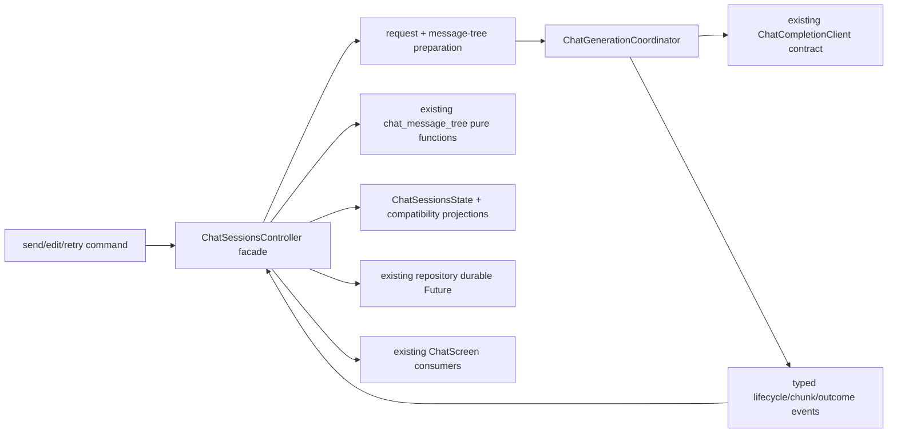

# Phase 9 - Chat Generation 生命周期 Implementation Plan

**Goal：** 在不改变聊天产品语义和 `chatSessionsProvider` 公共入口的前提下，把 generation 的准备、流式接收、停止、取消、异常 finish reason、自动重试、成功、空回复、失败和持久化失败收敛为显式 application 生命周期；同时把当前 2,000 行 controller/mixin 及 2,143 行 controller 测试按公开契约拆开。所有步骤都保持可运行，最终不包含 ChatScreen/workspace 重写。

**Architecture：** `ChatSessionsController` 继续作为 Riverpod facade，保留现有 CRUD、branching、checkpoint command 和 provider API；新增无 Flutter/Riverpod 状态的 `ChatGenerationCoordinator`，只拥有一次 generation 的异步时序、attempt、stream subscription、retry window 和 cancellation token。controller 负责准备请求快照、消息树纯操作、将 coordinator 事件投影到 `ChatSessionsState`，并通过现有 `ChatCompletionClient` / `ChatConversationRepository` 合同完成数据访问。`ChatMessageTree`、请求 builder/filter 和 checkpoint context 仍是纯输入输出，不迁移 ownership。

**现状基线：** 当前实际文件规模为 `chat_sessions_controller.dart` 1,043 行、`chat_sessions_controller_streaming.dart` 817 行、`chat_sessions_controller_support.dart` 225 行、`chat_sessions_state.dart` 230 行；`chat_sessions_controller_test.dart` 2,143 行，`chat_lifecycle_integration_test.dart` 247 行。controller 内部同时保存 `_activeStreamingSubscription`、`_activeStreamingCompleter`、`_latestStreamingReply`、`_streamStopRequested`、`_autoRetryCancelled`、`_requestGeneration`，并由两个 mixin 共同解释其时序。当前 `saveConversation` 多处未等待；Phase 4 已提供 repository 的 durable `save/flush/close` 完成语义，本 Phase 只消费该契约，不重做 data layer。

> 本 Plan 以 `Phase 9 - Chat Generation 生命周期.md` 为唯一完整审查输入。该文档的范围、依赖和验收条件没有矛盾，因此没有阅读完整 `architecure-review.md`；仅核对 TD-04（约第 196 行）和 TD-35（约第 324 行）所在局部证据。计划不提前实现 Phase 10 的 ChatScreen state/command 拆分、Phase 11 的 ports ownership、Phase 15 的存量等待/Key 治理或其他 Phase 功能。

## 一、范围、边界与必须保留的语义

### 1.1 本 Phase 的闭环

| 领域 | 当前问题 | 本 Phase 的目标 |
|---|---|---|
| generation 时序 | subscription、completer、布尔标志和 generation counter 分散在 controller/mixin | coordinator 以单一生命周期和 generation token 管理一次发送及其 retry attempts |
| stop/cancel | `stopStreaming()` 同时处理流式中断、retry 等待和延迟回调 | stop 是有原因的取消命令；旧回调只可结束自己的 generation，不能清空新 generation |
| retry | retry policy、随机等待、异常 finish reason 和空回复判断混在 streaming mixin | policy 是不可变 request 输入，等待器可注入，retry 由 coordinator 统一驱动 |
| 持久化 | generation 起始、终止和 stop 写入未等待，失败可能被吞掉 | 关键 generation checkpoint 等待 Phase 4 durable Future；失败成为可观察的 persistence failure，不能报告假成功 |
| controller 责任 | CRUD、消息树、checkpoint、generation 共用同一组隐式字段 | controller 只编排公开 command 和状态投影；tree/checkpoint 仍由现有纯函数和 command 负责 |
| 测试结构 | 一个入口覆盖 2,143 行场景，竞态定位困难 | 按 generation、CRUD、branching、checkpoint、lifecycle race 分组，保留最小共享 harness |

### 1.2 不可改变的产品/域契约

- 保持 `chatSessionsProvider`、`ChatSessionsController` 的现有公开方法和 presentation 调用方式；新增状态只能是向后兼容的 additive surface。
- 保持消息树规则：编辑用户消息创建新分支，旧节点保留；仅最新 assistant 回复可重试；删除分支时的回退选择继续使用 `chat_message_tree.dart`。
- 保持 Reasoning/Content 分离、finish reason 持久化、Prompt 拼接五步顺序、checkpoint context 解析和 inline error/empty-reply UI 语义。
- 保持流式 UI 300ms 刷新节流只发生在 UI 增量层；增量仍放在独立 `ChatStreamingReply`，不能把每个 token 写入会话列表。
- 不以 SnackBar/Dialog 显示网络或持久化错误；错误继续映射到 inline assistant/error state。确认操作的 dialog 规则不在本 Phase 扩展。
- 不把 `ChatCompletionClient`、SQLite repository、全量 ports、Riverpod framework 或 ChatScreen ownership 搬到新层；Phase 11/10 分别负责这些边界。

### 1.3 目标依赖图



coordinator 不读取 `ref`、不操作 `ChatConversation` 的 message tree、不决定 checkpoint 或 prompt 顺序；它只处理一次 generation 的异步控制流。controller 不再持有 coordinator 内部的 subscription/completer/cancellation flags。

## 二、显式生命周期与状态契约

### 2.1 生命周期模型

新增不可变的 `ChatGenerationSnapshot`（或同等命名）及 `ChatGenerationPhase`，至少包含：`generationId`、`conversationId`、可选 `assistantMessageId`、`attempt`、当前 phase、取消原因、terminal outcome 的 typed 标识。不得把 `StreamSubscription`、`Completer`、session token 或异常堆栈放入 state。

建议 phase 及转移如下；终态的具体文案仍由现有 `ChatErrorMessages`/controller 映射：

| Phase | 进入条件 | 允许的下一步 | 旧 API 投影 |
|---|---|---|---|
| `idle` | 无 generation | `preparing` | `isStreaming=false`、`isAutoRetryWaiting=false` |
| `preparing` | command 已校验、pending conversation 尚未开始网络请求 | `streaming`、`failed`、`persistenceFailed`、`cancelled` | busy，但不把未收到 chunk 误报为完成 |
| `streaming` | attempt 已创建 assistant 占位并开始监听 | `succeeded`、`emptyReply`、`failed`、`stopping`、`retryWaiting` | `isStreaming=true` |
| `stopping` | 用户 stop 已使 token 失效、正在形成中断快照 | `cancelled`、`persistenceFailed` | 对外立即 `isStreaming=false`，防止按钮需点击两次 |
| `retryWaiting` | 空回复/异常 finish/可重试网络失败且 policy 允许 | `streaming`、`cancelled`、`failed`、`persistenceFailed` | `isAutoRetryWaiting=true` |
| `succeeded` | 非空内容已处理并 durable save 成功 | `idle` 或下一次 command 的 `preparing` | 清除旧错误和 retry count |
| `emptyReply` | 原始 content/reasoning 均为空，或既有 empty-reply 语义命中 | `retryWaiting`、`idle` | 保留 assistant 占位和 inline empty card |
| `failed` | 流错误、retry 上限、不可重试 finish reason 或 output rule 错误 | `retryWaiting` 或 `idle` | 保留 inline assistant error |
| `cancelled` | user stop、取消 retry、旧 generation 被 supersede | `idle` | 保留已收到部分内容；不再触发迟到回调写入 |
| `persistenceFailed` | 关键 save/flush Future 失败 | `idle` 或显式 retry command | 内容快照保留，inline 告知“未能保存”，不得伪装成功 |

`disposed` 只作为 coordinator 的内部终止标识，不再向已 dispose 的 controller 写 state。terminal snapshot 在 controller 完成对应消息树/错误投影前保留；下一次 command 开始时统一转入新的 `preparing`，避免散落的 `clear*` flag 继续定义状态机。

### 2.2 Typed request、event 和 outcome

在 `lib/features/chat/application/` 新增不可变 DTO（命名可按仓库约定微调）：

- `ChatGenerationRequest`：conversation/parent identity、已构建 request messages、model/reasoning、preset/checkpoint metadata，以及一个不可变 `ChatRetryPolicy`；不重新构造 prompt。
- `ChatGenerationEvent`：`started`、`chunk`、`attemptCompleted`、`attemptFailed`、`retryScheduled`、`stopped`、`cancelled`、`persistenceFailed` 等 typed event；chunk 只带 content/reasoning/finish reason，不暴露 stream 实现。
- `ChatGenerationOutcome`：`success`、`emptyReply`、`failure`、`cancelled`、`persistenceFailure`，携带 generation/attempt identity 和必要的原始异常供 controller 既有 formatter 使用。

coordinator 对外提供 `start(request, observer/host)`、`stop()`、`dispose()`（具体签名以实现时的最小 typed contract 为准）；不得返回一个永远等待的 Future。每个 generation 必须有唯一 token，所有 `onData/onDone/onError` 首先验证 token 和当前 active handle。

### 2.3 Retry 与取消契约

- `ChatRetryPolicy` 从 controller 在 command 开始时读取一次 settings snapshot；coordinator 不在 retry loop 中 `ref.read`，也不依赖会话在等待期间的可变配置。
- `ChatRetryScheduler`/`ChatGenerationClock` 可注入。生产实现保留当前 per-minute window、fixed interval、jitter 和 timeout 语义；单元测试使用 fake scheduler/clock，不用真实秒级等待。
- `stop()` 先使 token 失效，再尽快取消 subscription，并完成当前 run 的 outcome；取消 `Future` 挂起不得阻塞 UI。之后到达的 onDone/onError/chunk 只能被丢弃。
- stop 发生在 retry waiting、流式间隙、已有部分内容或 `cancel()` 挂起时，都只产生一次终态和一次必要持久化；连续 stop 是幂等的。
- controller dispose 调用 coordinator dispose，取消等待器和 subscription；旧 generation 不可清理新 generation 的 handle，也不可在 dispose 后写入 state。

### 2.4 持久化完成/失败契约

沿用 Phase 4 的 repository contract，不增加 arbitrary delay：

1. generation 开始前，pending user + assistant placeholder 的保存作为 `preparing` checkpoint；Future 未成功前不启动网络请求。
2. 流式 token 只更新 `ChatStreamingReply`；attempt 成功、空回复、失败保留节点、stop 中断和 retry attempt 重置等语义节点各自通过统一 `persistGenerationSnapshot` 写入，并等待 durable Future。
3. durable save 失败时，controller 保留内存中的 conversation/inline error，标记 `persistenceFailed`，不把 run 返回为 success，也不自动把同一 request 重放；用户可通过既有 retry action 再次发起。
4. CRUD/checkpoint 仍经 controller facade，但所有写入统一经过带结果的 persistence helper；同步 command 可保持原有公开返回形状，失败必须进入可观察 error state，不得依赖 `Future.delayed` 判断是否落盘。
5. controller dispose 前只负责停止 generation；repository 的 `flush/close` ownership 仍由现有 composition/test harness 管理，不在本 Phase 改 bootstrap 或 data provider。

## 三、文件清单与具体修改

### 3.1 新增生产文件

| 文件 | 内容 | 明确不做 |
|---|---|---|
| `lib/features/chat/application/chat_generation_lifecycle.dart` | `ChatGenerationPhase`、snapshot、request、retry policy、cancel reason、outcome/event 的 Equatable/不可变值语义 | 不放 Flutter widget、Riverpod provider、消息树算法 |
| `lib/features/chat/application/chat_generation_retry_scheduler.dart` | `ChatGenerationClock`、retry scheduler contract 及生产实现；保留现有窗口/固定间隔语义 | 不改设置模型或 Phase 15 的全仓时间治理 |
| `lib/features/chat/application/chat_generation_coordinator.dart` | 单一 generation 的 attempt/stream/retry/stop/dispose 编排；消费现有 completion contract，通过 typed observer/host 回传事件 | 不 import presentation、不负责 checkpoint/prompt/tree、不搬迁 data ports |

### 3.2 修改生产文件

| 文件 | 计划修改 |
|---|---|
| `chat_sessions_state.dart` | 增加 additive 的 generation snapshot（或等值公开只读投影）；保留 `isStreaming`、`isAutoRetryWaiting`、`autoRetryCount`、错误字段，改由 lifecycle projection 维护；更新 copyWith/props 和 round-trip 测试 |
| `chat_sessions_controller.dart` | 保持 provider 和现有公开 commands；在 build/dispose 管理 coordinator；准备 send/edit/retry/checkpoint 输入，接收 typed events，处理 tree/state/persistence projection；移除 `_activeStreaming*` 等 generation 私有字段及 mixin setter/getter |
| `chat_sessions_controller_streaming.dart` | 第一阶段可作为旧签名到 coordinator 的薄 adapter，保留行为兼容；全部调用迁移后删除文件或只保留无状态兼容 helper，不能继续保存 lifecycle flags |
| `chat_sessions_controller_support.dart` | 只保留摘要、排序、配置解析、conversation merge 等无 generation 状态辅助；统一 persistence helper 的结果处理，移除对 streaming handle 的依赖 |
| `chat_sessions_controller_test.dart` | 收缩为入口/注册器或最终兼容测试；不再继续向单文件添加 generation case |
| `test/integration/chat_lifecycle_integration_test.dart` | 增加 durable generation success/failure、stop/retry/dispose 的跨容器行为验证；保留既有消息树和 checkpoint 恢复测试 |

### 3.3 明确不修改或仅在编译需要时触碰

- `lib/features/chat/application/chat_message_tree.dart`、`chat_request_message_builder.dart`、`request_message_filter.dart`、`checkpoint_request_context.dart`：只作为现有纯函数输入输出使用；不得改变消息树、Prompt 顺序或 checkpoint 语义。
- `lib/features/chat/data/chat_completion_client.dart`、`chat_conversation_repository.dart` 及其实现：只消费 Phase 4 已完成的 Future/flush contract；不在本 Phase 移动 ports、重写 SQL、改变 isolate 防抖。
- `lib/features/chat/presentation/chat_screen.dart` 及其 widgets：不改 state owner、composer、本地 workspace 参数或 presentation command；Phase 10 再消费稳定 generation command。
- settings auto-retry/output-processing models：只读取既有快照，不新增设置字段，不改变异常 finish reason 和输出正则的产品规则。

## 四、实施任务、可运行小步与独立提交

每个任务完成后都必须能通过其对应测试；不得先删除旧 mixin 再补新实现。

### Task 1：冻结公开行为和 lifecycle contract

1. 在新增 lifecycle DTO 前，为当前 controller 补齐/整理 characterization tests：成功、空回复、inline error、用户 stop、retry 上限、异常 finish reason、dispose、finish reason 持久化。
2. 从现有 `_isBusy` 和 flags 写出状态投影表，明确哪些字段是 compatibility projection，避免把 `isStreaming` 的旧 UI 意义误改成 `preparing/stopping`。
3. 添加 `chat_generation_lifecycle.dart` 与纯值测试；此任务不替换 controller 调用链。

**提交建议：** `test(chat): freeze generation lifecycle contract`（若只有文档/测试变更，使用仓库 Conventional Commit 规则）。

### Task 2：实现 coordinator 的单 attempt 和 callback guard

1. 实现 `start(request)` 的 `preparing → streaming → terminal` 路径，持有单一 active handle；把 token/attempt identity 校验放在每个 chunk、done、error 回调入口。
2. 将当前 `completeWithSuccess`、`completeWithError`、`streamStopRequested` 的竞态逻辑搬成 coordinator 内部 typed outcome；保留 output processing、tree replace 和 inline error 的决策在 controller/host。
3. 注入 fake clock/scheduler 和可控 StreamController，覆盖 onDone/onError 延迟到达、cancel 挂起、重复 stop、新 generation 启动后旧回调到达。
4. 暂时不删除 streaming mixin；增加一个兼容 adapter，让现有 controller 仍能通过旧公开 command 使用 coordinator。

**提交建议：** `refactor(chat): add generation coordinator single-attempt lifecycle`。

### Task 3：迁移普通 send、edit 和 manual retry 的 generation bridge

1. controller 继续使用现有 `resolveMessageTreeState`、`appendNodeToTree` 和 `resolveCheckpointContext` 创建 pending conversation/request；在 `preparing` checkpoint durable save 成功后调用 coordinator。
2. coordinator 的 chunk event 只更新 `ChatStreamingReply`，保持 `activeChatConversationProvider` 高频刷新隔离；terminal event 再由 controller 用 `replaceAssistantMessageInTree`/`mergeStreamingResultIntoActive` 产生最终会话。
3. 保留流式期间修改 model/preset/reasoning 时的 merge 规则；generation conversation identity 不匹配时拒绝写入，而不是依赖 debug assert。
4. 先迁移 `sendMessage`，再让 `editMessage` 和 `retryLatestAssistant` 共用同一 bridge；旧方法名、参数和 presentation 调用不变。

**提交建议：** `refactor(chat): route send and retry through generation coordinator`。

### Task 4：把 retry policy、异常 finish reason 和 stop/cancel 收进 coordinator

1. 从 settings controller 读取一次 `ChatRetryPolicy`，覆盖当前 `maxRetryCount`、jitter、fixedInterval/per-minute、timeout、empty reply 和 abnormal finish reason 规则。
2. 将 `sendMessageWithAutoRetry` 的 while loop、retry count 和 scheduler 等待移入 coordinator；当用户在 waiting 期间关闭 auto-retry、切换命令或 stop 时，使用 generation token 终止，不用隐藏布尔 flag 让旧循环继续。
3. 保持异常 finish reason 的既有分支：`stop`/`tool_calls` 不重试；`length`、`content_filter` 等按既有 setting 决定；output regex 将正文清空时优先显示 output-rule error，不重试死循环。
4. `stopStreaming()` 变为 facade：调用 coordinator stop，再由 typed outcome 生成部分内容/空占位/inline stopped error 并等待一次必要持久化；连续调用幂等。

**提交建议：** `refactor(chat): make retry and cancellation explicit`。

### Task 5：接通 durable persistence 和 controller dispose

1. 用统一 helper 包装 `repository.saveConversation/saveConversations` Future，区分“状态已更新”和“durable save 成功”；generation 关键 checkpoint 由 coordinator host await。
2. 注入故障 repository，验证 pending save、terminal save、stop save、retry reset save 任一点失败都会得到 `persistenceFailed`/inline error，且不会触发重复网络请求或假成功完成。
3. `build()` 注册 `ref.onDispose`：先让 coordinator invalidate/cancel，再清理订阅；不要在迟到回调中重置已创建的新 coordinator/run。
4. 保持现有 repository `flush/close` 的 ownership；本任务不修改 database/provider/bootstrap。

**提交建议：** `fix(chat): await generation persistence outcomes`。

### Task 6：收缩 controller/mixin 责任并完成 CRUD/checkpoint 边界

1. 删除 controller 中所有 generation handle 的 getter/setter 和旧私有 generation flags；`ChatSessionsControllerSupport` 只保留无状态 helper。
2. `createConversation`、rename/delete、message delete/select、preference update 和 checkpoint command 继续由 facade 暴露，统一走可观察 persistence helper；busy 守卫只读取 lifecycle projection。
3. 校验 checkpoint 创建期间与 generation 互斥、会话切换/分支编辑在 generation 期间被拒绝、错误和 empty-reply marker 不被 unrelated CRUD 清掉。
4. 只有所有 call site、测试和 provider 编译通过后，才删除 `chat_sessions_controller_streaming.dart` 中的旧实现；删除前用 `rg` 检查没有 presentation/test 直接依赖 mixin 私有行为。

**提交建议：** `refactor(chat): separate session commands from generation state`。

### Task 7：按公开契约重组测试入口

在 `test/features/chat/application/` 下采用 case-file decomposition：

```text
chat_sessions_controller_test.dart                 # 入口：import cases，调用 register*()
chat_sessions_controller/
  chat_sessions_controller_test_helpers.dart       # fake client/repository、container、finder
  chat_sessions_controller_generation_cases.dart   # success/empty/error/finish reason
  chat_sessions_controller_retry_cases.dart        # retry policy、abnormal finish、retry cap
  chat_sessions_controller_stop_cases.dart         # stop/cancel/late callback/dispose races
  chat_sessions_controller_crud_cases.dart         # conversation CRUD、preferences、history
  chat_sessions_controller_branching_cases.dart    # edit/select/delete/version navigation
  chat_sessions_controller_checkpoint_cases.dart   # checkpoint create/select/request context
```

原测试名称和行为断言尽量保留，只把它们归入公开契约；禁止按行数机械切片。测试 helper 不再从 `chat_screen` presentation helper 反向借用 Fake；application fake 只实现 `streamCompletion()`，保留 `complete()` 基类实现。setup 使用单帧 `pump`/同步 fixture；coordinator 测试用 fake scheduler/StreamController，不用真实 `Future.delayed`。

**提交建议：** `test(chat): decompose controller tests by public contract`。

### Task 8：范围审计与质量门禁

1. 检查生产 diff 只涉及 Chat application、必要的现有 data contract 消费和 Chat lifecycle tests；不得出现 ChatScreen/workspace、全量 ports、schema/migration、settings 产品语义或其他 Phase 文件。
2. 对本 Phase 改动的 Dart 文件执行 `dart format`，暂存后再次执行 `dart format --output=none --set-exit-if-changed`。
3. 依次运行单元/集成相关测试、`flutter analyze` 和按仓库规则重定向的全量测试；任何失败都在本 Phase 内修复后再提交。

## 五、测试计划与验收映射

### 5.1 Lifecycle/coordinator 单元测试

| 场景 | 必须观察的契约 |
|---|---|
| normal success | `preparing → streaming → succeeded`，chunks 合并，attempt 只计一次，terminal durable save 成功后才报告 success |
| empty reply | content/reasoning 都为空时进入 `emptyReply`，assistant placeholder、finish reason、inline empty marker 保留 |
| inline error | stream error 进入 `failed`，assistant 节点保留，异常经既有 formatter，不能被迟到 onDone 覆盖 |
| user stop | 部分内容持久化；无内容保留空占位；`isStreaming` 立即归 false；stop 重复调用只产生一个 outcome |
| cancel retry wait | scheduler 可取消；不发起下一次 request；旧 retry future 完成且不改新 state |
| abnormal finish/retry | 按 policy 触发或跳过重试；`stop`/`tool_calls` 等既有例外保持不变；output rule 清空正文不进入 retry loop |
| retry failure/cap | 每次 attempt identity 单调；达到上限进入 failed；不重复保存同一终态 |
| persistence failure | pending/terminal/stop save 失败进入 persistence failure；不报告 success、不自动重放 body |
| dispose | active subscription、scheduler、coordinator handle 被取消；任何迟到事件均被忽略；无未处理异常 |

### 5.2 Controller contract tests

- CRUD：创建、选择、重命名、删除和 history revision 的外部状态保持现状；generation 期间 busy 守卫仍阻止会话切换/删除等冲突操作。
- Branching：编辑用户消息产生新 branch；旧 branch 保留；最新 assistant retry 规则、select-version navigation、delete fallback 保持现状。
- Checkpoint：创建、链式 context、excluded messages、applied checkpoint title 和 generation 互斥保持现状。
- Provider compatibility：现有 `chatConversationsProvider`、`activeConversationIdProvider`、`isChatStreamingProvider`、`isChatBusyProvider`、`activeChatConversationProvider` 消费者无需迁移即可得到同样的 projection。
- State value semantics：generation snapshot、legacy flags、streaming reply、error/empty IDs 的 copyWith/Equatable 行为明确，不依赖私有 subscription 或 widget layout。

### 5.3 Integration tests

在现有 `chat_lifecycle_integration_test.dart` 上扩展：

1. send success → container dispose/recreate，消息、finish reason 和 branch selection 完整恢复。
2. stop/empty/error 后重建，持久化消息节点可恢复；错误文案本身仍按既有 state 规则处理。
3. generation 期间触发会话切换/编辑/stop，再发送新 generation，验证旧回调不会覆盖新会话或产生重复持久化。
4. 注入一次性 repository failure，确认内存状态和 durable 状态的差异可解释，下一次显式 retry 可继续，不自动重复模型请求。
5. checkpoint 创建与普通 generation 互斥，已有 checkpoint persistence 测试继续通过。

不通过像素位置、私有 `ValueKey` 或 timing 偶然性断言生命周期；所有异步顺序由 fake stream/scheduler/可观察 outcome 控制。

### 5.4 Verification commands

```powershell
# 仅运行本 Phase 相关测试时也要重定向
flutter test test/features/chat/application --reporter compact 2>&1 | Out-File -Encoding utf8 phase9-chat-tests.log; $E = $LASTEXITCODE; Write-Host "EXIT=$E"; Get-Content -Tail 150 phase9-chat-tests.log

# 集成生命周期测试
flutter test test/integration/chat_lifecycle_integration_test.dart --reporter compact 2>&1 | Out-File -Encoding utf8 phase9-chat-integration.log; $E = $LASTEXITCODE; Write-Host "EXIT=$E"; Get-Content -Tail 150 phase9-chat-integration.log

# 提交前：对本次改动 Dart 文件先 format，再暂存后做严格检查
dart format <本次改动的 Dart 文件列表>
dart format --output=none --set-exit-if-changed <暂存的 Dart 文件列表>

flutter analyze
flutter test --reporter compact 2>&1 | Out-File -Encoding utf8 fltest.log; $E = $LASTEXITCODE; Write-Host "EXIT=$E"; Get-Content -Tail 150 fltest.log
```

## 六、完成清单

- [ ] `ChatGenerationCoordinator` 是 generation 时序的唯一 owner；controller/mixin 不再以多个隐藏 flags 定义 lifecycle。
- [ ] preparation、streaming、retry waiting、stopping、success、empty、failure、cancel、persistence failure、dispose 的转移和 token guard 有 typed 测试。
- [ ] 关键 generation 写入等待 Phase 4 durable Future；持久化失败不被吞掉、不假报成功、不自动重放请求。
- [ ] 现有 `chatSessionsProvider` 和所有当前 presentation 消费者无需一次性迁移；legacy state projection 回归通过。
- [ ] CRUD、branching、checkpoint、generation 可按独立公开契约理解和测试，消息树/Prompt/Reasoning/inline error 产品语义不变。
- [ ] controller 测试入口已按 generation、CRUD、branching、checkpoint 等 case 文件拆分，shared helper 没有反向绑定 ChatScreen。
- [ ] `chat_sessions_controller_streaming.dart` 只在所有 call site 迁移后删除；最终无残留旧 subscription/completer ownership。
- [ ] `flutter analyze` 通过，全量测试按重定向规范得到 `EXIT=0`，所有本 Phase Dart 文件格式检查通过。
- [ ] commit/review/rollback 可作为独立 Phase 完成；diff 不含 Phase 10/11/15 或其他范围外功能。

## 七、严格反范围检查

以下任一项出现都应停止并拆回后续 Phase，而不是顺手实现：

- 修改 `ChatScreen`、composer local state、workspace 参数、路由或 presentation ownership。
- 搬迁/重命名全部 chat/sync ports，改变 data/application ownership（Phase 11）。
- 修改 SQLite schema、migration、SQL/mapper 单一事实源或 background writer 实现（Phase 4/17）。
- 改变自动重试产品策略、Prompt 顺序、消息树分支规则、Reasoning/Content 分离、inline error 展示规则。
- 用另一种状态管理框架、代码生成或新的厂商 SDK 替代 Riverpod/raw `http`。
- 将 Phase 15 的全仓 `pumpAndSettle`、Key、真实时间治理扩大到本 Phase 未直接触及的存量测试。

