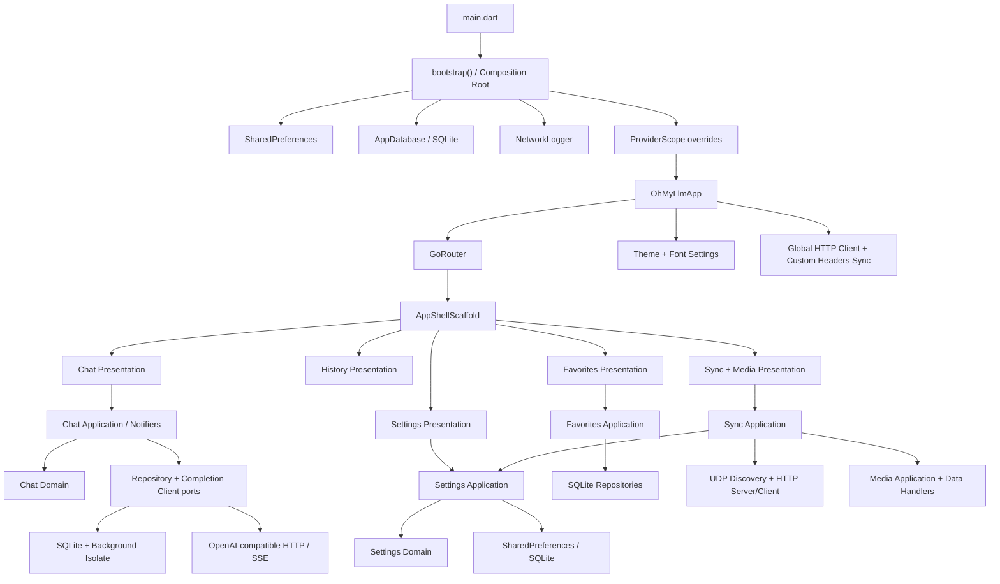
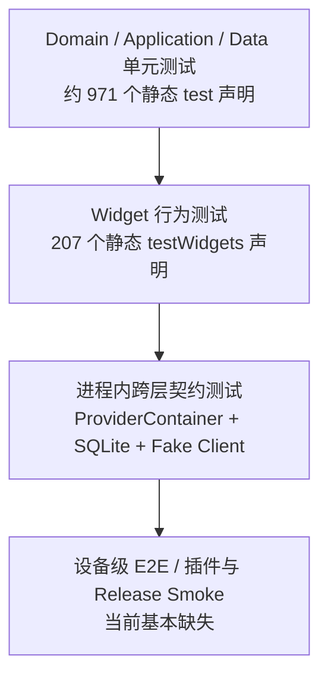
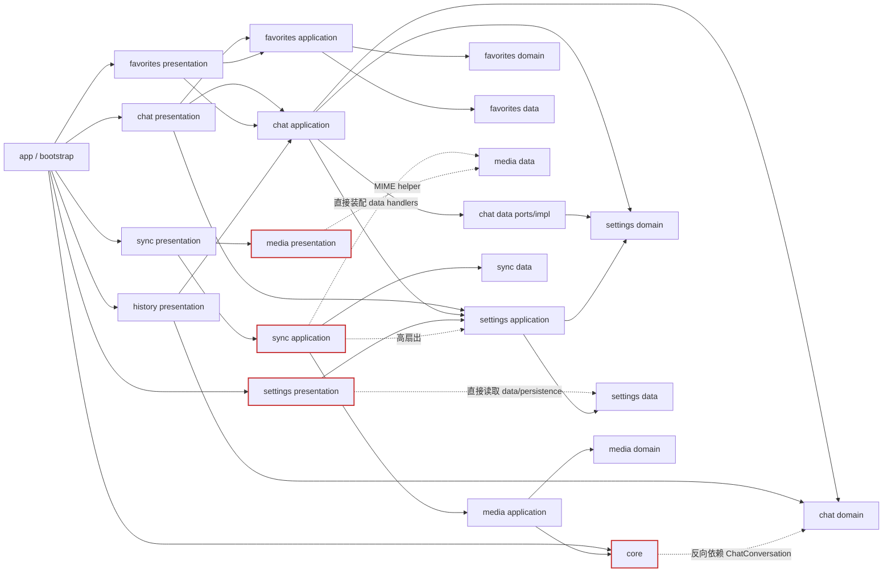
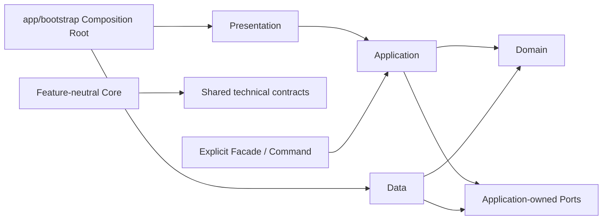

# Oh My LLM 第一轮架构审查

> 审查日期：2026-07-25  
> 审查基线：`8de45d5`（审查期间工作区存在用户自己的未提交改动；本报告不评价这些改动）  
> 审查目标：长期可维护性、演进成本与工程可验证性，不以罗列功能缺陷为目标  
> 审查范围：`lib/`、`test/`、`android/`、`windows/`、`.githooks/`、构建脚本、依赖与分析配置、README/协作规范  
> 代码改动：无。本轮只新增本报告。

## 1. 执行摘要

这是一个已经形成明确工程方法的 Flutter 项目，不是“先写页面、后补架构”的代码库。项目采用 feature-first 目录、Riverpod 3、Repository、原始 HTTP/SSE、SQLite migration、Provider override 测试注入，并针对消息树、流式刷新、后台持久化和厂商兼容做了专门设计。文件级 import 图未发现真实循环依赖，静态分析也保持干净。

长期风险不在技术栈选错，而在业务增长已经开始超过部分边界的承载能力：

1. `ChatSessionsController`、`ChatScreen`、`SettingsScreen`、`SyncServerController` 成为高变更集中点；mixin 和叶子 Widget 降低了文件局部复杂度，但没有完全降低共享状态和工作流耦合。
2. 文档声明的 `presentation -> application -> domain`、`core` 不依赖 feature 等边界已出现多处穿透；当前尚未形成 import cycle，但 feature 之间的可独立演进能力正在下降。
3. HTTP、同步和后台 SQLite 的实现细节整体扎实，但“信任域”和“异步完成语义”没有成为显式架构契约：LLM 自定义 Header 会进入局域网请求，后台 save 的 Future 只代表排队而非落盘。
4. 测试规模和层次优于多数同体量项目，但没有 CI 将其变成门禁；当前全量测试在本机为 1258 通过、4 失败，且失败体现了 Windows 路径表示与 UDP 并发隔离问题。
5. 不建议引入另一套状态管理、全面上 Clean Architecture、或给每个按钮建立 UseCase。最优策略是保留现有骨架，优先修复信任域、持久化契约、CI 和高扇出模块，再按需求渐进拆分核心工作流。

### 总体评分

| 维度 | 评分 | 结论 |
|---|---:|---|
| 可维护性 | **7.0 / 10** | 基础结构清楚，但核心工作流和跨 feature 边界已出现集中化 |
| 测试质量 | **7.5 / 10** | 覆盖层次广、fixture/harness 成熟；无 CI，当前全量测试非全绿，部分测试依赖时序/环境 |
| Flutter Best Practice 符合度 | **7.2 / 10** | Riverpod、GoRouter、不可变模型、响应式布局方向正确；UI 边界、导航恢复、设备 E2E 有缺口 |
| **Overall Score** | **72 / 100** | 适合继续演进，但应先偿还少量高杠杆架构债，避免复杂度在 chat/sync 周围继续聚集 |

## 2. 审查方法与客观画像

### 2.1 扫描规模

| 项目 | 数量 |
|---|---:|
| 生产 Dart 文件 | 260 |
| 生产 Dart 物理行（含空行/注释） | 约 32,838 |
| 测试 Dart 文件 | 144 |
| 测试 Dart 物理行（含空行/注释） | 约 26,846 |
| 静态 `test` / `testWidgets` 声明 | 1,178 |
| 当前运行时展开的测试数 | 1,262 |
| `NotifierProvider` | 约 29 |
| 全部 Provider 声明 | 约 59 |
| Provider override 使用 | 约 97 处 |
| 文件级 import cycle | 0 |

测试代码与生产代码行数比约为 0.82，说明项目对回归保护投入较高。需要注意，测试数量包含循环参数化后在运行时展开的用例，因此高于静态声明数。

### 2.2 验证结果

| 命令 | 结果 | 解释 |
|---|---|---|
| `flutter analyze --no-pub` | `EXIT=0`，No issues found | 当前静态分析干净 |
| 全量 `flutter test --reporter compact` | `EXIT=1`，1258 通过 / 4 失败 | 3 个媒体路径断言受 Windows 8.3 短路径影响；1 个 UDP 用例在全量并发时收到残留广播 |
| 媒体目录扫描单文件测试 | 15 通过 / 3 失败 | `media_directory_scanner_test.dart:33,39,55` 稳定复现短路径/长路径表示不一致 |
| UDP 单文件测试 | 2/2 通过 | `sync_udp_discovery_test.dart:77` 单独运行通过、全量并发失败，说明共享网络环境隔离不足 |

四个失败测试现已修复。

仓库中的 `coverage/lcov.info` 显示旧快照为 82.39%（9559/11602），但文件时间为 2026-07-19，且包含当前已不存在的文件，不能作为本次审查的当前覆盖率。它只能说明项目曾建立过较高覆盖基线。

### 2.3 评判基准

本报告以项目自己的 `AGENTS.md` 为首要约束，同时参考 Flutter 官方 Architecture Recommendations：清晰 UI/Data 边界、Repository、依赖注入、单向数据流、不可变模型、Widget 不承载业务逻辑；domain/use case 层按复杂度选择，而非强制每个操作建立一层。Riverpod 部分按项目实际使用的 3.3.1 文档评估 Provider override、`ref.watch` 与生命周期。

因此，本报告不会因为“没有统一 Service/UseCase 目录”机械扣分，而会判断某个工作流是否已经复杂到需要独立事务或资源边界。

## 3. 目录结构审查

### 3.1 当前结构

```text
lib/
  app/                    应用壳层、GoRouter、导航、主题
  core/                   HTTP、日志、持久化、通用 Widget/工具
  features/
    chat/                 domain / data / application / presentation
    favorites/            domain / data / application / presentation
    history/              presentation（复用 chat 的 application/domain）
    media/                domain / data / application / presentation / utils
    settings/             domain / data / application / presentation
    sync/                 domain / data / application / presentation
  bootstrap.dart          生产基础设施初始化与 Provider overrides
  main.dart               极薄入口

test/
  app/ core/ features/    与生产目录大体镜像
  helpers/                harness、fixture、matcher、fake
  integration/            进程内跨层契约测试
```

### 3.2 Feature 规模

| Feature | 文件数 | 约行数 | 判断 |
|---|---:|---:|---|
| chat | 79 | 13,585 | 最大且业务密度最高；application 与 presentation 均出现集中点 |
| settings | 77 | 8,653 | 模型和 UI 拆分充分，但 Screen 与持久化策略不一致 |
| media | 27 | 3,545 | 数据处理与 UI 边界基本可识别，OS/进程依赖未充分注入 |
| sync | 17 | 2,322 | 文件不多但跨模块扇出最大，是实际组合模块 |
| favorites | 13 | 1,448 | 结构简洁，但与 chat presentation 双向知道 |
| history | 6 | 720 | 更接近 chat 的查询视图，而非独立 bounded context |

### 3.3 优点

- feature-first 使功能代码具有较好邻近性，chat/settings 又继续按 `composer`、`dialogs`、`form`、`list`、`tab` 等细分。
- `main.dart`、`bootstrap.dart`、`app/` 职责清楚，启动依赖顺序可读且可测试。
- 测试目录镜像生产结构，并用 `*_cases.dart` 处理超大 Widget 测试入口，避免测试运行器重复发现。
- 没有 `part/part of`，大文件拆分通过正常 import 完成，符合项目规范。

### 3.4 问题与决策

| ID | 问题与证据 | 为什么是问题 | 影响 | 重构收益 | 成本 | 现在是否值得 |
|---|---|---|---|---|---|---|
| TD-08 | `history` 只有 presentation，并直接依赖 chat application/domain；例如 `history_screen.dart:11-16` | 目录名暗示独立 feature，实际却是 chat 的历史查询视图，ownership 不明确 | 新增历史能力时容易在 history 与 chat 两边放逻辑；维护者难判断边界 | 明确为 `chat/history` 子模块，或保留目录但在文档中声明它是 chat read model | 低 | **现在值得做“边界声明”**；不值得只为目录整齐搬文件 |
| TD-09 | `core/persistence/background_sqlite_writer.dart:6` 反向依赖 chat domain，并包含 chat 表写入 | `core` 不再是 feature-neutral 基础设施 | chat schema 变化会修改 core；其他 feature 复用 writer 时继续堆特例 | 把 chat command/mapper 移入 `features/chat/data`，core 只保留通用 isolate 通道 | 低-中 | **值得现在做**，行为改动小、依赖方向收益高 |
| TD-17 | 仓库跟踪 `.claude/settings.local.json` 和异常命名的 `E…gitfull_diff.txt`；README/默认 pubspec 描述也有陈旧信息 | 本地配置、诊断产物、项目元数据混在源码事实源中 | clone 噪声、潜在信息暴露、维护者执行过时流程 | 清理跟踪文件，补 ignore，移除易过期数字或自动生成 | 低 | **值得现在做**，独立 housekeeping 提交 |

## 4. 总体架构设计

### 4.1 当前项目架构图



### 4.2 架构优点

- 使用单向状态流：Widget 读取 Provider state，通过 Notifier command 修改状态。
- domain 模型大多不可变并使用 `Equatable`，消息树、请求拼接、正则处理等纯业务函数已从 UI 分离。
- Repository 与网络 client 在 chat/favorites 中有明确抽象，SQLite/HTTP 可通过测试 override 替换。
- SSE 厂商差异被拆为 payload adapter、chunk strategy、parser 三类策略，避免主 client 充满供应商分支。
- AppDatabase 统一 PRAGMA、migration、事务与测试内存库，数据生命周期集中。

### 4.3 结构性问题与决策

| ID | 问题与证据 | 为什么是问题 | 影响 | 重构收益 | 成本 | 现在是否值得 |
|---|---|---|---|---|---|---|
| TD-05 | application 所依赖的抽象接口位于 data，例如 `chat_sessions_controller.dart:16` 导入 `data/chat_completion_client.dart` 与 `data/chat_conversation_repository.dart` | 已依赖接口，但接口由实现层拥有；port、Provider binding、具体实现选择混在 data | 架构规则难自动验证，模块抽取和多实现演进不自然 | 将上层需要的 port 渐进迁至 `application/ports` 或 domain，data 仅实现 | 中 | **渐进做**；新 port 立即遵循，旧代码不做大搬迁 |
| TD-06 | 聚合 feature 有双向“知道”：chat presentation 调 favorites application，favorites presentation 调 chat application；sync 直接依赖大量 settings/media 内部类 | 虽无文件级 cycle，但 feature 不是独立演进单元 | 一方内部重构波及另一方；继续增长后容易形成真实环 | 建立少量跨 feature facade/command；明确 history 是 chat read model；sync 只依赖 snapshot/media route port | 中-高 | **优先收敛 sync 高扇出和 chat↔favorites command**，不追求消灭所有横向 import |
| TD-10 | settings domain 模型依赖 `core/persistence/has_id_and_updated_at.dart`，如 `memory_prompt.dart:5`；部分 domain 摘要依赖展示工具 | 持久化需求反向塑造 domain 类型 | 更换存储或抽 package 时需携带 persistence 概念 | 先把 entity metadata 移到中性 domain/core 类型；最终由 repository adapter 取字段 | 中 | **先低成本止损**；彻底解耦等模块化/换存储需求出现 |
| TD-07 | AppDatabase 集中所有 feature schema/migration | 单体应用下简单有效，但 schema ownership 全落在 core | feature 增长后 migration 文件和跨 feature变更继续集中 | 逐步引入 feature migration registry/mapper ownership，由 AppDatabase 统一执行 | 高 | **暂不全面重构**；下一次大 schema 扩张时开始渐进拆分 |

## 5. 状态管理方案

### 5.1 评价

Riverpod 3 + `NotifierProvider` 适合当前项目，不建议更换框架。项目对 rebuild 隔离已有成熟认识：

- `chat_sessions_controller.dart:38-103` 提供细粒度派生 Provider，并使用 `.select`。
- `ChatStreamingReply` 与持久会话列表分离，避免高频 token 更新让侧栏等无关区域重建。
- streaming UI 以 300ms 节流，而不是污染 SSE parser。
- ProviderScope override 被大量用于测试，和 Riverpod 3.3.1 推荐的注入方式一致。
- 长生命周期 HTTP client、sync socket 等基本都有 `ref.onDispose` 或显式 dispose 意识。

问题不在 Provider 数量，而在状态 ownership 与工作流状态机仍集中于少数对象。

### 5.2 问题与决策

| ID | 问题与证据 | 为什么是问题 | 影响 | 重构收益 | 成本 | 现在是否值得 |
|---|---|---|---|---|---|---|
| TD-04 | `ChatSessionsController` 1045 行，streaming mixin 813 行，support mixin 225 行；共同管理订阅、generation、stop、retry、消息树、持久化和 checkpoint | mixin 只拆文件，没有拆共享状态；它们共同构成隐式异步状态机 | 修改停止、自动重试或分支编辑需理解约 2000 行和多个时序标志；竞态回归成本高 | 抽取 `ChatGenerationCoordinator`/显式生命周期状态机；会话 CRUD、checkpoint 作为独立 application command，保持现有 Provider API | 高（约 1-2 周，需分阶段） | **值得现在启动渐进重构**；禁止大爆炸替换 |
| TD-11 | `ChatScreen` 同时维护本地 controller、草稿、模板选择、编辑快照，又读多个全局 Provider；部分概念需要本地/Provider 双写 | 同一状态存在多个 owner，等值更新和页面销毁语义复杂 | 恢复、重建和测试需要理解隐式同步规则 | 明确页面瞬态、会话态、持久态三类 owner；先抽 composer view-state/command | 中-高 | **随下一次 composer/chat 需求拆**，不要为形式一次性迁移全部状态 |
| TD-12 | `SyncClientState.selectedCategories`、`MediaBrowserState.items/pathHistory` 暴露可变集合，部分 state 无值相等 | 调用方理论上可绕过 Notifier 原地修改；状态相等语义不一致 | Riverpod 通知和测试比较更难推理 | 使用 `List.unmodifiable`/`Set.unmodifiable`，统一 state value semantics；无需强制引入代码生成 | 低-中 | **值得现在渐进治理** |
| TD-13 | 资源型 Provider 基本是全局非 autoDispose，sync/media 页面离开后是否保活由隐式容器生命周期决定 | UI 路由生命周期与网络/进程资源生命周期没有显式策略 | 后台保活可能是需求，也可能造成资源长期占用；维护者无法从 API 判断 | 为每个资源记录 keep-alive policy；页面级资源采用 autoDispose + 显式 keepAlive，会话级资源保留全局 | 中 | **先写清策略再改**，不应统一机械切 autoDispose |

## 6. 依赖注入方案

### 6.1 优点

- `bootstrap()` 是明确的基础设施 composition root，可注入 SharedPreferences、AppDatabase、NetworkLogger。
- Repository/client 多数通过 Provider 构建，测试可以 override 为 fake。
- `httpClientProvider` 统一实例生命周期并在 dispose 时关闭。
- 生产初始化顺序明确：Flutter binding → preferences → database → logger → ProviderScope。

### 6.2 问题与决策

| ID | 问题与证据 | 为什么是问题 | 影响 | 重构收益 | 成本 | 现在是否值得 |
|---|---|---|---|---|---|---|
| TD-14 | `SyncServerController` 内直接 new `SyncHttpServer`、Media scanner/cache/generator/handlers；thumbnail generator 直接 `Process.run` ffmpeg | 基础设施 construction 散落在 application，Provider 只注入了底层资源的一部分 | controller 测试需要真实 socket/process；替换传输/媒体后端会改业务控制器 | 注入 `SyncServerTransport`、`MediaRouteFactory`、`ThumbnailBackend/ProcessRunner` | 中 | **同步/媒体继续扩展前做**；不必为所有纯函数造接口 |
| TD-03 | `SettingsImportExecutor.executeImport(dynamic ref, ...)` 使用动态 ref 作为 service locator | 依赖列表隐藏，编译器无法检查调用契约 | Provider 改名/类型变化延迟到运行时；导入流程难以纯单测 | 显式注入 `SettingsImportTarget`/repositories，或将 executor 做成有类型依赖的 Provider | 低-中 | **值得现在做** |
| TD-15 | `ref.read(...)` 在大型 Notifier 内承担隐式服务定位，尤其 sync 对 8 类 settings controller 的读取 | 单个 Provider override 不足以替换完整用例依赖 | 测试装配复杂，依赖扇出增长不易察觉 | 在 application 边界注入聚合 facade，例如 `SettingsSnapshotService` | 中 | **优先用于 sync**；小型 controller 保持现状即可 |

依赖注入评分为 6.5/10。框架机制使用正确，但 composition root 尚未覆盖高层用例，部分 controller 自身就是隐藏的 composition root。

## 7. 网络层设计

### 7.1 优点

1. `OpenAiCompatibleChatClient` 只负责请求与流传输，解析交给 `ChatChunkParser`，响应差异交给 `ChunkParseStrategy`，请求差异交给 `VendorPayloadAdapterRegistry`。
2. SSE idle timeout 只由 `data:` 行重置，并处理 pause/resume/cancel，比直接 `Stream.timeout` 更符合协议语义。
3. 原始 `package:http` 没有引入厂商 SDK，符合无厂商绑定目标。
4. HTTP client 复用连接并集中关闭，自定义 Header 原地更新，不会因设置变化中断在途请求。
5. NetworkLogger 有脱敏、截断、滚动文件和测试，说明可观测性被当作基础设施设计。

### 7.2 问题与决策

| ID | 问题与证据 | 为什么是问题 | 影响 | 重构收益 | 成本 | 现在是否值得 |
|---|---|---|---|---|---|---|
| TD-01 | 全局 `CustomHeadersHttpClient.send()` 对所有 host 注入用户 Header（`custom_headers_http_client.dart:27-38`）；sync/media 也使用同一个 `httpClientProvider` | LLM 外部供应商与局域网 peer 是不同信任域，却共享 Header policy | API key、Cookie 或代理 token 可能被发到局域网服务；模块无法声明自己的安全策略 | 拆为 `externalLlmHttpClientProvider` 与 `peerHttpClientProvider`，或注入 host allowlist policy | 低-中 | **立即值得**，边界清晰且安全收益高 |
| TD-02 | Sync HTTP 绑定 `InternetAddress.anyIPv4`（`sync_http_server.dart:20`），任意 POST 可请求包含 provider API key 的设置快照；无配对、认证或授权 | “同一局域网即可信”是隐式假设，没有成为协议策略 | 凭据暴露；未来补认证会穿透协议、UI、handler、测试 | 建立 threat model；加入一次性配对码/session token，敏感分类二次确认，必要时请求签名/重放保护 | 中-高 | **对外分发或继续扩展同步前必须做** |
| TD-16 | `NetworkLogRedactor` 只专门识别 Authorization/apiKey；任意自定义 Cookie/X-API-Key 可原样落盘；每条 SSE 均 fire-and-forget 且日志 `flush:true` | 自定义 Header 是开放集合，逐 chunk 强制落盘形成隐私和吞吐双重风险 | 凭据/聊天内容明文留存；高频输出产生磁盘写放大和无界 Future 链 | Header 默认匹配 `token/key/secret/cookie/auth` 脱敏或 allowlist；正文日志 opt-in；SSE bounded queue + 批量 flush + drain | 中 | **脱敏立即做**；批处理在性能测量后紧随 |
| TD-18 | vendor adapter 主要按硬编码 host 推断能力（`vendor_payload_adapters.dart:102-121`） | 自托管、代理或同 host 不同模型能力不能准确选择策略 | 新非标准 endpoint 需要改源码发版，host 推断可能误判 | model/provider 配置增加显式 capability/adapter id，host 仅作 fallback | 低-中 | **等真实兼容需求出现再做**，不预建插件系统 |
| TD-19 | `ModelListClient` 与 chat client 分别实现计时/日志/错误映射，前者 elapsed 固定为 zero | HTTP 横切能力没有单一薄层 | 新 endpoint 继续复制不一致模板，诊断数据可信度下降 | 建立轻量 instrumented request executor/decorator，统一计时、最终 Header 与错误截断 | 低-中 | **可与 HTTP 信任域拆分一起做** |

## 8. Repository、Service 与 UseCase 分层

### 8.1 当前判断

项目没有统一 `service/` 或 `usecase/` 目录本身不是问题。简单 CRUD 由 Notifier 直接编排，能减少空洞转发层。当前真正需要独立用例边界的是：

- chat generation/stream/retry/stop 生命周期；
- settings snapshot/export/import；
- sync session/server lifecycle；
- background durable write/flush/close。

这些流程都有独立事务、并发或资源边界，继续放在 Controller 会加剧状态耦合。

### 8.2 Repository 优点

- Chat、Favorites、Collections 有抽象 Repository；SQLite 是实现细节。
- `SqliteEntityRepository<T>` 对“小规模全量加载+全量替换”实体减少了重复代码。
- `VersionedJsonStorage` 为 SharedPreferences JSON 提供版本封装。
- AppDatabase migration 和 `PRAGMA user_version` 集中，事务工具对失败回滚。

### 8.3 问题与决策

| ID | 问题与证据 | 为什么是问题 | 影响 | 重构收益 | 成本 | 现在是否值得 |
|---|---|---|---|---|---|---|
| TD-20 | `BackgroundChatConversationRepository.save*` 返回的 Future 在 80ms debounce 排队后即完成；无 ACK、`flush()`、`close()`、worker error/exit 协议，ReceivePort/Isolate 无完整生命周期 | Repository 的异步完成语义与“持久化完成”直觉不一致 | 退出时尾部消息可能未确认落盘；失败只能 print；测试依赖固定 delay | 命令加 requestId+ACK，提供 queued/durable 两种语义、flush/close、有界 drain、onError/onExit 降级 | 中 | **值得现在做**，这是主数据可靠性基础 |
| TD-21 | 前台 `sqlite_chat_conversation_repository.dart:470-625` 与后台 writer 重复完整 UPSERT/映射；`loadAll` 读取 `finish_reason`，`loadConversation` 路径未读取该列 | schema、编码、解码存在多个事实源，迁移无法由编译器提示漏改 | 新列需多点同步，读取路径与写入路径逐渐漂移 | 提取 chat-owned SQL mapper/command codec，前后台共享；core writer 不认识 ChatConversation | 中 | **值得现在做**，已有漂移证据 |
| TD-22 | ChatDefaults 有 repository，但 auto-retry/custom headers/font/output/media root/sidebar 等 Controller 直接 JSON + SharedPreferences；有的更新 state 后写盘，有的先写盘 | 同类设置存在两套持久化架构和错误语义 | 格式迁移、损坏恢复、并发写入策略分散 | 建立轻量 `SettingsStore<T>`：key、codec、version、fallback、commit policy；小设置无需每个单独 interface | 中 | **先统一 Future/版本契约，其他随修改迁移** |
| TD-23 | `settings_entity_controller.dart:19-46` 的公开 async 方法调用 `_commit()` 时没有 await/return；泛型 repository 每次 DELETE+全量 INSERT | application 对成功提交的定义不一致；全量替换策略被泛型隐藏 | 调用方 await 不代表 `_commit()` 写完；数据增长后写放大 | 修正 Future 链；为高频/大集合增加增量 CRUD，小集合保留 replace-all | 低-中 | **Future 契约现在修；增量 CRUD 以规模为触发** |
| TD-24 | SyncMessage/version 与 SettingsExportData formatVersion 存在字段但没有 supported range、拒绝或 migration；payload 还二次 JSON 编码 | 版本是装饰数据，不是兼容性协议 | 新旧客户端可能静默丢字段，兼容逻辑散落 controller | typed protocol DTO、版本协商/迁移、结构化 payload | 中 | **跨设备协议继续发布前做** |

## 9. Widget 组织与导航

### 9.1 优点

- Widget 按 feature 及语义子目录组织，chat/settings 的叶组件拆分细致。
- `AppShellScaffold` 在桌面 NavigationRail 与移动 NavigationBar 间切换，业务页面无需复制壳层。
- `AdaptiveMasterDetailLayout`、Settings card grid、chat composer 等使用 LayoutBuilder 处理局部约束。
- 确认弹窗、empty state、notification bubble、rename dialog 有 core 级复用。
- 错误采用 inline assistant card，没有 SnackBar 错误路径，和领域交互一致。
- 大部分 IconButton 有 tooltip；复杂消息锚点已有 Semantics。

### 9.2 问题与决策

| ID | 问题与证据 | 为什么是问题 | 影响 | 重构收益 | 成本 | 现在是否值得 |
|---|---|---|---|---|---|---|
| TD-25 | `ChatScreen` 1324 行，build 读大量 Provider，`_buildBody`/`_buildWorkspace` 有 20+ 参数，并直接编排收藏、撤销、模板和发送 | 叶 Widget 已拆，但页面 coordinator 仍混合视觉、瞬态状态和跨 feature 用例；参数爆炸是 data clump | 高频变更集中同一文件，review/冲突/全页重建和测试装配成本增长 | 先引入不可变 `ChatWorkspaceViewState/Bindings` 参数对象，再逐项把收藏/发送组装移入 application command | 高 | **按需求渐进拆**；不建议一次重写 |
| TD-26 | `SettingsScreen` 831 行，直接读 SharedPreferences、ModelListClient，处理 tab 迁移、Clipboard import/export、去重和所有 dialog | presentation 穿透 data/persistence，同时承担完整 workflow | 存储或网络 DTO 变化迫使 Widget 改；纯逻辑只能通过 Widget 测试覆盖 | 抽 `SettingsTabPreferenceController`、`SettingsTransferController`、model catalog state；Screen 只组合 UI | 中 | **值得现在做**，边界独立且比 chat 风险低 |
| TD-27 | Media presentation 直接 import `data/media_mime_types.dart`；SyncScreen 直接读 persistence 并嵌入 media presentation | 声明的单向依赖规则不能由目录保证 | 数据实现变更传播到 UI；sync/media ownership 不清 | MIME 分类移 domain；偏好经 application；Sync+Media 组合放 app/composite 页面 | 低到中 | **MIME/偏好立即快修；组合边界在功能扩展前做** |
| TD-28 | 顶层 GoRoute 平铺，收藏详情用 `state.extra as Favorite`（`app_router.dart:50`），media 又用 `Navigator.push(MaterialPageRoute)` | 路由状态不可序列化且混用两套路由栈 | deep link/刷新缺 extra 会失败；顶层切页销毁页面状态；返回行为复杂 | 详情改为 ID route + Provider 加载；评估 StatefulShellRoute；media 变子路由 | 详情低，shell 中-高 | **详情近期做**；shell 仅在状态丢失已影响 UX 或新增顶层模块时做 |
| TD-29 | 断点有 720/840/680/640/600/560 等散落值，测试主要覆盖超宽桌面，Settings/Sync 缺 compact 矩阵 | 局部断点合理，但没有语义 token 和组合测试 | 平板、窄桌面、横屏 Android 容易出现布局夹缝 | 定义 shell/content/form/bubble 语义断点；参数化测试 390、600、719/720/721、1024、1440 | 低-中 | **值得现在先补测试和命名常量** |
| TD-30 | 显式 Semantics 很少，无语义测试；本地化未启用 | 对自绘手势/状态组件，可访问性不是框架自动保证 | 键盘/屏幕阅读器使用受限；未来多语言成本随文案增长 | 先给视频手势、通知、锚点等关键控件加 Semantics/焦点测试 | 中 | **a11y 渐进做**；仅中文个人应用不应为“最佳实践”立即全量 l10n |

## 10. 测试架构

### 10.1 测试金字塔与现状



项目的 `test/integration/` 实际主要是进程内 contract/integration：它验证 Provider、Repository、内存 SQLite 和 fake client 共同工作，但不等同于 Android/Windows 真设备 E2E。这个层次本身很有价值，只需避免名称让维护者高估平台覆盖。

### 10.2 优点

- `pumpTestApp()` 统一内存 DB、SharedPreferences、Provider overrides、viewport 和 teardown。
- `TestFixtures` 返回真实模型而非散装 Map，编译器能保护 fixture。
- `FakeChatCompletionClient` 只 override streamCompletion，并可排队 chunk/error，符合测试约定。
- domain、data、application、Widget、跨模块契约均有覆盖；chat 消息树、SSE parser、migration、后台 writer、同步/媒体 handler 都有专门测试。
- case-file decomposition 将大屏测试按行为域拆开，入口仍由单一 `*_test.dart` 注册。

### 10.3 问题与决策

| ID | 问题与证据 | 为什么是问题 | 影响 | 重构收益 | 成本 | 现在是否值得 |
|---|---|---|---|---|---|---|
| TD-31 | 全仓约 301 次 `pumpAndSettle()`，32 次 `find.byKey`，部分 setup helper 也 settle；后台测试有 200/300ms delay | 与项目“setup 用 pump、行为 finder、避免 timing”规范不一致 | 测试慢、动画/pending timer 易卡；字段或 Key 重构引发非行为性失败 | 新测试立即按规范门禁；先清 setup helper、5s settle、真实 debounce delay；用 clock/debouncer/ACK 替换时间等待 | 中 | **新增立即执行，存量渐进清理** |
| TD-32 | 当前媒体路径测试把 `Directory.absolute.path` 与 `resolveSymbolicLinksSync()` 比较，Windows 上分别得到 8.3 短路径和长路径；UDP 测试单独通过但并发失败 | 测试依赖 OS 路径表示与共享广播环境，而非稳定契约 | 本地/CI 结果不一致，开发者对红灯失去信任 | 使用路径 canonical identity/同文件语义；UDP 分配唯一 protocol token/端口或串行 tag，确保清理完成 | 低-中 | **值得现在做**，先恢复全绿门禁 |
| TD-33 | 没有 `integration_test` 设备层；file picker、video_player、SystemChrome、真实权限、Windows runner/Android manifest/release 启动未被验证 | 进程内 fake 无法覆盖平台插件和打包契约 | 插件升级、权限或 runner 配置问题只能发布时发现 | 每平台 2-4 个关键 smoke；发布前运行真实 Windows/Android build+launch | 中-高 | **计划分发则必须做**；个人开发至少 release 启动 smoke |
| TD-34 | coverage 只有过期本地快照，无 CI 阈值；总覆盖率会被模型/Getter 抬高 | 无法判断当前提交是否降低关键路径保护 | 覆盖趋势不可审计，局部 UI/平台空白被总数掩盖 | CI 生成 lcov；核心 application/data 阈值 + changed-lines coverage；presentation 用行为清单而非盲追行数 | 低-中 | **与 CI 同时做** |
| TD-35 | `chat_sessions_controller_test.dart` 2076 行，若干 case 文件 600+ 行 | 测试本身成为维护热点，fixture/场景关联难定位 | 生产拆分时测试重组成本高，review 边界模糊 | 按 generation、CRUD、branching、checkpoint 等公开契约拆文件，共享 harness 保持最小 | 中 | **与 chat application 拆分同步进行**，不单独机械搬迁 |

## 11. CI/CD 与代码规范

### 11.1 优点

- `analysis_options.yaml` 使用 `flutter_lints`，当前 analyze 零问题。
- `dart_test.yaml` 明确并发 4、超时 120s；AGENTS 对长输出重定向给出可靠命令。
- Windows/Android 有本地 release 脚本、统一产物命名和版本读取。
- hook 对 Conventional Commit 语义和版本策略有实现，注释较完整。
- 代码注释以简体中文解释“为什么”，没有 TODO/FIXME/HACK 堆积。

### 11.2 问题与决策

| ID | 问题与证据 | 为什么是问题 | 影响 | 重构收益 | 成本 | 现在是否值得 |
|---|---|---|---|---|---|---|
| TD-36 | 仓库没有 `.github` 或其他 CI；pre-commit 只对 >500 行给非阻塞提醒，不跑 format/analyze/test；release 脚本构建前也不测 | 质量规则只存在于本机约定，hook 可未安装或被跳过 | 现有 1200+ 测试无法保护主分支和产物；平台差异晚发现 | CI 固定 Flutter，执行 format check、analyze、重定向 test，保存日志；tag 再做平台 build | 中 | **最高优先级，现在做** |
| TD-37 | Android 本地脚本硬编码自签名密码；Gradle 无 release key 时回退 debug signing；build number 为 `+0` 且未形成单调策略；构建不关联测试结果 | “release” 产物没有清晰信任与来源语义 | 正式分发、升级、商店接入和追溯困难 | 区分 local-self-use 与 distributable release；secret 环境注入；无 key 时失败；CI 记录 provenance/version | 中 | **个人侧载可接受并记录；任何分发前必须做** |
| TD-38 | 实际版本 hook 是 `post-commit` 自动 amend；AGENTS/pre-commit 注释仍称 `commit-msg`，CLAUDE 写 post-commit，脚本注释又有其他说法 | 同一关键流程有多个事实源，且 post-commit 隐式改写刚生成 commit | 版本跳号、签名/hash 变化、不同开发环境行为不一致 | 先统一文档和 hook 测试；长期把版本生成放 tag/release CI，避免日常 commit 改写历史 | 低-中 | **文档立即统一；机制与 CI 一起迁移** |
| TD-39 | analyzer 仅基础 `flutter_lints`，没有架构边界检查；当前已存在 presentation→data/persistence、core→feature 穿透 | 文档约束不可执行，review 是唯一防线 | 边界漂移会持续发生，直到出现真正循环或难拆模块 | 增加高信号 lint（分批）与 import boundary 测试/脚本；谨慎评估 riverpod_lint | 低-中 | **值得现在做**，先检查依赖方向，不一次开启大量低价值 lint |

## 12. Code Smell 汇总

| Smell | 证据 | 对应技术债 | 严重度 |
|---|---|---|---|
| God Object / God Widget | ChatSessionsController、ChatScreen、SettingsScreen、SyncServerController | TD-04、TD-25、TD-26、TD-15 | 高 |
| Feature Envy / Boundary Leakage | settings presentation→data/persistence，media presentation→data，core→chat | TD-09、TD-26、TD-27 | 中-高 |
| Service Locator | 大型 Notifier 内多处 `ref.read`，`dynamic ref` | TD-03、TD-15 | 中-高 |
| Leaky Async Abstraction | background repository Future 只代表排队 | TD-20 | 高 |
| Duplicated Knowledge | 前台/后台两套 chat SQL/mapper，多个 SharedPreferences codec | TD-21、TD-22 | 高 |
| Divergent Change | sync controller 同时因设置类别、媒体 route、协议、socket 变化而变 | TD-14、TD-15、TD-24 | 高 |
| Data Clump / Parameter Explosion | ChatScreen workspace/body 20+ 参数 | TD-25 | 中 |
| Primitive Obsession | Sync protocol 使用动态 Map、二次 JSON string、version 无语义 | TD-24 | 中 |
| Temporal Coupling | 根 Widget 必须 watch customHeadersSyncProvider；writer 要靠时间等待落盘 | TD-01、TD-20 | 中-高 |
| Mutable State Exposure | Sync/Media state 暴露 List/Set | TD-12 | 中 |
| Shotgun Surgery | 新增 chat DB 列需改 migration、多个 SELECT、前后台 UPSERT/mapper | TD-21 | 高 |
| Swallowed Failure | isolate/持久化若干 catch/print，无统一错误反馈与 drain | TD-20、TD-22 | 中 |
| Test Smell | settle 过度、内部 Key、真实时间/共享 UDP、环境路径表示 | TD-31、TD-32 | 中-高 |
| Documentation Drift | hook、README、测试数、模板元数据不一致 | TD-17、TD-38 | 中 |

## 13. 模块依赖关系图

下面是实际主要依赖，而非理想化分层。红色虚线表示最值得收敛的依赖方向；它们目前没有构成文件级 import cycle。



### 建议目标依赖方向



目标不是把所有代码包装成接口，而是确保：外部 I/O 进入 data adapter；复杂事务/资源生命周期进入 application service；Widget 只组合展示与 intent；跨 feature 通过少量稳定 facade 协作。

## 14. 技术债列表

成本口径：低 = 0.5-1 人日；低-中 = 1-3 人日；中 = 3-5 人日；中-高 = 1-2 周；高 = 2 周左右且需要分阶段。估算不含产品决策等待和设备 CI 采购。

| 优先级 | ID | 技术债 | 成本 | 当前决策 |
|---|---|---|---:|---|
| P0 | TD-01 | HTTP Client 按外部 LLM / 局域网 peer 拆信任域 | 低-中 | 立即 |
| P0 | TD-02 | Sync 配对/认证/敏感设置授权 | 中-高 | 分发或扩展同步前必须 |
| P0 | TD-20 | Background writer ACK/flush/close/error lifecycle | 中 | 立即 |
| P0 | TD-21 | Chat SQL/mapper 单一事实源，修复 schema 漂移结构 | 中 | 立即 |
| P0 | TD-36 | 建立 format/analyze/test CI 门禁 | 中 | 立即 |
| P0 | TD-32 | 恢复跨环境、并发下稳定全绿测试 | 低-中 | 立即 |
| P1 | TD-04 | 分阶段提取 chat generation 状态机 | 高 | 现在启动、渐进交付 |
| P1 | TD-03 | 消除 `dynamic ref` 导入执行器 | 低-中 | 立即 |
| P1 | TD-14/15 | Sync transport、settings snapshot、media routes facade | 中-高 | 下一次 sync/media 功能前 |
| P1 | TD-16 | 日志敏感 Header 策略与 bounded SSE logging | 中 | 脱敏立即，吞吐随后 |
| P1 | TD-24 | 同步协议版本契约与 typed payload | 中 | 协议继续发布前 |
| P1 | TD-26 | SettingsScreen workflow/application 边界 | 中 | 近期渐进 |
| P1 | TD-39 | 可执行 import boundary + 高信号 lint | 低-中 | 近期 |
| P1 | TD-37 | Release 签名、versionCode、产物 provenance | 中 | 正式分发前 |
| P2 | TD-05 | Port ownership 从 data 渐进上移 | 中 | 新代码先执行 |
| P2 | TD-06 | 收敛 chat↔favorites、sync→settings 横向耦合 | 中-高 | 按高扇出优先 |
| P2 | TD-11/25 | ChatScreen view-state/command/参数对象拆分 | 高 | 随需求渐进 |
| P2 | TD-12 | State collection 不可变和值语义统一 | 低-中 | 渐进 |
| P2 | TD-22/23 | SharedPreferences store 与 commit Future 语义统一 | 中 | Future 立即，其余渐进 |
| P2 | TD-28 | 收藏详情 ID 路由；评估 StatefulShellRoute | 低/中高 | ID 近期，shell 按 UX 触发 |
| P2 | TD-29 | 响应式语义断点与 viewport 矩阵 | 低-中 | 近期 |
| P2 | TD-31 | 测试等待、Key、真实时间治理 | 中 | 新增门禁，存量渐进 |
| P2 | TD-33/34 | 设备 E2E smoke 与 coverage gate | 中-高 | 随 CI/发布建设 |
| P2 | TD-38 | Hook/文档单一事实源，版本迁 release CI | 低-中 | 文档立即，机制随 CI |
| P3 | TD-07/10 | Feature migration ownership 与 domain metadata 解耦 | 高/中 | 下一轮模块化时 |
| P3 | TD-17 | 仓库卫生、README、pubspec 元数据 | 低 | 独立清理 |
| P3 | TD-18/19 | Vendor capability 显式化、统一 HTTP instrumentation | 低-中 | 有真实需求时/随 TD-01 |
| P3 | TD-30 | 关键控件 a11y；l10n 暂缓 | 中/高 | a11y 渐进，l10n 等产品需求 |

## 15. 推荐重构路线

### 阶段 A：恢复可信工程基线（1 周内）

1. 修正媒体路径测试的 canonical comparison，隔离 UDP 广播测试，确保全量并发稳定全绿。
2. 建立 CI：format check、analyze、按仓库规范重定向 test、上传日志。
3. 拆分 LLM/peer HTTP client，禁止局域网请求继承全局敏感 Header。
4. 扩展日志 Header 脱敏策略。
5. 统一 AGENTS/CLAUDE/hook/script 对版本流程的描述。

### 阶段 B：固化数据与协议契约（1-2 个迭代）

1. 为 background writer 增加 ACK、flush、close、onError/onExit；删除基于固定 delay 的测试等待。
2. 抽 Chat SQL mapper/command codec，前后台共用，移出 `core` 对 chat 的依赖。
3. 为 sync 建立 SettingsSnapshot/Importer facade、MediaRouteFactory、typed protocol/version policy。
4. 明确同步认证方案；至少加入一次性配对和敏感分类确认。

### 阶段 C：降低核心变更集中度（持续渐进）

1. 先拆 Settings tab preference、import/export 和 model catalog，降低 SettingsScreen 职责。
2. 保持 `chatSessionsProvider` 公共 API，内部提取 generation lifecycle state machine。
3. 以 `ChatWorkspaceViewState/Bindings` 收敛 ChatScreen 参数，再迁移收藏/发送等 command。
4. 增加 import boundary 检查，防止 presentation→data/core persistence、core→feature 新增穿透。

### 阶段 D：发布能力（计划公开分发时）

1. 正式 release key 和 secret 管理，无 key 时构建失败而非 debug signing 降级。
2. tag/versionCode/provenance 自动化，release 构建必须依赖通过的测试 job。
3. Windows 与 Android 的 device/release smoke，覆盖启动、配置、fake/local server chat、sync/media 基本路径。

## 16. 评分明细

| 分项 | 权重 | 得分 | 主要依据 |
|---|---:|---:|---|
| 目录与模块组织 | 10 | 8 | feature-first、测试镜像清晰；history/core ownership 有偏差 |
| 分层与依赖方向 | 20 | 14 | 基本分层成立、无 import cycle；多处 presentation/data 与 core/feature 穿透 |
| 状态管理与 DI | 15 | 12 | Riverpod 使用成熟、override 充分；大型 Notifier 和隐式 service locator |
| 网络与持久化 | 15 | 12 | SSE/adapter/migration 强；信任域、writer completion、SQL 重复扣分 |
| Widget 与导航 | 10 | 7 | 组件化和响应式良好；God Screen、路由不可序列化、边界穿透 |
| 测试架构 | 15 | 12 | 覆盖层次广、harness/fixture 优秀；当前非全绿、无设备 E2E、时序异味 |
| CI/CD 与规范 | 10 | 5 | 本地脚本/hook 可用；无 CI、release 签名与版本流程不足 |
| 文档与仓库卫生 | 5 | 2 | AGENTS 很详细；hook/README/跟踪文件存在明显漂移 |
| **合计** | **100** | **72** | 结构基础好，工程门禁和关键边界需要优先加固 |

## 17. 最终结论

Oh My LLM 当前最值得保留的是已有的 feature-first/Riverpod/Repository/SSE strategy/SQLite migration/testing harness 组合。它们已经证明项目具备可维护基础。当前不应通过更换框架、全面生成代码或增加大量空洞 UseCase 来“重做架构”。

下一阶段的架构目标应是把隐式契约变显式：

- HTTP 请求属于哪个信任域；
- Repository Future 何时才算完成；
- sync 协议如何认证与演进；
- 哪些状态由页面、会话或持久层拥有；
- 哪个 feature 拥有 port、schema 与跨模块 command；
- 哪些质量规则由 CI 强制，而不是只写在文档里。

完成 P0/P1 项后，项目的总体结构无需大改即可支撑下一阶段增长；若继续在现有 Chat/Sync Controller 上直接叠加功能，则维护成本会呈非线性上升。

## 参考基准

- Flutter 官方 Architecture Recommendations：<https://docs.flutter.dev/app-architecture/recommendations>
- Flutter 官方 App Architecture Guide：<https://docs.flutter.dev/app-architecture/guide>
- Riverpod 3.3.1 `ProviderScope` / overrides：<https://pub.dev/documentation/flutter_riverpod/3.3.1/flutter_riverpod/ProviderScope-class.html>
